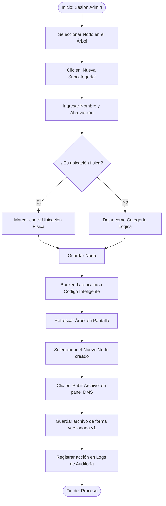
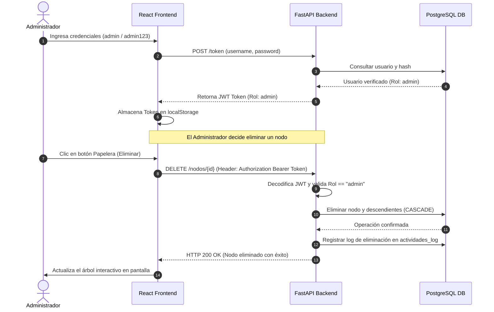

# Manual de Usuario - Archi-vite [Ecosistema XF]

Este manual proporciona una guía detallada para operar la aplicación **Archi-vite**, explicando sus menús, los permisos según roles de usuario y los flujos lógicos del sistema.

---

## 1. Guía por Menús e Interfaces

La interfaz de usuario está dividida en tres paneles de alta fidelidad:

### A. Panel Lateral Izquierdo (Navegación y Búsqueda)
* **Buscador en Tiempo Real**: Permite escribir el nombre o el Código Inteligente de un nodo. Despliega sugerencias al instante. Al hacer clic en una de ellas, el árbol central enfoca e ilumina el nodo seleccionado.
* **Menú de Opciones**:
  - **Visor de Árbol**: Muestra el lienzo interactivo del árbol jerárquico.
  - **Estadísticas Globales**: Abre un panel flotante con indicadores del sistema (total de carpetas, ubicaciones físicas, documentos y distribución).
  - **Auditoría (Logs)** *(Solo visible para administradores)*: Muestra la bitácora de auditoría en tiempo real con las últimas 20 actividades realizadas en el sistema.
* **Perfil de Usuario**: En la parte inferior se muestra el nombre del usuario conectado, su rol y un botón de cierre de sesión.

### B. Área Central (Lienzo Interactivo de Árbol 2D)
* **Visualizador D3 Tree**: Dibuja la estructura jerárquica con líneas neón de conexión animadas.
* **Interactividad**: Puedes arrastrar el árbol para moverte por el lienzo, usar el scroll del mouse para hacer zoom y hacer clic en cualquier nodo (cápsula glassmorphic) para seleccionarlo.
* **Botón 'Nueva Subcategoría'** *(Solo Admin)*: Permite inyectar un nodo hijo bajo el nodo que tengas seleccionado en ese momento.

### C. Panel de Detalles y DMS Derecho
* **Ficha Técnica**: Muestra el Nombre del nodo, su Código Inteligente heredado y si representa o no una ubicación física.
* **Acciones de Nodo**:
  - **Código QR**: Abre una ventana con el código QR único del nodo para descargar e imprimir.
  - **Reporte CSV**: Genera y descarga al instante un reporte de inventario completo de ese nodo y sus subnodos.
  - **Eliminar Nodo (Papelera)** *(Solo Admin)*: Borra el nodo seleccionado y todos sus descendientes en cascada.
* **Gestor Documental (DMS)**:
  - **Subir Archivo** *(Solo Admin)*: Permite cargar archivos PDF al servidor de forma versionada.
  - **Previsualizar (Icono de Ojo)**: Abre el lector de PDFs integrado a pantalla completa.
  - **Descargar**: Guarda el archivo digital en tu máquina local.

---

## 2. Guía de Roles de Usuario (RBAC)

El sistema de control de accesos basado en roles (RBAC) define dos perfiles:

### 👤 Administrador de Infraestructura (`admin` / `admin123`)
* Permisos de lectura de la jerarquía y el DMS.
* Permisos de escritura y modificación:
  - Crear nuevas categorías y subcategorías.
  - Eliminar nodos en cascada.
  - Subir nuevos archivos y crear nuevas versiones en el DMS.
* Acceso exclusivo a los **Logs de Auditoría** de seguridad.

### 👤 Usuario Lector / Invitado (`invitado` / `guest123`)
* Permisos de consulta de la jerarquía (árbol interactivo) y buscador.
* Acceso de lectura al DMS: previsualizar PDFs en pantalla y descargar archivos.
* Generar y descargar códigos QR de ubicaciones.
* Exportar inventarios a reportes CSV.
* **Bloqueado**: No puede añadir categorías, subir archivos ni eliminar nodos (los botones se ocultan o bloquean a nivel de UI y la API deniega la petición con error 403).

---

## 3. Diagramas de Flujos y Secuencia

### A. Diagrama de Flujo: Registro y Gestión Documental
Muestra el camino para añadir una nueva ubicación física y asociarle un archivo digital:

### B. Diagrama de Secuencia: Validación de Seguridad (JWT)
Describe cómo el backend de FastAPI protege los recursos críticos y restringe accesos:

