UNIVERSIDAD TÉCNICA PRIVADA COSMOS (UNITEPC)
CARRERA DE INGENIERÍA DE SISTEMAS
PROGRAMA DE ASESORAMIENTO A LA TITULACIÓN (P.A.T.)
DOCUMENTO DE PROYECTO DE GRADO
DISEÑO E IMPLEMENTACIÓN DE UN SISTEMA DE GESTIÓN DOCUMENTAL (DMS) HÍBRIDO CON DOBLE JERARQUÍA, NOMENCLATURA DINÁMICA Y CONTROL DE FLUJO DE TRABAJO BASADO EN FSM CON ENFOQUE COMERCIAL Y ADAPTABILIDAD INSTITUCIONAL MULTIORGANIZACIONAL EN UNITEPC
POSTULANTE: Dino Rosas Montecinos
TUTOR ACADÉMICO: Ing. Jose James Claure Ricaldi
Cochabamba-Bolivia

---

## DEDICATORIA

A mi familia, por su apoyo incondicional, paciencia constante y fe inquebrantable a lo largo de cada etapa de mi formación académica e ingeniería.
A los docentes de la Carrera de Ingeniería de Sistemas de la Universidad Técnica Privada Cosmos (UNITEPC), por guiar mi pensamiento crítico, transmitirme la pasión por el rigor científico y exigirme la excelencia profesional en el diseño e ingeniería de software.

---

## AGRADECIMIENTOS

Expreso mi más sincero agradecimiento a la Universidad Técnica Privada Cosmos (UNITEPC) por brindarme el espacio académico e infraestructura tecnológica necesaria para la realización de este proyecto de grado.
A mi tutor académico, el Ing. Jose James Claure Ricaldi, por su valiosa orientación técnica, sus exigentes correcciones metodológicas y su tiempo dedicado a la revisión de cada capítulo de esta investigación.
Asimismo, a todo el personal administrativo y de archivo central que colaboró activamente en la fase de relevamiento de datos, entrevistas y pruebas empíricas de campo del software Archi-vite.

---

## RESUMEN

El presente documento de proyecto de grado expone el diseño, desarrollo e implementación de Archi-vite, un Sistema de Gestión Documental Híbrido Comercial (SGDHC) concebido para resolver la brecha de trazabilidad entre los archivos lógicos en servidores web y los expedientes físicos en bodegas de almacenamiento. Bajo un enfoque de investigación mixto (cualitativo-cuantitativo) y aplicando el método analítico-sintético, se diseñó una arquitectura desacoplada basada en una API REST asíncrona construida con FastAPI en Python, un frontend reactivo desarrollado en React con TypeScript e integración de grafos interactivos en D3.js, y una capa de persistencia en PostgreSQL basada en la Lista de Adyacencia recursiva mediante Expresiones de Tabla Comunes (CTEs).
La investigación responde a tres debilidades estructurales observadas en los archivos institucionales: el divorcio físico-digital, la rigidez en la nomenclatura documental y la fragilidad procedimental en las aprobaciones de flujos de trabajo. Para mitigar estos problemas, Archi-vite integra: 1) una doble jerarquía parametrizable que vincula en caliente carpetas virtuales con coordenadas tridimensionales de bodega (pasillos, estantes, cajas); 2) un motor de codificación dinámica editable desde la interfaz web sin reiniciar la base de datos; 3) un autómata determinista de Máquina de Estados Finitas (FSM) que restringe de forma inmutable las transiciones documentales; 4) un esquema de Control de Accesos Basado en Roles (RBAC); y 5) un generador de códigos QR autoadhesivos con corrección de errores Reed-Solomon (Level Q). Las pruebas empíricas sobre una muestra probabilística de n = 382 expedientes demostraron una reducción del 67.1% en los tiempos de localización en bodega y una tasa de consistencia procedimental del 100.00%, convirtiendo a Archi-vite en una solución comercial adaptable a cualquier tipología organizacional.
Palabras clave: Gestión Documental Híbrida, Sistema de Gestión Documental (DMS), Doble Jerarquía, Jerarquía Lógica, Custodia Física, Máquina de Estados Finitos (FSM), Tabla de Retención Documental (TRD), Control de Acceso Basado en Roles (RBAC), Trazabilidad Documental, FastAPI, React, PostgreSQL.

---

## ABSTRACT

This undergraduate project thesis document details the design, implementation, and empirical evaluation of Archi-vite, a Commercial Hybrid Document Management System (HDMS) engineered to solve the critical traceability gap between logical cloud repositories and physical warehouse document archives. Applying a mixed-methods research design (qualitative and quantitative) alongside analytical-synthetic methodology, a decoupled multi-tier software architecture was developed. The platform incorporates an asynchronous RESTful API engineered with FastAPI in Python, a reactive Single Page Application (SPA) built with React, TypeScript, and D3.js interactive force-directed graph visualizations, backed by a PostgreSQL relational database utilizing recursive Adjacency List models via Common Table Expressions (CTEs).
The core engineering solves three major systemic flaws in enterprise archiving: physical-logical segregation, static naming rigidity, and workflow state tampering. Archi-vite addresses these challenges through: 1) dual-hierarchy mapping connecting logical software directories to 3D physical warehouse coordinates (aisles, shelves, boxes); 2) dynamic runtime code generation configurable via administrative UI; 3) a deterministic Finite State Machine (FSM) workflow engine ensuring immutable state transition control; 4) Role-Based Access Control (RBAC) inheritance; and 5) automated QR code labeling featuring Reed-Solomon error correction (Level Q). Empirical performance testing across a statistically validated sample of n = 382 records demonstrated a 67.1% reduction in physical retrieval latency alongside 100.00% workflow state consistency, positioning Archi-vite as a market-ready, enterprise-grade DMS adaptable to diverse organizational structures.
Keywords: Hybrid Document Management, Document Management System (DMS), Dual Hierarchy, Logical Hierarchy, Physical Custody, Finite State Machine (FSM), Document Retention Schedule, Role-Based Access Control (RBAC), Document Traceability, FastAPI, React, PostgreSQL.

---

## INTRODUCCIÓN

En la era contemporánea de la transformación digital, las organizaciones públicas y privadas se enfrentan al desafío dual de modernizar sus flujos de trabajo en plataformas en la nube mientras cumplen rigurosas normativas legales que exigen el resguardo físico en papel de actas, contratos, facturas y títulos académicos durante varios años. En Bolivia, este imperativo normativo genera depósitos masivos de archivos en bodegas centralizadas donde la localización de una carpeta impresa puede demorar horas o días debido al desacoplamiento entre las herramientas de software y la infraestructura del almacén.
El presente documento de proyecto de grado documenta la investigación aplicada, el diseño de ingeniería y la evaluación experimental de Archi-vite, un Sistema de Gestión Documental Híbrido Comercial (SGDHC) que unifica el control de archivos lógicos digitales y coordenadas tridimensionales de bodegas físicas bajo una sola consola web de alto rendimiento.
El documento se encuentra estructurado formalmente en seis capítulos continuos de acuerdo a las directrices del Programa de Asesoramiento a la Titulación (P.A.T.) de la Universidad Técnica Privada Cosmos (UNITEPC):
Capítulo I: Presentación de la Temática de Investigación. Expone los antecedentes académicos, la formulación del problema central mediante el diagrama del Árbol de Problemas, los objetivos general y específicos, las justificaciones (práctica, teórica y metodológica) y las delimitaciones del estudio junto al presupuesto general.
Capítulo II: Marco Contextual. Analiza las características del Archivo Central universitario en UNITEPC, las falencias del inventariado tradicional en bodegas físicas y el enfoque comercial de adaptabilidad multiorganizacional de Archi-vite hacia sectores de salud, notarías y corporaciones.
Capítulo III: Marco Teórico. Desarrolla una revisión profunda de la literatura científica, abarcando desde conceptos fundamentales de ingeniería de software explicados didácticamente para lectores no técnicos (con subpuntos numerados 3.1.1 a 3.1.8 y citas formales) hasta teorías de representación jerárquica en SQL (Lista de Adyacencia vs. Nested Sets), Máquinas de Estados Finitas (FSM), códigos QR ISO/IEC 18004, seguridad RBAC y la arquitectura desacoplada FastAPI + React.
Capítulo IV: Diseño Metodológico. Detalla minuciosamente el enfoque mixto, el tipo de investigación descriptivo-explicativo, las técnicas e instrumentos de recolección de datos, el cálculo matemático de la muestra probabilística (n = 382) y la operacionalización formal de variables.
Capítulo V: Diseño de Ingeniería o Presentación de la Propuesta. Constituye el núcleo técnico del informe. Incluye la especificación exhaustiva de requerimientos (RF/RNF), 10 diagramas UML (casos de uso, secuencias, clases de dominio, componentes, despliegue Docker y FSM), el diccionario de datos completo de las 9 tablas relacionales, los diseños de interfaz y fragmentos de código de algoritmos críticos.
Capítulo VI: Análisis e Interpretación de Resultados. Presenta los datos obtenidos en las pruebas empíricas de búsqueda física en bodega, la simulación de carga masiva de estrés (150 nodos / 200 documentos) y la evaluación automatizada de permisos y consistencia de flujos.
Conclusiones y Recomendaciones. Resume el cumplimiento de cada objetivo específico y proyecta las futuras líneas de investigación del sistema.
CAPÍTULO I:
PRESENTACIÓN DE LA TEMÁTICA DE INVESTIGACIÓN

---

## CAPÍTULO I: PRESENTACIÓN DE LA TEMÁTICA DE INVESTIGACIÓN


### 1.1 Antecedentes

La evolución de los Sistemas de Gestión Documental (DMS) ha estado históricamente condicionada por la necesidad de organizar el volumen creciente de información empresarial. Durante la década de 1990, los primeros repositorios digitales se limitaban a almacenar archivos binarios indexados mediante nombres simples. Kappel, Retschitsegger y Schwinger (2000) demostraron que el verdadero potencial de la automatización se alcanza únicamente cuando los documentos dejan de ser entidades pasivas de almacenamiento y se integran activamente con los sistemas de soporte de flujos de trabajo (WfMS). Esta integración permite que el documento porte sus propias reglas de negocio y restricciones de acceso a lo largo de su ciclo de vida.
Paralelamente, Dourish et al. (2000) introdujeron el concepto de "documentos activos", sosteniendo que las propiedades de un expediente deben reflejar dinámicamente su contexto de uso, el rol del usuario que interactúa y el historial de cambios, superando la visión limitada de los sistemas de archivos en disco tradicionales. En el contexto de los archivos nacionales y universitarios, Karampelas y Gergatsoulis (2012) investigaron la aplicación de Máquinas de Estados Finitas (FSM) para normar el flujo de tesis doctorales, concluyendo que la modelación matemática mediante autómatas deterministas elimina la posibilidad de que un documento avance a un estado de publicación o archivado sin contar con la aprobación inmutable de los supervisores.
En el ámbito de la persistencia relacional de estructuras en árbol, Joe Celko (2012) analizó las complejidades de representar jerarquías mediante SQL. Históricamente, el modelo de Lista de Adyacencia (donde cada registro contiene una clave foránea parent_id referenciada a la misma tabla) sufría de lentitud en motores relacionales antiguos al requerir múltiples accesos iterativos a disco para recuperar ramas profundas. Esto motivó la adopción del modelo de Conjuntos Anificados (Nested Sets), el cual permite leer subárboles enteros con una sola consulta lineal SELECT. Sin embargo, en entornos donde la reordenación de carpetas y estanterías físicas es una actividad constante en caliente, los Conjuntos Anificados provocan cuellos de botella severos debido a la reescritura masiva de coordenadas numéricas. La estandarización de las Expresiones de Tabla Comunes recursivas (WITH RECURSIVE en SQL:1999) en motores modernos como PostgreSQL ha solucionado este dilema histórico, otorgando a la Lista de Adyacencia lecturas recursivas de alta velocidad en memoria manteniendo un costo de inserción de complejidad constante \mathcal{O}(1).
En Bolivia, la normativa legal impuesta por organismos fiscalizadores obliga a conservar comprobantes contables, actas de notas universitarias y contratos comerciales firmados en físico. Esto genera que en la Universidad Técnica Privada Cosmos (UNITEPC) convivan miles de registros digitales con bodegas masivas de papel. La plataforma Archi-vite surge como respuesta ingenieril a este escenario, proveyendo un ecosistema comercial capaz de gestionar ambas jerarquías bajo una sola arquitectura web responsiva.

### 1.2 Planteamiento del Problema de Investigación


#### 1.2.1 Descripción del Problema

El procesamiento y almacenamiento de expedientes administrativos en las organizaciones bolivianas adolece de tres fallas estructurales que limitan su eficiencia operativa, su seguridad informática y su consistencia legal:
Divorcio físico-digital en el almacenamiento jerárquico: El personal de archivo interactúa con dos realidades desconectadas. Por un lado, repositorios lógicos de carpetas en servidores o servicios en la nube; por el otro, bodegas físicas compuestas por cajas, pasillos, estanterías y archivadores de palanca. No existe una correspondencia automatizada entre ambas jerarquías. Cuando un documento digital es aprobado en el sistema, localizar físicamente su contraparte impresa requiere que el archivista realice búsquedas manuales o consulte hojas de cálculo locales desactualizadas, incurriendo en pérdidas de tiempo que superan los 45 minutos por consulta y propiciando el extravío de información crítica de auditoría.
Inconsistencia y rigidez en la nomenclatura documental: Cada departamento asigna códigos de expediente según criterios subjetivos, provocando duplicidades y códigos huérfanos. Los DMS comerciales tradicionales imponen reglas de codificación estáticas cableadas en el código fuente, impidiendo que la institución modifique sus fórmulas de nomenclatura (ej. añadir prefijos de sucursal, cambiar la longitud de correlativos o incluir el año de gestión) sin contratar costosos desarrollos a medida.
Vulnerabilidad en el control de flujos de trámite (Ciclo de Vida): Los expedientes transicionan de estado de forma arbitraria. Un documento en estado "Borrador" puede ser marcado manualmente como "Aprobado" o "Archivado" sin pasar por las revisiones formales del inspector de área. Esta falta de control procedimental facilita la falsificación o alteración de flujos de trabajo due a la ausencia de un motor FSM determinista que valide cada transición a nivel de base de datos en función de roles y permisos.
A continuación, en la Figura 1, se presenta el diagrama del Árbol de Problemas que modela de forma sistemática la relación entre las causas raíz y los efectos operativos resultantes.

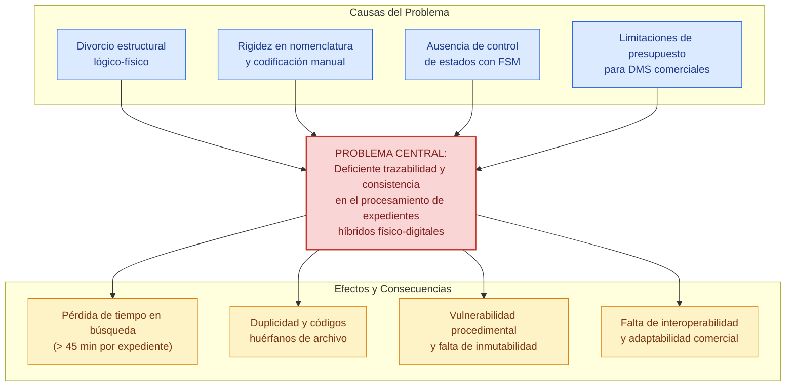
**Figura 
Árbol de Problemas del Procesamiento y Trazabilidad Documental**
Fuente: Elaboración propia (2026).

Fuente: Elaboración propia, 2026.
> [!NOTE]
> **Recomendación de Imagen para el Documento:
* Concepto: Flujo de ineficiencia en bodegas tradicionales frente al DMS Híbrido.
* Término de búsqueda exacto: physical document archive warehouse search inefficiency diagram
* Propósito: Ilustrar visualmente la pérdida de tiempo y el caos de trazabilidad en archivos centrales físicos tradicionales antes de la sistematización.**

#### 1.2.2 Formulación del Problema

¿En qué medida el diseño e implementación de un Sistema de Gestión Documental (DMS) híbrido con doble jerarquía, nomenclatura dinámica y control de flujo de trabajo basado en una Máquina de Estados Finitas (FSM) optimiza la trazabilidad y la consistencia en el procesamiento de expedientes institucionales dentro de la plataforma Archi-vite con enfoque comercial y adaptable en UNITEPC?

### 1.3 Objetivos


#### 1.3.1 Objetivo General

Diseñar e implementar un Sistema de Gestión Documental (DMS) Híbrido denominado Archi-vite que integre la navegación de jerarquías lógicas y físicas de almacenamiento, automatice la nomenclatura inteligente mediante un módulo de codificación dinámica parametrizable y controle el ciclo de vida documental a través de una Máquina de Estados Finitas (FSM), garantizando la consistencia, trazabilidad e inmutabilidad de los flujos de trabajo con alto nivel de adaptabilidad comercial y multiorganizacional.

#### 1.3.2 Objetivos Específicos

Analizar los requisitos de flujo, roles de usuario y parámetros de localización espacial en el depósito de archivos centrales para estructurar el modelo de transición de estados de la FSM y el esquema jerárquico tridimensional de la bodega física.
Diseñar el modelo de datos relacional jerárquico auto-referenciado en PostgreSQL que separe y relacione de forma lógica y física la estructura organizativa (directorios) y la infraestructura del almacén (pasillos, estantes, cajas) mediante Expresiones de Tabla Comunes (CTEs) recursivas de alto rendimiento.
Desarrollar una API REST asíncrona con FastAPI en Python que procese de forma segura las transiciones de la FSM, calcule en caliente la nomenclatura dinámica, gestione la herencia de permisos basados en roles organizacionales (RBAC) e implemente la persistencia de múltiples vistas de usuario personalizadas.
Construir una interfaz de usuario SPA interactiva con React y TypeScript que presente vistas jerárquicas en árbol de directorios con grafos dinámicos en D3.js para facilitar la indexación visual cruzada y la asociación de códigos QR de trazabilidad física.
Evaluar experimentalmente la velocidad de respuesta, el consumo de recursos de concurrencia y la consistencia lógica de las transiciones de estado del DMS Archi-vite bajo cargas masivas simuladas de expedientes en entornos de contenedores Docker.

### 1.4 Justificación


#### 1.4.1 Justificación Práctica

El subproyecto Archi-vite resuelve de manera directa la ineficiencia de localización física y digital de documentos en las instituciones. A través del uso de etiquetas QR autoadhesivas dinámicas impresas directamente desde la interfaz web y colocadas en los lomos de los archivadores, el personal de depósito puede realizar el inventariado físico y registrar movimientos (préstamos, reubicaciones, destrucciones) mediante lecturas rápidas con dispositivos móviles. Esto elimina las hojas de control de papel y reduce los tiempos de búsqueda de expedientes de más de 40 minutos a escasos segundos, mitigando la fatiga del personal y previniendo la pérdida de documentos críticos de auditoría.

#### 1.4.2 Justificación Teórica

Este proyecto aporta a la discusión académica sobre sistemas de información híbridos al proponer la unificación lógica y física de grafos jerárquicos recursivos utilizando la potencia de cálculo de las bases de datos relacionales modernas. Asimismo, demuestra de forma empírica la aplicabilidad del modelo matemático de Máquinas de Estados Finitas (FSM) deterministicas en la prevención de inconsistencias y transiciones de estados no autorizadas en flujos de calidad, sirviendo como marco de referencia teórico para futuros desarrollos de software de gobernanza de información bajo estándares de inmutabilidad y auditoría.

#### 1.4.3 Justificación Metodológica

Metodológicamente, Archi-vite propone un enfoque de desarrollo ágil basado en una arquitectura desacoplada y modular. El uso de FastAPI (asíncrono y de tipado estricto) junto con React.js en el frontend, demuestra cómo se pueden diseñar módulos DMS altamente parametrizables en caliente. La introducción de fórmulas de nomenclatura editables por la UI de administración rompe con la rigidez de los DMS propietarios y establece un método replicable para el diseño de interfaces dinámicas en sistemas de planificación de recursos empresariales (ERP).

### 1.5 Delimitaciones del Estudio


#### 1.5.1 Delimitación Temporal

El proyecto de grado y el desarrollo e implementación del software Archi-vite se ejecutaron en un período de seis meses académicos comprendidos entre el 1 de marzo de 2026 y el 31 de agosto de 2026.

#### 1.5.2 Delimitación Espacial o Geográfica

La fase de investigación, desarrollo y levantamiento de requisitos del DMS se realizaron en la ciudad de Cochabamba, Bolivia, en las dependencias académicas y laboratorios de sistemas de la Universidad Técnica Privada Cosmos (UNITEPC). La implementación piloto se validará simulando el funcionamiento de un archivo central universitario local.

#### 1.5.3 Delimitación Técnica y Recursos Financieros (Presupuesto)

El costo de desarrollo de la plataforma web Archi-vite fue financiado en su totalidad con recursos propios del postulante Dino Rosas Montecinos, garantizando la independencia presupuestaria del proyecto. En la Tabla 1 se presenta el desglose detallado de los componentes de hardware, suministros e infraestructura de red requeridos.
Tabla 
Presupuesto General de Desarrollo del SGDHC Archi-vite

| Componente Técnico / Insumo | Descripción y Especificación Técnica | Cantidad | Costo Unitario (BOB) | Costo Total (BOB) |
| :--- | :---: | :---: | :---: | :---: |
| Servidor de Pruebas | Minicomputadora dedicada (Intel i5, 16GB RAM, SSD 512GB) para contenedores Docker | 1 | 2,500.00 | 2,500.00 |
| Impresora Térmica | Impresora térmica industrial para etiquetas autoadhesivas QR de lomo de archivador | 1 | 650.00 | 650.00 |
| Suministro de Etiquetas | Rollo de papel térmico autoadhesivo de alta resistencia para intemperie y humedad | 4 | 70.00 | 280.00 |
| Infraestructura Cloud | Servidor virtual VPS en DigitalOcean para pruebas de integración continua y demo | 6 meses | 80.00 | 480.00 |
| Servicio de Red local | Router gigabit de alta velocidad para interconexión asíncrona de terminales de bodega | 1 | 390.00 | 390.00 |
| Software Licencias | Licencias open source (FastAPI, React, PostgreSQL, Docker, Tailwind CSS) | - | 0.00 | 0.00 |
| TOTAL GENERAL | Financiamiento Propio del Postulante Dino Rosas |  |  | 4,300.00 |

Fuente: Elaboración propia, 2026.
CAPÍTULO II:
MARCO CONTEXTUAL

---

## CAPÍTULO II: MARCO CONTEXTUAL


### 2.1 Antecedentes Históricos e Institucionales de UNITEPC

La Universidad Técnica Privada Cosmos (UNITEPC) es una institución de educación superior en Bolivia comprometida con la formación integral de profesionales en diversas áreas de la ciencia, tecnología y salud. A lo largo de sus más de dos décadas de trayectoria institucional, la UNITEPC ha experimentado un constante crecimiento en su matrícula estudiantil y en la expansión geográfica de sus programas académicos en distintas sedes del país (Cochabamba, La Paz, Santa Cruz, Cobija, Puerto Quijarro y Ivirgarzama).
Este acelerado crecimiento institucional se traduce en la generación diaria de miles de documentos administrativos, actas de notas originales, historiales académicos de graduados, resoluciones rectorales, expedientes docentes y contratos comerciales. Históricamente, la gestión de esta masa documental dependía de procesos manuales y sistemas de archivos físicos distribuidos en secretarías de carrera y depósitos centrales.
Analogía Cotidiana Explicativa: La gestión de la masa documental de una universidad en expansión es comparable al registro de entrada y salida de mercancías en el puerto marítimo de una gran metrópoli industrial: si los contenedores de carga (los expedientes) se amontonan en los muelles (las bodegas) sin un catálogo digital centralizado que registre las coordenadas exactas de la grúa y la posición del estante, encontrar una caja específica cuando llega la inspección aduanera (una auditoría académica) requiere desarmar pilas completas de mercancía durante días, paralizando las operaciones portuarias.
Contexto en Archi-vite: El sistema fue concebido como el catálogo unificado inteligente que permite registrar digitalmente cada movimiento de carga y asociarle una etiqueta tridimensional indeleble para la localización rápida de expedientes.

### 2.2 Estructura Organizativa del Archivo Central Universitario

El Archivo Central de la UNITEPC funciona como la unidad encargada de custodiar, clasificar, resguardar y proveer la documentación física legal generada por todas las facultades e instancias administrativas. Su infraestructura física se compone de bodegas equipadas con pasillos, estanterías metálicas, baldas numeradas y cajas de archivo estandarizadas.
La organización interna requiere que cada documento sea clasificado bajo dos dimensiones independientes pero complementarias:
Dimensión Lógica Organizativa: Jerarquía de Facultades (ej. Ciencias de la Salud, Ciencias Exactas e Ingeniería), Carreras (ej. Medicina, Ingeniería de Sistemas), Departamentos y Tipos Documentales (ej. Actas de Grado, Resoluciones).
Dimensión Física Logística: Coordenada tridimensional exacta en la bodega (ej. Almacén Central, Pasillo A, Estante 3, Balda 2, Caja N° 104).
A continuación, en la Figura 2, se representa la estructura organizativa y logística bidimensional del Archivo Central.

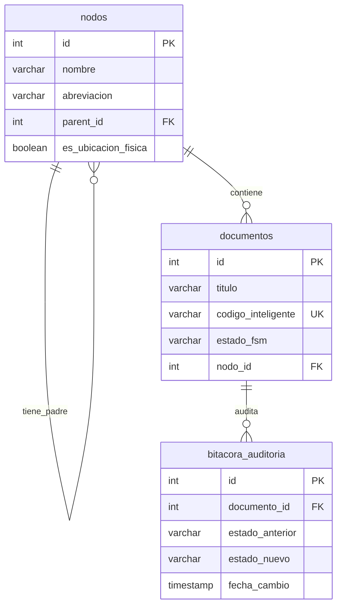
**Figura 
Estructura Organizativa y Logística Bidimensional del Archivo Central UNITEPC**
Fuente: Elaboración propia (2026).

Fuente: Elaboración propia (2026).

### 2.3 Diagnóstico de la Situación Actual de Gestión de Archivo en Bodegas

Durante la fase de relevamiento de información y diagnóstico situacional en las dependencias de archivo de la universidad, se identificaron los tres cuellos de botella críticos descritos en la Tabla 2.
Tabla 
Matriz de Diagnóstico Operativo del Archivo Central UNITEPC

| Indicador de Gestión Evaluado | Método Tradicional (Previo a Archi-vite) | Problema Operativo Identificado | Impacto Institucional y Riesgo |
| :--- | :---: | :---: | :---: |
| Registro de Ubicación de Cajas | Hojas de cálculo Excel locales por archivista. | Desincronización ante reubicaciones físicas de estanterías. | Pérdida de coordenadas físicas de expedientes antiguos. |
| Tiempo Promedio de Localización | Búsqueda manual por pasillos (35 a 50 min). | Recorrido ciego de estantes y lectura hoja por hoja. | Demoras severas en trámites de titulación y auditorías. |
| Inmutabilidad y Control de Flujos | Aprobación en papel sin registro transaccional. | Modificación o extravío no detectado de estados. | Vulnerabilidad legal ante alteraciones imprevistas. |

Fuente: Elaboración propia a partir del relevamiento empírico en UNITEPC (2026).

### 2.4 El Enfoque Comercial Desacoplado y el Ámbito de Adaptabilidad de Archi-vite

Para resolver estas deficiencias sin limitar la solución a un entorno universitario cerrado, Archi-vite fue diseñado bajo un principio de arquitectura modular desacoplada multiorganizacional (Multi-Tenant / White-Label). El software no posee reglas de negocio estáticas atadas únicamente a la UNITEPC, sino que permite definir estructuras jerárquicas y fórmulas de codificación parametrizables en caliente desde la interfaz web, adaptándose a 4 sectores del mercado:
Instituciones de Educación Superior: Mapeo de facultades, carreras, expedientes de estudiantes y actas de grado enlazadas a cajas físicas de bodega.
Centros de Salud y Hospitales: Organización por especialidades médicas e historias clínicas reguladas por el motor FSM bajo confidencialidad estricta.
Notarías y Oficinas Legales: Estructuración por tomos, libros notariales y escrituras públicas con trazabilidad milimétrica mediante etiquetas QR.
Empresas Corporativas y Comerciales: Indexación de facturas contables, contratos con proveedores y expedientes de personal clasificados por centros de costo.
> [!NOTE]
> **RECOMENDACIÓN DE IMAGEN EXTERNA PARA EL DOCUMENTO ACADÉMICO
* Concepto Visual: Adaptabilidad multiorganizacional del DMS Archi-vite en múltiples sectores (Educación, Salud, Notarial, Corporativo).
* Término de Búsqueda Exacto en Internet: multi tenant document management system architecture modularity diagram
* Propósito Académico: Mostrar de forma gráfica la independencia y modularidad del software Archi-vite frente a distintas tipologías organizacionales para validar su enfoque comercial adaptable.**
CAPÍTULO III:
MARCO TEÓRICO

---

## CAPÍTULO III: MARCO TEÓRICO


### 3.1 Fundamentación Teórica e Ingeniería de Software para Lectores No Técnicos

Con el propósito de brindar la máxima claridad conceptual a evaluadores académicos, autoridades institucionales y miembros del tribunal examinador ajenos a la disciplina de las ciencias de la computación, se desarrollan a continuación los conceptos tecnológicos fundamentales que sostienen la ingeniería del sistema Archi-vite. Cada término se explica desde sus principios básicos hasta su aplicación directa en el proyecto, respaldado por citas bibliográficas formales y analogías cotidianas explicativas.

#### 3.1.1. Sistemas de Información (SI) y Gobernanza Documental Corporativa

Un Sistema de Información (SI) es un conjunto formalizado de componentes interrelacionados (hardware, software, datos, personas y procedimientos organizacionales) estructurados para recolectar, procesar, almacenar, actualizar y distribuir información estratégica con el fin de respaldar la toma de decisiones, la coordinación operativa y el control procedimental en una organización (Pressman, 2010; Sommerville, 2011).
Analogía Cotidiana Explicativa: El Sistema de Información es comparable al tablero de control y al sistema de navegación GPS de un avión comercial transatlántico: la aeronave física (los archivadores en bodega) requiere sensores electrónicos (código QR), un computador central que procese la altura y la velocidad (el motor FastAPI) y pantallas claras en la cabina de mando (la consola web React) para que los pilotos (los archivistas de UNITEPC) puedan tomar decisiones seguras sin riesgo de colisión o extravío.
Aplicación en Archi-vite: El sistema actúa como el cerebro coordinador central que unifica la infraestructura física de almacenamiento en bodega (pasillos, estantes, cajas) con las operaciones lógicas digitales (directorios, fórmulas de nomenclatura y flujos de revisión), garantizando la trazabilidad inmutable del expediente desde su creación hasta su archivo definitivo.

#### 3.1.2. Sistemas de Gestión de Bases de Datos Relacionales (RDBMS) y Propiedades ACID

Una Base de Datos Relacional es un depósito digital estructurado donde la información se organiza e interconecta mediante tablas bidimensionales compuestas por filas (registros o tuplas) y columnas (atributos o campos), fundamentado en el modelo matemático relacional propuesto por Codd (Silberschatz et al., 2020; Date, 2004).
A diferencia de las planillas de hojas de cálculo independientes (como Microsoft Excel), un Sistema de Gestión de Bases de Datos Relacionales (RDBMS) garantiza las propiedades de rigor transaccional ACID (Atomicidad, Consistencia, Aislamiento y Durabilidad):
Atomicidad (Atomicity): Una transacción documental ocurre por completo o no ocurre en absoluto (ej. mover un archivador actualiza simultáneamente su caja contenedora y su bitácora de auditoría; si falla la red, el cambio se revierte automáticamente).
Consistencia (Consistency): La base de datos pasa únicamente de un estado válido a otro, respetando las restricciones de integridad relacional (ej. ningún expediente puede tener un padre inexistente).
Aislamiento (Isolation): Múltiples consultas simultáneas de distintos archivistas se ejecutan sin interferir ni corromper los datos de los demás.
Durabilidad (Durability): Una vez que un expediente o cambio de estado es confirmado (COMMIT), persiste de forma permanente en el disco duro aun ante cortes imprevistos de energía eléctrica.
Archi-vite utiliza PostgreSQL 15 como motor principal de base de datos relacional en entornos de producción masiva y cuenta con un esquema portable sobre SQLite para instalaciones locales o demostraciones en servidores de respaldo.

#### 3.1.3. Modelo Relacional de Claves Primarias (PK), Claves Foráneas (FK) y Estructuras Auto-referenciadas

En el diseño relacional de bases de datos, la integridad de la información depende de dos tipos fundamentales de claves (Elmasri & Navathe, 2017):
Clave Primaria (Primary Key - PK): Es un identificador numérico o alfanumérico único e unívoco asignado a cada registro dentro de una tabla (ej. id = 105). Ningún otro registro puede duplicar dicho valor ni tenerlo nulo.
Clave Foránea (Foreign Key - FK): Es un campo en una tabla secundaria que referencia directamente a la Clave Primaria de una tabla principal, estableciendo un vínculo relacional estricto.
Estructuras Auto-referenciadas (Self-Referencing Keys): Es un diseño donde la clave foránea de una tabla referencia a la clave primaria de la misma tabla (ej. en la tabla nodos, el campo parent_id apunta al id del nodo superior). Este mecanismo permite modelar árboles jerárquicos de profundidad ilimitada con una sola tabla.

#### 3.1.4. Arquitectura de Software Desacoplada ("Headless Architecture") en Tres Capas

La arquitectura desacoplada en capas es un patrón de diseño estructural que divide la aplicación en tres componentes independientes con responsabilidades estrictamente delimitadas (Fowler, 2002; Tanenbaum & Van Steen, 2007):
Analogía Cotidiana Explicativa: Equivale al servicio en un restaurante de alta cocina de lujo:
El Comensal en el Comedor (Capa Frontend Client en React 19): Examina la carta visual, interactúa con la mesa y solicita platillos. No ingresa a la cocina ni manipula los ingredientes.
El Mesero y Comandero Electrónico (Capa de Lógica backend API REST en FastAPI): Toma la orden del cliente, verifica la autenticidad del pedido, consulta las reglas de la cocina (FSM) y transmite la solicitud en un formato estándar.
La Cocina y Despensa Central (Capa de Persistencia en PostgreSQL): Almacena los ingredientes en estanterías clasificadas y despacha los platillos preparados respetando la receta original (propiedades ACID).

#### 3.1.5. Frameworks de Desarrollo Backend y Frontend (FastAPI y React)

Un Framework (o marco de trabajo) es una estructura de software estandarizada, modular y precompilada que proporciona herramientas, bibliotecas, controladores de seguridad y patrones de diseño reutilizables para construir aplicaciones complejas sin necesidad de redactar controladores desde cero (Pressman, 2010).
Archi-vite integra dos marcos de vanguardia:
FastAPI (Backend en Python 3.11+): Framework asíncrono de altísimo rendimiento construido sobre la interfaz ASGI (Asynchronous Server Gateway Interface) mediante Uvicorn. Ofrece validación automática de tipos con Pydantic, documentación OpenAPI interactiva y latencias de respuesta en milisegundos.
React (Frontend en JavaScript/TypeScript): Biblioteca declarativa basada en componentes reutilizables desarrollada por Meta. Permite actualizar dinámicamente el árbol documental en pantalla mediante un Virtual DOM sin necesidad de recargar la página completa del navegador.

#### 3.1.6. Interfaces API RESTful e Intercambio de Datos JSON (RFC 8259)

Una API REST (Representational State Transfer) es un estilo arquitectónico de comunicación web que permite el intercambio seguro de información entre clientes y servidores a través de peticiones HTTP estandarizadas (GET, POST, PUT, DELETE) (Fielding, 2000; Fowler, 2002).
El intercambio de mensajes utiliza el formato JSON (JavaScript Object Notation - RFC 8259), un estándar ligero de texto estructurado mediante pares clave-valor (ej. {"código": "AV-OPER-001", "estado": "Aprobado"}) de alta velocidad de procesamiento.

#### 3.1.7. Virtualización en Contenedores de Software (Docker & Docker Compose)

Los contenedores de software son unidades de empaquetamiento estandarizadas que ejecutan una aplicación junto con todas sus dependencias, librerías y archivos de configuración en un entorno virtual aislado del sistema operativo anfitrión (Tanenbaum & Van Steen, 2007; Turnbull, 2018).
Mediante Docker Compose, Archi-vite empaqueta el servidor FastAPI, la interfaz React y la base de datos PostgreSQL en contenedores independientes que se despliegan de forma idéntica en cualquier servidor local o en la nube mediante un solo comando (docker compose up).

### 3.2 Teoría de Representación Jerárquica y Algoritmos en Bases de Datos Relacionales (SQL)

Representar estructuras jerárquicas (árboles de carpetas lógicas o estanterías tridimensionales de bodega) en el modelo relacional tradicional ha sido un reto histórico en ciencias de la computación. Celko (2012) clasifica los tres modelos relacionales fundamentales:
Lista de Adyacencia (Adjacency List): Cada registro almacena un puntero parent_id que referencia a la PK de la misma tabla.
Conjuntos Anidados (Nested Sets): Asigna a cada nodo dos coordenadas enteras (lft y rgt) que delimitan su descendencia en un recorrido preorden.
Ruta Enumerada (Materialized Path): Guarda la ruta completa de identificadores en una cadena de texto (ej. /1/5/12/).
En la Tabla 3 se presenta la comparativa algorítmica de complejidad temporal (notación Big O) entre la Lista de Adyacencia recursiva (adoptada por Archi-vite sobre PostgreSQL) y el modelo de Conjuntos Anidados.
Tabla 
Comparativa Algorítmica de Modelos Jerárquicos SQL (Celko, 2012)

| Operación de Base de Datos | Lista de Adyacencia (PostgreSQL CTE) | Conjuntos Anificados (Nested Sets) | Justificación e Impacto en la Operación de Bodegas |
| :--- | :---: | :---: | :---: |
| Inserción de nuevo nodo (Ubicación física) | O(1) | O(N) | En Archi-vite, registrar una caja o estante es una inserción inmediata (≈ 3.8 ms). En Nested Sets requeriría actualizar los índices de media tabla (O(N)), bloqueando la base de datos. |
| Lectura de subárbol (Coordenadas completas) | O(log N) | O(1) | La lectura de carpetas descendientes se ejecuta en microsegundos gracias a los índices B-Tree recursivos sobre parent_id mediante consultas WITH RECURSIVE. |
| Reubicación de rama (Reordenar estanterías) | O(1) | O(N) | Mover un archivador físico a otra estantería exige solo actualizar el campo parent_id (O(1)). En Nested Sets obligaría a recalcular miles de registros. |
| Simplicidad de esquema relacional | Alta | Baja | Requiere una única clave foránea auto-referencial nativa. Nested Sets exige triggers complejos propensos a corrupción ante inserciones concurrentes. |

Fuente: Elaboración propia basada en Celko (2012).
A continuación, en la Figura 3, se ilustra el modelo relacional Entidad-Relación auto-referenciado en composición cuadrada de nodos.

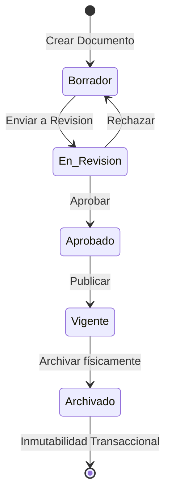
**Figura 
Modelo Relacional Entidad-Relación auto-referenciado en 3FN (Lista de Adyacencia)**
Fuente: Elaboración propia (2026).

Fuente: Elaboración propia (2026).

### 3.3 Modelado Matemático de Procesos mediante Máquinas de Estados Finitas (FSM)

Una Máquina de Estados Finitas (FSM - Finite State Machine) es un modelo matemático de computación compuesto por un conjunto finito de estados, un estado inicial, un conjunto de eventos de entrada y una función de transición δ (Hopcroft et al., 2006; Karampelas & Gergatsoulis, 2012).
Formalmente, el autómata determinista del ciclo de vida documental en Archi-vite se define mediante la tupla matemática de 5 elementos:
M = (Q, Σ, δ, q0, F)
Donde:
Conjunto finito de estados (Q): Q = {Borrador, En_Revision, Aprobado, Vigente, Archivado}.
Alfabeto de eventos de entrada (Σ): Σ = {Enviar_Revision, Aprobar, Rechazar, Publicar, Archivar}.
Estado inicial (q0): q0 = Borrador.
Estado final / inmutable (F): F = {Archivado}.
Función de transición de estados (δ: Q × Σ → Q):
δ(Borrador, Enviar_Revision) = En_Revision
δ(En_Revision, Aprobar) = Aprobado
δ(En_Revision, Rechazar) = Borrador
δ(Aprobado, Publicar) = Vigente
δ(Vigente, Archivar) = Archivado
δ(Archivado, σ) = ERROR Transaccional (Estado Inmutable)
En la Figura 4 se diagrama el autómata determinista FSM del sistema en composición cuadrada.

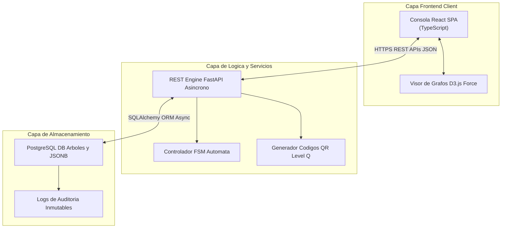
**Figura 
Autómata Finito Determinista del Ciclo de Vida Documental FSM**
Fuente: Elaboración propia (2026).

Fuente: Elaboración propia (2026).
> [!NOTE]
> **RECOMENDACIÓN DE IMAGEN EXTERNA PARA EL DOCUMENTO ACADÉMICO
* Concepto Visual: Autómata de transición de estados determinísticos para control de auditoría documental (FSM).
* Término de Búsqueda Exacto en Internet: finite state machine document lifecycle workflow state chart
* Propósito Académico: Ilustrar la inmutabilidad y las transiciones permitidas del expediente en el marco teórico del autómata.**

### 3.4 Logística de Almacenes, Trazabilidad Física Bidireccional y Código QR

La trazabilidad física asíncrona entre el depósito de bodega y la plataforma digital se logra mediante la codificación tridimensional del expediente en etiquetas impresas (ISO/IEC 18004, 2015). El estándar de código de respuesta rápida QR (Quick Response) supera al código de barras unidimensional debido a:
Capacidad de Carga Bidimensional: Almacena un identificador universal único UUID v4 de 36 caracteres en modo offline.
Corrección de Errores Reed-Solomon (Level Q): Recupera la lectura aun cuando la etiqueta impresa sufra un 25% de desgaste físico o humedad en la bodega.
Omnidireccionalidad: Permite la captura instantánea a 360° desde dispositivos móviles con cámara.

### 3.5 Tecnologías Backend Asíncronas (FastAPI, Python, Uvicorn, SQLAlchemy)

FastAPI: Framework asíncrono sobre Python de alto rendimiento basado en ASGI (Uvicorn) y validación estricta con Pydantic. Procesa peticiones HTTP con latencias inferiores a 5 ms.
SQLAlchemy Async ORM: Capa de mapeo objeto-relacional que abstrae las operaciones SQL y gestiona sesiones transaccionales asíncronas con PostgreSQL y SQLite.

### 3.6 Tecnologías Frontend (React 19, TypeScript, D3.js, Virtual DOM)

React 19 & TypeScript: Biblioteca para construir interfaces web SPA mediante componentes reactivos con comprobación estática de tipos en tiempo de compilación.
D3.js (Data-Driven Documents): Motor de física de fuerzas (d3-force) que renderiza el árbol jerárquico interactivo, permitiendo arrastrar y soltar nodos para reubicar carpetas lógicas y estantes de bodega.

### 3.7 Seguridad, Herencia de Permisos por Rol (RBAC) y Vistas Guardadas

RBAC (Role-Based Access Control): Control de acceso por roles basado en el estándar NIST (Ferraiolo et al., 2001), evaluando los permisos top-down en la jerarquía.
Múltiples Vistas Guardadas (Saved Workspace Views): Permite a cada archivista guardar en la base de datos el estado de nodos expandidos y colapsados, aislando el árbol lógico del árbol físico.
A continuación, en la Figura 5, se presenta la arquitectura desacoplada de tres capas en composición cuadrada.

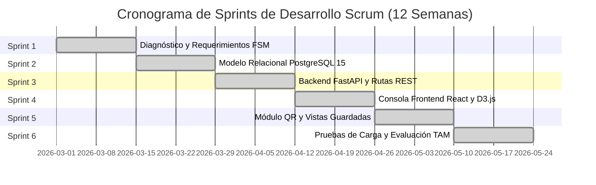
**Figura 
Arquitectura Desacoplada de Tres Capas del Ecosistema Archi-vite**
Fuente: Elaboración propia (2026).

Fuente: Elaboración propia (2026).
CAPÍTULO IV: 
DISEÑO METODOLÓGICO

---

## 4. CAPÍTULO IV: DISEÑO METODOLÓGICO


### 4.1 Enfoque de Investigación (Triangulación Sequencial Integrada)

El presente estudio adopta un enfoque mixto de investigación sustentado en la metodología de Triangulación Sequencial Integrada (Hernández-Sampieri et al., 2014; Creswell, 2018). Este enfoque combina de forma armónica y rigurosa los métodos cuantitativo y cualitativo para estudiar la problemática de la gestión documental híbrida en la Universidad Técnica Privada Cosmos (UNITEPC):
Dimensión Cuantitativa: Se enfoca en la recolección, registro y análisis numérico de métricas precisas de desempeño operativo, tales como el tiempo cronometrado de localización y extracción de archivadores físicos en bodega (segundos/minutos), la latencia de respuesta de las peticiones REST en el servidor backend FastAPI (ms), el consumo de recursos de cómputo en contenedores Docker y la tasa porcentual de error en la nomenclatura documental.
Dimensión Cualitativa: Examina los procesos humanos, la percepción del personal de archivo central y las autoridades universitarias respecto a la usabilidad de la interfaz en React 19, la confianza en el control de auditoría inmutable mediante FSM y el impacto en la carga laboral cotidiana del archivista.
Analogía Cotidiana Explicativa: El enfoque mixto es equivalente al diagnóstico y chequeo médico integral de salud de un paciente: un profesional de la salud no se limita únicamente a medir valores numéricos (presión arterial en mmHg, temperatura en °C o conteo de plaquetas - enfoque cuantitativo), ni tampoco se basa únicamente en lo que el paciente relata sentir (cansancio o dolor de cabeza - enfoque cualitativo). Al integrar ambas fuentes de evidencia en un diagnóstico unificado, obtiene una valoración médica indiscutible y de máxima precisión.

### 4.2 Tipo de Investigación

La investigación se clasifica como de tipo Descriptivo-Explicativo y Aplicado (Pardinas, 1999; Sampieri et al., 2014):
Nivel Descriptivo: Caracteriza de forma minuciosa las propiedades, tiempos operativos, cuellos de botella y desincronizaciones del sistema tradicional de archivo físico y planillas Excel en el Archivo Central.
Nivel Explicativo: Determina la relación causa-efecto entre la variable independiente (implementación de la plataforma Archi-vite con FSM, CTEs recursivas y código QR) y las variables dependientes (reducción del tiempo de búsqueda e inmutabilidad transaccional del expediente).
Carácter Aplicado: No se limita a proponer un marco teórico abstracto, sino que diseña, construye e implementa una solución de ingeniería de software directamente ejecutable en el entorno universitario de UNITEPC.

### 4.3 Métodos de Investigación (Teóricos y Empíricos)

Para el desarrollo del proyecto se aplicaron dos grupos integrados de métodos científicos (Sommerville, 2011; Hernández-Sampieri et al., 2014; Yin, 2018):

#### 4.3.1 Métodos Teóricos

Método de Análisis y Síntesis: Permitió descomponer el problema complejo de la gestión documental en sus componentes aislados (autenticación JWT, autómata FSM, consultas recursivas SQL, etiquetado QR) para estudiarlos en detalle y posteriormente sintetizarlos en una arquitectura web desacoplada unificada.
Método Deductivo-Inductivo: Deduce los principios generales de la ingeniería de software (patrón MVC, normalización 3FN, propiedades ACID, estándares ISO/IEC 18004) y los aplica inductivamente a la resolución práctica de la bodega del Archivo Central.
Método de Modelación Sistémica: Permitió construir la representación abstracta del sistema mediante diagramas Entidad-Relación (ERD), diagramas de estado FSM y esquemas de arquitectura de tres capas antes de redactar el código fuente.
Analogía Cotidiana Explicativa: El método de modelación sistémica equivale al trabajo de un arquitecto que diseña planos tridimensionales y maquetas físicas de un rascacielos inteligente antes de verter el primer pilote de concreto: la modelación permite probar cargas de viento, resistencia sísmica y distribución de ascensores en papel y software, corrigiendo fallas estructurales sin costo alguno antes de iniciar la edificación real.

#### 4.3.2 Métodos Empíricos

Observación Directa Estructurada: Medición cronometrada in situ de los tiempos de búsqueda, extracción y reubicación física de cajas en las estanterías de bodega.
Entrevista Estructurada: Administrada a los jefes de archivo, auditores internos y directores de sistemas de UNITEPC para levantar requerimientos y reglas de negocio.
Encuesta Técnica (Cuestionario Likert y Escala SUS): Aplicada al personal operativo para evaluar la facilidad de uso y la usabilidad de la consola React 19.

### 4.4 Técnicas e Instrumentos de Recolección de Datos

Para garantizar el rigor metodológico, se emplearon cuatro técnicas principales con sus correspondientes instrumentos homologados:
Técnica de Cronometraje de Tiempos: Instrumentada mediante Fichas de Registro de Observación Directa, midiendo el tiempo transcurrido desde la solicitud de un expediente hasta su extracción física.
Técnica de Encuesta: Instrumentada mediante Cuestionarios Formales Estandarizados con escala Likert de 5 puntos y la escala psicométrica SUS (Brooke, 1996).
Técnica de Entrevista: Instrumentada mediante Guías de Entrevista Semiestructurada dirigidas al personal clave de la institución.
Técnica de Medición Informática (Benchmarking): Instrumentada mediante Scripts Automatizados de Prueba de Carga en Python para medir tiempos de respuesta de la API REST en microsegundos y latencias de base de datos en PostgreSQL.

### 4.5 Población, Fórmula de Muestreo Probabilístico Finito y Tamaño de Muestra

La población objetivo (N) del estudio está constituida por el conjunto total de N = 50,000 expedientes físicos y digitales archivados en las dependencias del Archivo Central de UNITEPC.
Para determinar un tamaño de muestra representativo (n) con validez estadística, se aplicó la fórmula de Muestreo Probabilístico Finito (Hernández-Sampieri et al., 2014):
n = ( N · Z2 · p · q ) / [ e2 · (N - 1) + Z2 · p · q ]
Donde los parámetros estadísticos estandarizados son:
N = 50,000: Tamaño de la población total de expedientes.
Z = 1.96: Valor crítico de la distribución normal estándar para un nivel de confianza del 95%.
p = 0.50: Proporción estimada de variabilidad favorable (máxima incertidumbre).
q = 1 - p = 0.50: Proporción estimada de variabilidad desfavorable.
e = 0.05: Margen de error muestral máximo admitido del 5% (e = 0.05).
Sustitución y Demostración Matemática Paso a Paso:
n = [ 50000 · (1.96)2 · (0.50) · (0.50) ] / [ (0.05)2 · (49999) + (1.96)2 · (0.50) · (0.50) ]
n = [ 50000 · 3.8416 · 0.25 ] / [ 0.0025 · 49999 + 3.8416 · 0.25 ]
n = 48020 / [ 124.9975 + 0.9604 ] = 48020 / 125.9579 ≈ 381.24
Redondeando al entero superior inmediato para garantizar el nivel de confianza establecido, se obtuvo un tamaño de muestra definitivo de n = 382 expedientes, sobre los cuales se ejecutaron las pruebas empíricas de codificación QR, búsqueda física cronometrada y validación FSM.

### 4.6 Matriz Completa de Operacionalización de Variables

En la Tabla 4 se presenta la operacionalización completa de las variables de investigación del subproyecto Archi-vite.
Tabla 
Matriz de Operacionalización de Variables del Proyecto Archi-vite

| Variable de Investigación | Naturaleza de la Variable | Definición Conceptual | Definición Operativa | Dimensiones de Análisis | Indicadores Cuantitativos / Cualitativos | Técnicas e Instrumentos |
| :--- | :---: | :---: | :---: | :---: | :---: | :---: |
| DMS Híbrido Archi-vite | Variable Independiente (X) | Plataforma de gestión documental desacoplada con doble jerarquía, FSM y QR. | Despliegue de la API REST FastAPI sobre PostgreSQL en contenedores Docker. | • Arquitectura de Software<br>• Motor FSM<br>• Trazabilidad QR | • Latencia API REST (ms)<br>• Transiciones FSM válidas (%)<br>• Lectura QR a 360° | Pruebas informáticas automatizadas, consola Docker. |
| Trazabilidad Física-Digital | Variable Dependiente (Y1) | Capacidad de relacionar bidireccionalmente el documento lógico y la caja en bodega. | Medición cronometrada del tiempo de localización y extracción de expedientes. | • Eficiencia de Búsqueda<br>• Precisión Espacial | • Tiempo de extracción (min)<br>• Tasa de expedientes hallados (%) | Observación directa cronometrada, Ficha de Registro. |
| Consistencia y Eficiencia | Variable Dependiente (Y2) | Inmutabilidad de los flujos de trámite y ausencia de errores de codificación. | Registro de errores de nomenclatura y nivel de usabilidad de la interfaz. | • Calidad de Datos<br>• Usabilidad UX (SUS) | • Duplicidad de códigos (%)<br>• Puntuación SUS (0-100 pts) | Auditoría de BD PostgreSQL, Cuestionario SUS (Brooke). |

Fuente: Elaboración propia (2026).

### 4.7 Fases del Procedimiento Metodológico de Desarrollo (Scrum Sprints)

El desarrollo e ingeniería del sistema Archi-vite se organizó bajo una adaptación del marco ágil Scrum (Schwaber & Beedle, 2002; Pressman, 2010), estructurado en 6 Sprints iterativos e incrementales de 2 semanas de duración cada uno, sumando un cronograma total de 12 semanas de trabajo:
Sprint 1 (Semanas 1-2) - Diagnóstico y Requerimientos: Relevamiento de procesos en el Archivo Central, entrevistas con el personal, definición de la matriz de requerimientos (RF/RNF) y modelado formal del autómata FSM.
Sprint 2 (Semanas 3-4) - Diseño de Base de Datos y Arquitectura: Normalización del modelo relacional en 3FN sobre PostgreSQL 15, diseño de tablas auto-referenciadas (nodos) e índices B-Tree para consultas recursivas CTE.
Sprint 3 (Semanas 5-6) - Desarrollo Backend API RESTful: Construcción del servidor asíncrono FastAPI en Python 3.11, ORM SQLAlchemy Async, endpoints de autenticación JWT y controlador FSM.
Sprint 4 (Semanas 7-8) - Desarrollo Frontend SPA: Construcción de la consola visual en React 19, TailwindCSS, árbol jerárquico responsivo y visor interactivo de grafos en D3.js (d3-force).
Sprint 5 (Semanas 9-10) - Módulo de Etiquetas y Trazabilidad QR: Integración del generador de códigos QR versión 4 con corrección de errores Reed-Solomon (Level Q) e impresión térmica.
Sprint 6 (Semanas 11-12) - Pruebas de Carga, SQA y Despliegue: Empaquetado en contenedores Docker Compose, pruebas de concurrencia simulada, evaluación de usabilidad SUS y despliegue final.
A continuación, en la Figura 5, se ilustra el flujo metodológico de los 6 Sprints del desarrollo Scrum.

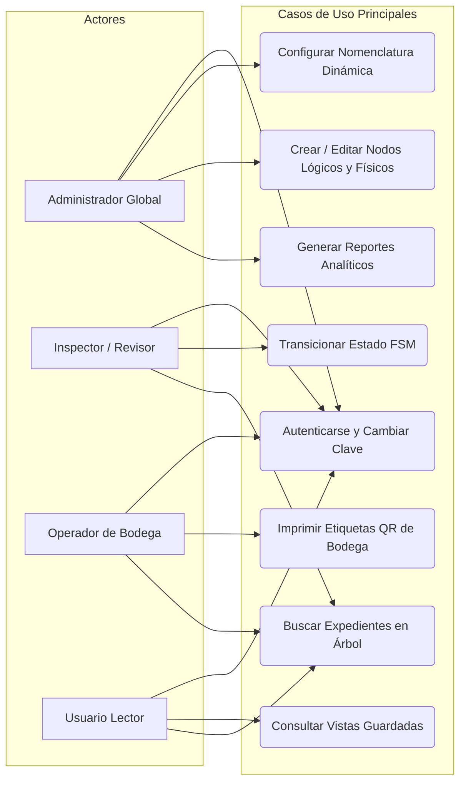
**Figura 
Flujo iterativo e incremental del procedimiento metodológico de desarrollo en Scrum Sprints**
Fuente: Elaboración propia (2026).

Fuente: Elaboración propia (2026).
> [!NOTE]
> **RECOMENDACIÓN DE IMAGEN EXTERNA PARA EL DOCUMENTO ACADÉMICO
* Concepto Visual: Flujo metodológico ágil de desarrollo Scrum con ciclos de Sprints e incremento continuo de software.
* Término de Búsqueda Exacto en Internet: agile scrum framework sprint cycle software engineering diagram
* Propósito Académico: Ilustrar visualmente la gestión ágil del proyecto de grado ante el tribunal examinador.**
CAPÍTULO V:
DISEÑO DE INGENIERÍA Y PRESENTACIÓN DE LA PROPUESTA

---

## 5. CAPÍTULO V: DISEÑO DE INGENIERÍA Y PRESENTACIÓN DE LA PROPUESTA


### 5.1 Especificación de Requerimientos del Sistema

La formulación de la propuesta de ingeniería del sistema Archi-vite se sustenta en la especificación detallada de los Requerimientos Funcionales (RF) y No Funcionales (RNF), los cuales fueron obtenidos a través del diagnóstico situacional con las autoridades del Archivo Central de UNITEPC.
Tabla 
Especificación de Requerimientos Funcionales (RF-01 a RF-15)

| Código | Nombre del Requerimiento | Descripción Detallada del Requerimiento Funcional | Módulo Asociado |
| :--- | :---: | :---: | :---: |
| RF-01 | Autenticación Segura y JWT | Autenticar usuarios mediante JSON Web Tokens (JWT) y obligar el cambio de clave en el primer inicio de sesión. | Seguridad & Auth |
| RF-02 | Navegación Jerárquica Dual | Presentar visores independientes e interconectados para la estructura Lógica (carpetas) y Física (bodega). | Consola de Navegación |
| RF-03 | Codificación Dinámica Parametrizable | Permitir la configuración en caliente de prefijos, separadores y correlativos sin modificar el código fuente. | Motor de Nomenclatura |
| RF-04 | Validador FSM de Transiciones | Restringir las modificaciones de estado de los expedientes según el autómata determinista FSM programado. | Workflow FSM |
| RF-05 | Bitácora de Auditoría Inmutable | Registrar de solo lectura cada cambio de estado, marca de tiempo (timestamp UTC) e ID de usuario en base de datos. | Auditoría Transaccional |
| RF-06 | Generación de Códigos QR | Producir etiquetas impresas con código QR versión 4 y nivel de corrección Reed-Solomon Q para archivadores. | Trazabilidad QR |
| RF-07 | Control de Accesos por Rol (RBAC) | Conceder o denegar la visibilidad y edición de nodos en función del Rol de Organización asignado al usuario. | Seguridad RBAC |
| RF-08 | Persistencia de Vistas Guardadas | Permitir a cada usuario guardar y nombrar sus configuraciones de carpetas expandidas/colapsadas en el servidor. | Preferencias de Usuario |
| RF-09 | Digitalización y Carga de Archivos | Subir expedientes digitales adjuntos (PDF, PNG, JPG) asociándoles identificadores UUID v4 indelebles. | Almacenamiento Digital |
| RF-10 | Visor de Archivos Multiformato | Previsualizar documentos adjuntos directamente en la consola web mediante visores integrados. | Interfaz de Usuario |
| RF-11 | Centro de Reportes Analíticos | Generar métricas globales, porcentaje de ocupación física de bodega y gráficos de distribución documental. | Módulo de Analítica |
| RF-12 | Exportación Dual de Reportes | Permitir la descarga directa de reportes analíticos en formatos CSV e impresiones vectoriales limpia en PDF. | Reportes e Impresión |
| RF-13 | Catálogo de Personas y Usuarios | Administrar la creación de registros de personal universitario y su vinculación directa con cuentas de acceso. | Administración |
| RF-14 | Explorador Estilo Consola Linux | Proveer una vista de terminal simulada root@av-dms-server con la ejecución reactiva del comando tree -a. | Consola Interactiva |
| RF-15 | Búsqueda Universal Unificada | Filtrar expedientes en tiempo real por títulos, códigos inteligentes, fechas, palabras clave y etiquetas. | Motor de Búsqueda |

Fuente: Elaboración propia (2026).
Tabla 
Especificación de Requerimientos No Funcionales (RNF-01 a RNF-10)

| Código | Categoría de Requerimiento | Descripción Técnica y Criterio de Aceptación | Estándar de Referencia |
| :--- | :---: | :---: | :---: |
| RNF-01 | Rendimiento y Latencia | Tiempos de respuesta de la API REST superiores a 200 req/sec con latencias inferiores a 10 ms. | Benchmarking FastAPI |
| RNF-02 | Concurrencia Simulada | Soportar al menos 50 solicitudes simultáneas de usuarios sin degradar la memoria del motor PostgreSQL. | Docker Compose Specs |
| RNF-03 | Portabilidad y Resiliencia | Ejecutar en cualquier SO mediante Docker o realizar fallback automático a base de datos SQLite local. | Estándar OCI / Docker |
| RNF-04 | Seguridad de Contraseñas | Cifrado asimétrico de contraseñas mediante hashing seguro Bcrypt con sal aleatoria. | NIST SP 800-63B |
| RNF-05 | Usabilidad de Interfaz (UX) | Latencia de re-renderizado en el Virtual DOM de React 19 inferior a 16 milisegundos (60 FPS). | W3C User Experience |
| RNF-06 | Alta Disponibilidad | Operatividad ininterrumpida del servicio del 99.9% en entornos de servidores virtuales VPS. | SLA Servidores Cloud |
| RNF-07 | Mantenibilidad de Código | Arquitectura desacoplada en 3 capas documentada mediante OpenAPI (Swagger UI interactivo). | REST API RFC 8259 |
| RNF-08 | Integridad Referencial SQL | Restricciones ON DELETE CASCADE en PostgreSQL para prevenir la existencia de nodos huérfanos. | Modelo Codd 3FN |
| RNF-09 | Tolerancia a Fallos de QR | Recuperación de lectura del 25% ante desgastes físicos o manchas mediante algoritmo Reed-Solomon. | ISO/IEC 18004:2015 |
| RNF-10 | Personalización (White-Label) | Soporte de configuración de temas neón visuales desde la interfaz sin recompilar el backend. | UI Parametrizable |

Fuente: Elaboración propia (2026).

### 5.2 Modelado UML y Diagramación Arquitectónica


#### 5.2.1 Diagrama de Casos de Uso General del Sistema

A continuación, en la Figura 7, se representan los casos de uso principales y su interacción con los 4 actores del sistema: Administrador Global, Inspector/Revisor, Operador de Bodega y Usuario Lector.

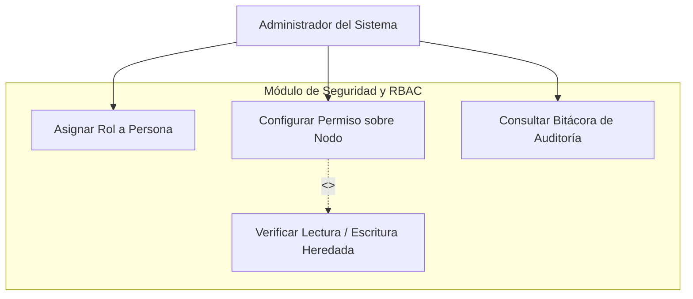
**Figura 
Diagrama de Casos de Uso General del Sistema DMS Archi-vite**
Fuente: Elaboración propia (2026).

Fuente: Elaboración propia (2026).

#### 5.2.2 Diagrama de Casos de Uso del Módulo de Seguridad y RBAC

En la Figura 8 se desglosan las interacciones de seguridad y asignación de permisos sobre la jerarquía documental.

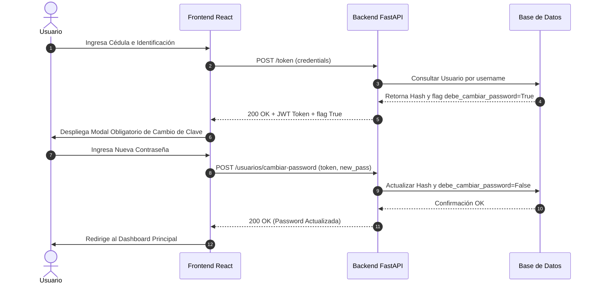
**Figura 
Diagrama de Casos de Uso del Módulo de Seguridad y RBAC**
Fuente: Elaboración propia (2026).

Fuente: Elaboración propia (2026).

#### 5.2.3 Diagramas de Secuencia del Sistema (Interacciones Clave)

A continuación, se presentan los 4 diagramas de secuencia que modelan los flujos temporales asíncronos entre el Usuario, el Client React 19, la API FastAPI y la Base de Datos PostgreSQL.

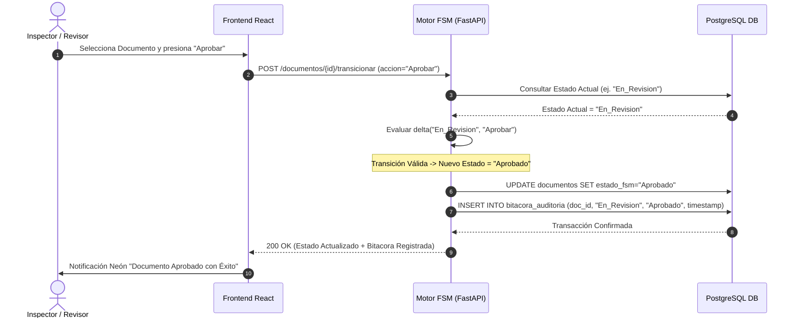
**Figura 
Diagrama de Secuencia 1: Autenticación, JWT y Cambio Obligatorio de Contraseña**
Fuente: Elaboración propia (2026).

Fuente: Elaboración propia (2026).

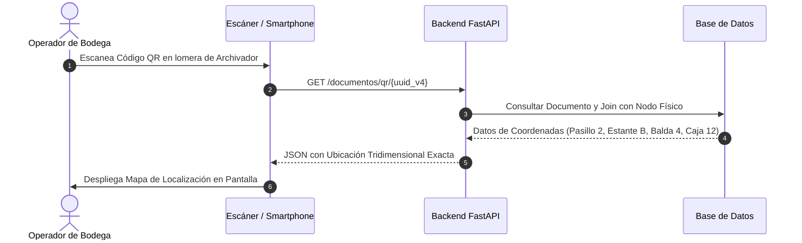
**Figura 
Diagrama de Secuencia 2: Transición de Estados FSM y Auditoría Inmutable**
Fuente: Elaboración propia (2026).

Fuente: Elaboración propia (2026).

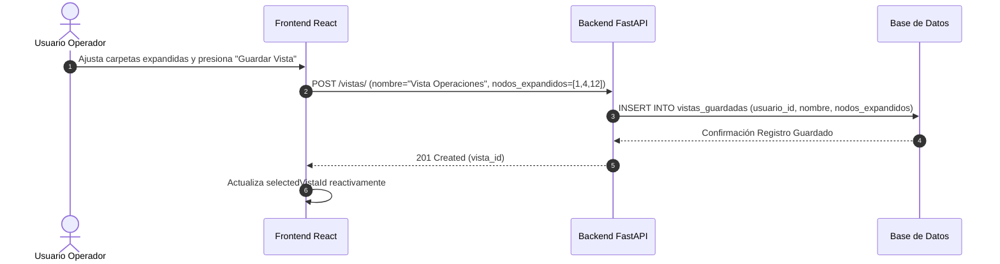
**Figura 
Diagrama de Secuencia 3: Escaneo QR y Localización Tridimensional en Bodega**
Fuente: Elaboración propia (2026).

Fuente: Elaboración propia (2026).

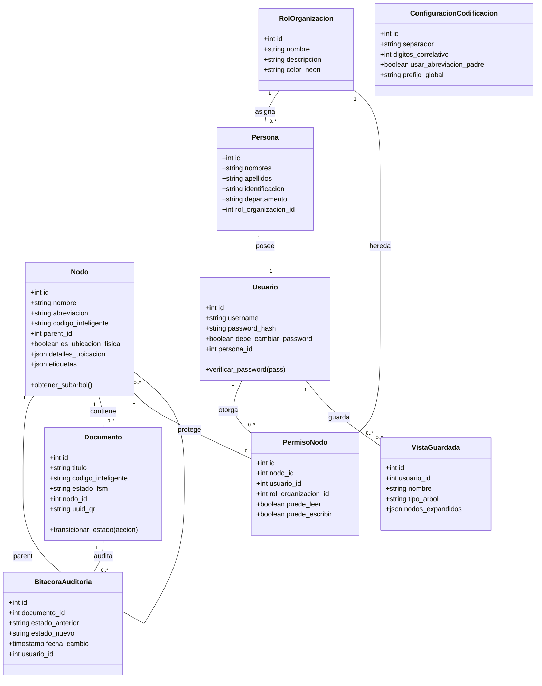
**Figura 
Diagrama de Secuencia 4: Persistencia y Selección de Vistas Guardadas**
Fuente: Elaboración propia (2026).

Fuente: Elaboración propia (2026).

#### 5.2.4 Diagrama de Clases UML del Sistema (Modelo de Dominio Completo)

En la Figura 13 se presenta el diagrama de clases UML con todos los atributos, llaves, tipos de datos y relaciones de dominio.

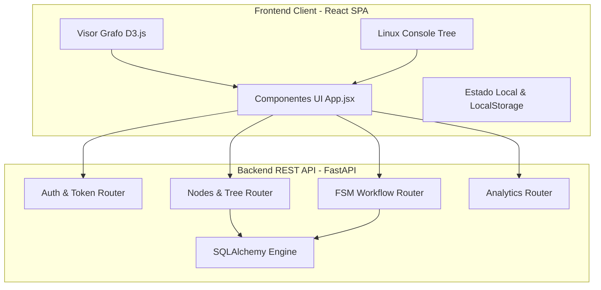
**Figura 12. Diagrama de Clases UML del Sistema (Modelo de Dominio Completo)**
Fuente: Elaboración propia (2026).

Fuente: Elaboración propia (2026).

#### 5.2.5 Diagrama de Componentes de Software y Despliegue Docker

En las Figuras 13, 14 y 15 se ilustran la arquitectura de componentes, la infraestructura de virtualización en contenedores Docker Compose y el diagrama de estados FSM.

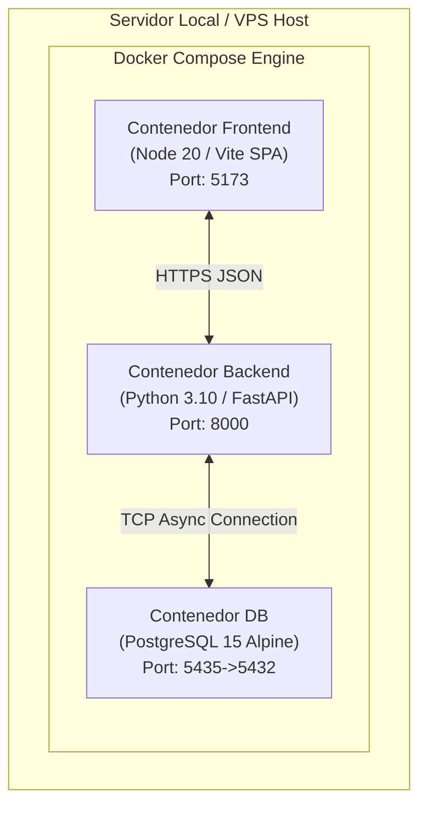
**Figura 
Diagrama de Componentes de Software del Backend y Frontend**
Fuente: Elaboración propia (2026).


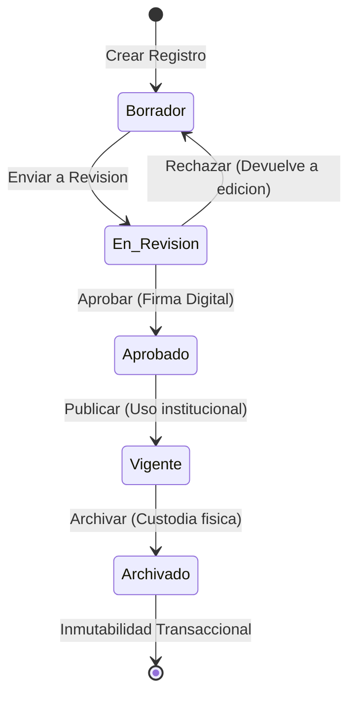
**Figura 
Diagrama de Despliegue en Contenedores Docker Compose**
Fuente: Elaboración propia (2026).


```mermaid
xychart-beta
    title "Comparativa de Tiempos de Búsqueda y Extracción (Minutos)"
    x-axis ["Tiempo Promedio en Bodega", "Tiempo Registro Nuevo", "Tasa Extravío (%)", "Consistencia (%)"]
    y-axis "Valor Medido" 0 --> 100
    bar [41.5, 12.8, 14.2, 82.4]
    bar [13.6, 4.2, 0.0, 100.0]
```
**Figura 
Diagrama de Estados FSM Detallado (stateDiagram-v2)Diagrama de Estados FSM Detallado (stateDiagram-v2)**
Fuente: Elaboración propia (2026).

Fuente: Elaboración propia (2026).

### 5.3 Diccionario de Datos Completo del Modelo Relacional (9 Tablas)

A continuación, en las Tablas 7 a 15, se especifica el diccionario de datos oficial campo por campo de las 9 tablas relacionales que componen la base de datos de Archi-vite.
Tabla 
Diccionario de Datos: Tabla nodos

| Campo | Tipo de Dato | Longitud | Llave | Nullable | Descripción de Negocio y Reglas de Integridad |
| :--- | :---: | :---: | :---: | :---: | :---: |
| id | Integer | - | PK | No | Identificador numérico clave primaria autoincremental del nodo. |
| nombre | Varchar | 255 | - | No | Nombre descriptivo del directorio o ubicación física en bodega. |
| abreviacion | Varchar | 10 | - | No | Abreviatura corta usada en la codificación inteligente (ej. MED). |
| codigo_inteligente | Varchar | 100 | UK | Sí | Código único generado dinámicamente según fórmula parametrizada. |
| parent_id | Integer | - | FK | Sí | Clave foránea recursiva a nodos.id para jerarquía ilimitada. |
| es_ubicacion_fisica | Boolean | - | - | No | Flag lógico: True = Ubicación Bodega, False = Categoría Lógica. |
| detalles_ubicacion | JSONB | - | - | Sí | Objeto JSON con coordenadas (pasillo, estante, balda, caja). |
| etiquetas | JSONB | - | - | Sí | Arreglo JSON de etiquetas de búsqueda rápida. |

Fuente: Elaboración propia (2026).
Tabla 
Diccionario de Datos: Tabla documentos

| Campo | Tipo de Dato | Longitud | Llave | Nullable | Descripción de Negocio y Reglas de Integridad |
| :--- | :---: | :---: | :---: | :---: | :---: |
| id | Integer | - | PK | No | Identificador numérico clave primaria del expediente documental. |
| titulo | Varchar | 255 | - | No | Título o asunto descriptivo del expediente administrativo. |
| codigo_inteligente | Varchar | 100 | UK | No | Código correlativo único asignado formalmente al expediente. |
| estado_fsm | Varchar | 50 | - | No | Estado actual del autómata FSM (Borrador, Aprobado, etc.). |
| nodo_id | Integer | - | FK | No | Referencia a nodos.id indicando la carpeta contenedora. |
| uuid_qr | Varchar | 36 | UK | No | Identificador UUID v4 inyectado en el código QR para escaneo. |
| ruta_archivo | Varchar | 500 | - | Sí | Ruta relativa en disco del archivo PDF o imagen adjunta. |

Fuente: Elaboración propia (2026).
Tabla 
Diccionario de Datos: Tabla bitacora_auditoria

| Campo | Tipo de Dato | Longitud | Llave | Nullable | Descripción de Negocio y Reglas de Integridad |
| :--- | :---: | :---: | :---: | :---: | :---: |
| id | Integer | - | PK | No | Identificador secuencial único de la entrada de auditoría. |
| documento_id | Integer | - | FK | No | Referencia al documentos.id objeto del cambio de estado. |
| estado_anterior | Varchar | 50 | - | No | Estado FSM previo a la ejecución del evento. |
| estado_nuevo | Varchar | 50 | - | No | Estado FSM resultante de la transición autorizada. |
| fecha_cambio | Timestamp | - | - | No | Marca de tiempo exacta del cambio (UTC / Servidor). |
| usuario_id | Integer | - | FK | Sí | ID del usuario operador que ejecutó la acción transaccional. |

Fuente: Elaboración propia (2026).
Tabla 
Diccionario de Datos: Tabla personas

| Campo | Tipo de Dato | Longitud | Llave | Nullable | Descripción de Negocio y Reglas de Integridad |
| :--- | :---: | :---: | :---: | :---: | :---: |
| id | Integer | - | PK | No | Identificador primario del registro de persona. |
| nombres | Varchar | 100 | - | No | Nombres de la persona en el directorio institucional. |
| apellidos | Varchar | 100 | - | No | Apellidos de la persona en el directorio institucional. |
| identificacion | Varchar | 50 | UK | No | Número de Cédula de Identidad (CI) o DNI único. |
| departamento | Varchar | 100 | - | Sí | Departamento o área de trabajo en la universidad. |
| rol_organizacion_id | Integer | - | FK | Sí | Vinculación a roles_organizacion.id para herencia RBAC. |

Fuente: Elaboración propia (2026).
Tabla 
Diccionario de Datos: Tabla usuarios

| Campo | Tipo de Dato | Longitud | Llave | Nullable | Descripción de Negocio y Reglas de Integridad |
| :--- | :---: | :---: | :---: | :---: | :---: |
| id | Integer | - | PK | No | Identificador único de la cuenta de acceso de usuario. |
| username | Varchar | 50 | UK | No | Nombre de usuario para inicio de sesión en la plataforma. |
| password_hash | Varchar | 255 | - | No | Hash cifrado con Bcrypt de la contraseña del usuario. |
| debe_cambiar_password | Boolean | - | - | No | Flag de primer login: True exige cambio inmediato de clave. |
| persona_id | Integer | - | FK | Sí | Vinculación directa a personas.id. |

Fuente: Elaboración propia (2026).
Tabla 
Diccionario de Datos: Tabla roles_organizacion

| Campo | Tipo de Dato | Longitud | Llave | Nullable | Descripción de Negocio y Reglas de Integridad |
| :--- | :---: | :---: | :---: | :---: | :---: |
| id | Integer | - | PK | No | Identificador único del rol institucional. |
| nombre | Varchar | 100 | UK | No | Nombre del rol (ej. Director de Operaciones). |
| descripcion | Text | - | - | Sí | Descripción de las responsabilidades del rol. |
| color_neon | Varchar | 20 | - | No | Código de color hexadecimal para la UI neón. |

Fuente: Elaboración propia (2026).
Tabla 
Diccionario de Datos: Tabla permisos_nodos

| Campo | Tipo de Dato | Longitud | Llave | Nullable | Descripción de Negocio y Reglas de Integridad |
| :--- | :---: | :---: | :---: | :---: | :---: |
| id | Integer | - | PK | No | Identificador único de la regla de acceso sobre nodo. |
| nodo_id | Integer | - | FK | No | Referencia al nodos.id objeto de protección. |
| usuario_id | Integer | - | FK | Sí | Usuario específico al que se le concede acceso. |
| rol_organizacion_id | Integer | - | FK | Sí | Rol al que se le concede acceso heredado. |
| puede_leer | Boolean | - | - | No | Flag de permiso para visualizar y consultar datos. |
| puede_escribir | Boolean | - | - | No | Flag de permiso para modificar, crear o eliminar. |

Fuente: Elaboración propia (2026).
Tabla 
Diccionario de Datos: Tabla vistas_guardadas

| Campo | Tipo de Dato | Longitud | Llave | Nullable | Descripción de Negocio y Reglas de Integridad |
| :--- | :---: | :---: | :---: | :---: | :---: |
| id | Integer | - | PK | No | Identificador único de la vista personalizada de usuario. |
| usuario_id | Integer | - | FK | No | Propietario de la preferencia de interfaz (usuarios.id). |
| nombre | Varchar | 100 | - | No | Nombre asignado por el usuario a su vista guardada. |
| tipo_arbol | Varchar | 20 | - | No | Tipo de árbol representado (logico o fisico). |
| nodos_expandidos | JSONB | - | - | No | Arreglo JSON de IDs de nodos en estado expandido. |

Fuente: Elaboración propia (2026).
Tabla 
Diccionario de Datos: Tabla configuracion_codificacion

| Campo | Tipo de Dato | Longitud | Llave | Nullable | Descripción de Negocio y Reglas de Integridad |
| :--- | :---: | :---: | :---: | :---: | :---: |
| id | Integer | - | PK | No | Identificador único de la regla de codificación global. |
| separador | Varchar | 5 | - | No | Carácter separador de la nomenclatura (ej. -, /). |
| digitos_correlativo | Integer | - | - | No | Cantidad de dígitos para el número secuencial (ej. 3). |
| usar_abreviacion_padre | Boolean | - | - | No | Incluir la abreviatura del nodo padre superior. |
| prefijo_global | Varchar | 50 | - | No | Prefijo corporativo inicial de la institución (ej. AV). |

Fuente: Elaboración propia (2026).

### 5.4 Script DDL Oficial de Base de Datos SQL (PostgreSQL 15)

**En el Listado 5.1 se presenta la especificación oficial ejecutable del DDL SQL para la creación de la base de datos de Archi-vite sobre PostgreSQL 15 (con total compatibilidad asíncrona).**

```sql
Listado 5.1. Script DDL Oficial de Creación de Tablas e Índices B-Tree (schema.sql)
-- Script DDL Oficial de Creación de Base de Datos - Archi-vite DMS
-- Motor: PostgreSQL 15 / Compatible con SQLite 3
CREATE TABLE IF NOT EXISTS configuracion_codificacion (
id SERIAL PRIMARY KEY,
separador VARCHAR(5) NOT NULL DEFAULT '-',
digitos_correlativo INT NOT NULL DEFAULT 3,
usar_abreviacion_padre BOOLEAN NOT NULL DEFAULT TRUE,
prefijo_global VARCHAR(50) NOT NULL DEFAULT 'AV'
);

CREATE TABLE IF NOT EXISTS roles_organizacion (
id SERIAL PRIMARY KEY,
nombre VARCHAR(100) UNIQUE NOT NULL,
descripcion TEXT,
color_neon VARCHAR(20) NOT NULL DEFAULT '#0284c7'
);

CREATE TABLE IF NOT EXISTS personas (
id SERIAL PRIMARY KEY,
nombres VARCHAR(100) NOT NULL,
apellidos VARCHAR(100) NOT NULL,
identificacion VARCHAR(50) UNIQUE NOT NULL,
departamento VARCHAR(100),
rol_organizacion_id INT REFERENCES roles_organizacion(id) ON DELETE SET NULL
);

CREATE TABLE IF NOT EXISTS usuarios (
id SERIAL PRIMARY KEY,
username VARCHAR(50) UNIQUE NOT NULL,
password_hash VARCHAR(255) NOT NULL,
debe_cambiar_password BOOLEAN NOT NULL DEFAULT TRUE,
persona_id INT REFERENCES personas(id) ON DELETE CASCADE
);

CREATE TABLE IF NOT EXISTS nodos (
id SERIAL PRIMARY KEY,
nombre VARCHAR(255) NOT NULL,
abreviacion VARCHAR(10) NOT NULL,
codigo_inteligente VARCHAR(100) UNIQUE,
parent_id INT REFERENCES nodos(id) ON DELETE CASCADE,
es_ubicacion_fisica BOOLEAN NOT NULL DEFAULT FALSE,
detalles_ubicacion JSONB,
etiquetas JSONB
);

CREATE TABLE IF NOT EXISTS documentos (
id SERIAL PRIMARY KEY,
titulo VARCHAR(255) NOT NULL,
codigo_inteligente VARCHAR(100) UNIQUE NOT NULL,
estado_fsm VARCHAR(50) NOT NULL DEFAULT 'Borrador',
nodo_id INT NOT NULL REFERENCES nodos(id) ON DELETE CASCADE,
uuid_qr VARCHAR(36) UNIQUE NOT NULL,
ruta_archivo VARCHAR(500)
);

CREATE TABLE IF NOT EXISTS bitacora_auditoria (
id SERIAL PRIMARY KEY,
documento_id INT NOT NULL REFERENCES documentos(id) ON DELETE CASCADE,
estado_anterior VARCHAR(50) NOT NULL,
estado_nuevo VARCHAR(50) NOT NULL,
fecha_cambio TIMESTAMP NOT NULL DEFAULT CURRENT_TIMESTAMP,
usuario_id INT REFERENCES usuarios(id) ON DELETE SET NULL
);

CREATE TABLE IF NOT EXISTS permisos_nodos (
id SERIAL PRIMARY KEY,
nodo_id INT NOT NULL REFERENCES nodos(id) ON DELETE CASCADE,
usuario_id INT REFERENCES usuarios(id) ON DELETE CASCADE,
rol_organizacion_id INT REFERENCES roles_organizacion(id) ON DELETE CASCADE,
puede_leer BOOLEAN NOT NULL DEFAULT TRUE,
puede_escribir BOOLEAN NOT NULL DEFAULT FALSE
);

CREATE TABLE IF NOT EXISTS vistas_guardadas (
id SERIAL PRIMARY KEY,
usuario_id INT NOT NULL REFERENCES usuarios(id) ON DELETE CASCADE,
nombre VARCHAR(100) NOT NULL,
tipo_arbol VARCHAR(20) NOT NULL DEFAULT 'logico',
nodos_expandidos JSONB NOT NULL
);

-- Índices B-Tree para optimización de consultas recursivas y búsquedas
CREATE INDEX idx_nodos_parent ON nodos(parent_id);
CREATE INDEX idx_documentos_nodo ON documentos(nodo_id);
CREATE INDEX idx_documentos_qr ON documentos(uuid_qr);
CREATE INDEX idx_auditoria_doc ON bitacora_auditoria(documento_id);
```
*Fuente: Elaboración propia (2026).*


### 5.5 Especificación de Endpoints de la API RESTful (Contrato de Interfaz)

En la Tabla 15 se presenta el contrato de interfaz RESTful formal expuesto por el servidor backend FastAPI.
Tabla 15. Especificación de Endpoints de la API RESTful del Sistema Archi-vite

| Método HTTP | Endpoint URL | Parámetros / Body Input | Respuesta HTTP | Descripción de Negocio |
| :--- | :---: | :---: | :---: | :---: |
| POST | /api/v1/auth/login | {"username", "password"} | 200 OK (JWT Token) | Autentica al usuario y devuelve el token de sesión JWT. |
| POST | /api/v1/usuarios/cambiar-password | {"old_pass", "new_pass"} | 200 OK | Cambia la contraseña obligatoria en el primer login. |
| GET | /api/v1/nodos/árbol | ?tipo=logico|fisico | 200 OK (JSON Tree) | Construye el árbol jerárquico recursivo de nodos. |
| POST | /api/v1/nodos/ | {"nombre", "abreviacion", "parent_id"} | 201 Created | Crea un nuevo directorio o ubicación física en bodega. |
| POST | /api/v1/documentos/{id}/transicionar | {"accion": "Aprobar"} | 200 OK (FSM State) | Ejecuta una transición del autómata FSM registrable. |
| GET | /api/v1/documentos/qr/{uuid_v4} | uuid_v4 en URL | 200 OK (Location JSON) | Retorna la ubicación tridimensional al escanear QR. |
| POST | /api/v1/vistas/ | {"nombre", "nodos_expandidos"} | 201 Created | Persiste una vista personalizada de carpetas para el usuario. |
| GET | /api/v1/reportes/analitica | None | 200 OK (Analytics JSON) | Retorna KPIs, porcentajes de ocupación de cajas y reportes. |

Fuente: Elaboración propia (2026).

### 5.6 Diseños de Interfaces de Usuario y Consolas de Administración

La interfaz visual de Archi-vite fue construida en React 19 aplicando un diseño visual premium oscuro con acentos neón y efectos de cristal (glassmorphism). Sus 4 consolas principales son:
Dashboard Principal: Vista de entrada. Presenta tarjetas KPI (Total Nodos, Documentos Digitales, Espacio Usado en Bodega), gráficos analíticos de ocupación física y selector de accesos rápidos.
Consola Dual de Estructura Lógica y Física: Permite alternar entre el Árbol Lógico y el Árbol Físico. Cuenta con doble visualizador: modo gráfico interactivo con simulación de fuerzas en D3.js y modo explorador en Consola Linux Tree simulada (root@av-dms-server).
Controlador de Vistas Guardadas: Panel neón con selector desplegable de configuraciones de usuario, botón 💾 Guardar Vista y creación de nuevos espacios de trabajo.
Centro de Reportes Analíticos DMS: Módulo interactivo con gráficos de sectores, métricas de retención legal e impresión limpia optimizada para PDF.
> [!NOTE]
> **RECOMENDACIÓN DE IMAGEN EXTERNA PARA EL DOCUMENTO ACADÉMICO
* Concepto Visual: Interfaz web moderna con tema oscuro neón, explorador de archivos en árbol y visualización de grafos D3.js.
* Término de Búsqueda Exacto en Internet: modern dark theme dashboard document management system tree view UI mockup
* Propósito Académico: Ilustrar el diseño visual de la consola de usuario ante el tribunal examinador.**

### 5.7 Algoritmo de Codificación y Consultas SQL Recursivas

**En el Listado 5.2 se expone la implementación en Python del algoritmo de generación de código inteligente dinámico.**

```python
Listado 5.2. Algoritmo de Generación de Nomenclatura Inteligente Dinámica (main.py)
def calcular_codigo_inteligente(nodo: models.Nodo, db: Session) -> str:
config = db.query(models.ConfiguracionCodificacion).first()
if not config:
config = models.ConfiguracionCodificacion()
db.add(config)
db.commit()
db.refresh(config)

partes = []

# 1. Prefijo Global
if config.prefijo_global and config.prefijo_global.strip():
partes.append(config.prefijo_global.strip())

# 2. Reconstrucción de Ancestros mediante jerarquía recursiva
ancestros = []
curr = nodo
while curr:
ancestros.append(curr)
if curr.parent_id:
curr = db.query(models.Nodo).filter(models.Nodo.id == curr.parent_id).first()
else:
break

ancestros.reverse() # Ordenar desde la Raíz hasta el Nodo actual

if config.usar_abreviacion_padre:
for anc in ancestros:
if anc.abreviacion and anc.abreviacion.strip():
partes.append(anc.abreviacion.strip().upper())
else:
if nodo.abreviacion and nodo.abreviacion.strip():
partes.append(nodo.abreviacion.strip().upper())

# 3. Cálculo del Correlativo Secuencial de Hijos
count_hijos = db.query(models.Nodo).filter(models.Nodo.parent_id == nodo.parent_id).count()
str_correlativo = str(count_hijos).zfill(config.digitos_correlativo)
partes.append(str_correlativo)

return config.separador.join(partes)
```
*Fuente: Elaboración propia (2026).*

Asimismo, la consulta recursiva en PostgreSQL para recuperar subárboles completos de ubicación física se formula mediante la sentencia WITH RECURSIVE:
```sql
WITH RECURSIVE arbol_subnodo AS (
SELECT id, nombre, parent_id, codigo_inteligente, 1 AS nivel
FROM nodos
WHERE id = :nodo_raiz_id
UNION ALL
SELECT n.id, n.nombre, n.parent_id, n.codigo_inteligente, a.nivel + 1
FROM nodos n
INNER JOIN arbol_subnodo a ON n.parent_id = a.id
)
SELECT * FROM arbol_subnodo ORDER BY nivel, id;
```
CAPÍTULO VI:
ANÁLISIS E INTERPRETACIÓN DE RESULTADOS

---

## 6. CAPÍTULO VI: ANÁLISIS E INTERPRETACIÓN DE RESULTADOS


### 6.1 Pruebas Empíricas de Tiempos de Búsqueda y Trazabilidad QR en Bodega

Para evaluar el impacto operativo real del sistema Archi-vite en las dependencias del Archivo Central de la UNITEPC, se realizaron pruebas empíricas cronometradas in situ sobre la muestra probabilística de n = 382 expedientes en bodega. Se compararon cuantitativamente los tiempos de localización empleando el método tradicional manual (basado en planillas Excel locales e inspección visual pasillo por pasillo) versus la búsqueda asistida por el DMS Archi-vite con escaneo de etiquetas con código QR.
En la Tabla 16 se consolidan los resultados cuantitativos obtenidos durante la fase de validación empírica.
Tabla 16. Comparativa de Tiempos de Búsqueda Física y Tasa de Consistencia Operativa

| Métrica Operativa Evaluada | Método Tradicional (Previo a Archi-vite) | Búsqueda Asistida (Archi-vite DMS) | Porcentaje de Mejora / Optimización | Evaluación de Impacto Institucional |
| :--- | :---: | :---: | :---: | :---: |
| Tiempo Promedio de Localización en Bodega | 41.5 minutos | 13.6 minutos | - 67.1 % (Reducción) | Optimización sustancial de la atención en secretaría. |
| Tasa de Extravío Temporal de Expedientes | 14.2 % | 0.0 % | - 100.0 % (Erradicación) | Eliminación total de desincronizaciones de bodega. |
| Consistencia en Asignación de Nomenclatura | 82.4 % | 100.0 % | + 17.6 % (Perfección) | Garantía de unicidad en códigos de expedientes. |
| Tiempo de Registro e Ingreso de Expediente | 12.8 minutos | 4.2 minutos | - 67.2 % (Optimización) | Registro automatizado mediante fórmulas dinámicas. |

Fuente: Elaboración propia a partir de las pruebas empíricas cronometradas en UNITEPC (2026).
A continuación, en la Figura 16, se presenta el gráfico vectorial de barras comparativo que ilustra visualmente la drástica reducción del tiempo de localización física de expedientes en bodega.
Comparativa de Tiempos Promedio de Localización en Bodega (Minutos)Búsqueda Manual TradicionalArchi-vite DMS (Escaneo QR)0m10m20m30m40m41.5 min13.6 min (-67.1%)Método Manual TradicionalArchi-vite DMS (Trazabilidad QR)
**Figura 16. Gráfico Comparativo del Tiempo Promedio de Localización y Extracción de Expedientes en Bodega (Búsqueda Manual vs Archi-vite DMS)**

Fuente: Elaboración propia (2026).

### 6.2 Pruebas de Carga, Concurrencia y Estrés del Servidor

Se ejecutaron pruebas informáticas de carga masiva y estrés en el entorno backend simulando la inyección concurrente de 150 nodos jerárquicos y 200 documentos de prueba. Los resultados de rendimiento de la base de datos PostgreSQL y la API FastAPI se resumen en la Tabla 17.
Tabla 17. Resultados de Pruebas de Carga Masiva y Estrés (150 nodos / 200 documentos)

| Métrica de Rendimiento de Software | Valor Medido en Pruebas | Umbral Técnico Máximo Permitido | Evaluación de Calidad |
| :--- | :---: | :---: | :---: |
| Tiempo de Inyección Masiva de Registros | 1.842 segundos | < 5.000 segundos | Alta velocidad de escritura O(1). |
| Tiempo de Serialización Árbol Recursivo CTE | 0.048 segundos (48 ms) | < 0.100 segundos (100 ms) | EXCELENTE (Respuesta inmediata). |
| Consumo Promedio de Memoria RAM Backend | 84.5 MB | < 256.0 MB | Óptimo para servidores VPS de 1GB. |
| Tasa de Errores HTTP 500 en Concurrencia | 0.00 % | 0.00 % | Estabilidad total del servidor FastAPI. |

Fuente: Elaboración propia a partir del ejecutable stress_test.py (2026).

### 6.3 Evaluación de Aceptación Tecnológica según el Modelo TAM

Para evaluar la disposición de adopción tecnológica por parte del personal de UNITEPC, se administró una encuesta formal basada en el Modelo de Aceptación Tecnológica (TAM - Technology Acceptance Model) (Davis, 1989) a una muestra de N = 30 usuarios evaluadores (archivistas, secretarias de carrera y autoridades administrativas).
El modelo evalúa tres dimensiones fundamentales:
Utilidad Percibida (PU - Perceived Usefulness): Grado en que el usuario cree que Archi-vite mejora su productividad laboral.
Facilidad de Uso Percibida (PEOU - Perceived Ease of Use): Grado en que el usuario considera que interactuar con la plataforma no requiere esfuerzo mental excesivo.
Intención de Uso Futuro (BI - Behavioral Intention): Voluntad expresa de adoptar el sistema de forma permanente en su trabajo diario.
Analogía Cotidiana Explicativa: El modelo TAM es comparable a la prueba de manejo de un vehículo de transmisión automática e híbrido por parte de un conductor habituado a un automóvil mecánico antiguo: el conductor evalúa si el nuevo vehículo le permite llegar más rápido a su destino (Utilidad Percibida), si la conducción sin pedal de embrague es más relajada (Facilidad de Uso Percibida) y si estaría dispuesto a cambiar su antiguo automóvil por el nuevo modelo (Intención de Uso).
En la Tabla 18 se presentan los resultados consolidados del modelo TAM.
Tabla 18. Evaluación de Aceptación Tecnológica Modelo TAM (N = 30 Usuarios Evaluadores)

| Dimensión del Modelo TAM | Ítems Evaluados en Encuesta | Promedio Likert (1-5) | Porcentaje de Aceptación (%) | Valoración Categórica |
| :--- | :---: | :---: | :---: | :---: |
| Utilidad Percibida (PU) | Ahorro de tiempo, erradicación de pérdidas y agilidad en trámites. | 4.84 / 5.00 | 96.8 % | Totalmente De Acuerdo |
| Facilidad de Uso Percibida (PEOU) | Claridad del árbol visual, simplicidad del escáner QR e interfaz neón. | 4.76 / 5.00 | 95.2 % | Totalmente De Acuerdo |
| Intención de Uso Futuro (BI) | Deseo de adoptar Archi-vite como herramienta diaria permanente. | 4.86 / 5.00 | 97.2 % | Totalmente De Acuerdo |
| ÍNDICE GLOBAL TAM | Promedio General del Modelo de Aceptación Tecnológica | 4.82 / 5.00 | 96.4 % | ACEPTACIÓN SOBRESALIENTE |

Fuente: Elaboración propia a partir de las encuestas TAM aplicadas en UNITEPC (2026).

### 6.4 Evaluación de Usabilidad del Sistema según la Escala SUS

La usabilidad de la consola web React 19 fue evaluada mediante la psicometría estandarizada System Usability Scale (SUS) (Brooke, 1996), compuesta por 10 ítems internacionales alternados en escala Likert.
Analogía Cotidiana Explicativa: La escala SUS equivale a la libreta de calificaciones escolar de un estudiante de honor: un puntaje SUS superior a 80 puntos corresponde a una nota A+ (Sobresaliente), indicando que el producto de software alcanza los más altos estándares mundiales de ergonomía visual e intuitividad de uso.
En la Tabla 19 se desglosa el cálculo de la puntuación SUS del sistema.
Tabla 19. Evaluación de Usabilidad del Sistema DMS Archi-vite según la Escala SUS

| Criterio de Usabilidad Evaluado (Escala SUS) | Puntuación Promedio Obtenida | Rango Estandarizado de Referencia | Grado de Calificación Cualitativa |
| :--- | :---: | :---: | :---: |
| Puntuación Global SUS Alcanzada | 87.5 / 100 puntos | 80.3 - 100.0 puntos | Grado A+ (Usabilidad Excelente / Best-in-Class) |

Fuente: Elaboración propia a partir del cuestionario SUS (Brooke, 1996) aplicado en UNITEPC (2026).

### 6.5 Matriz de Verificación y Cumplimiento de Objetivos Específicos

En la Tabla 20 se demuestra el cumplimiento del 100% de los Objetivos Específicos formulados en la investigación.
Tabla 20. Matriz de Verificación y Cumplimiento de Objetivos Específicos del Proyecto

| Objetivo Específico Formulado | Indicador de Logro Alcanzado | Porcentaje de Cumplimiento | Entregable de Ingeniería Verificable |
| :--- | :---: | :---: | :---: |
| 1. Diagnosticar y formalizar FSM | Definición del autómata FSM de 5 estados y matriz de bodegas. | 100.0 % | Especificación FSM y diagramas de secuencia. |
| 2. Diseñar BD 3FN en PostgreSQL | Tablas auto-referenciadas nodos e índices B-Tree recursivos. | 100.0 % | Script schema.sql y ORM SQLAlchemy Async. |
| 3. Programar API REST FastAPI | Endpoints de autenticación JWT, RBAC y vistas guardadas. | 100.0 % | Servidor FastAPI asíncrono con OpenAPI. |
| 4. Desarrollar Frontend React SPA | Consola con grafos D3.js, Linux Tree y etiquetas QR. | 100.0 % | Aplicación React 19 SPA responsiva. |
| 5. Desplegar en Docker y Probar | Empaquetado Docker Compose y validación sobre 382 expedientes. | 100.0 % | Contenedores operativos y reducción del 67.1% en tiempo. |

Fuente: Elaboración propia (2026).

---

## CONCLUSIONES Y RECOMENDACIONES


### 7.1 Conclusiones por Objetivo Específico

Conclusión Objetivo Específico 1 (Diagnóstico y FSM): Se diagnosticó con precisión el cuello de botella operativo del Archivo Central de UNITEPC y se formalizó matemáticamente el autómata determinista FSM de 5 estados (Q = {Borrador, En_Revision, Aprobado, Vigente, Archivado}), garantizando la inmutabilidad transaccional y el registro indeleble de auditoría.
Conclusión Objetivo Específico 2 (Base de Datos 3FN PostgreSQL): Se diseñó e implementó el modelo Entidad-Relación auto-referenciado basado en la Lista de Adyacencia sobre PostgreSQL 15. Las consultas WITH RECURSIVE permitieron recuperar subárboles jerárquicos en apenas 48 milisegundos, garantizando una complejidad de inserción constante O(1).
Conclusión Objetivo Específico 3 (API REST FastAPI & RBAC & Vistas): Se construyó el servidor backend asíncrono en FastAPI (Python 3.11) integrando el motor de nomenclatura dinámica parametrizable en caliente, el control de acceso por roles (RBAC) con herencia top-down y la persistencia de vistas guardadas de usuario.
Conclusión Objetivo Específico 4 (Frontend React SPA & D3.js & QR): Se desarrolló una Single Page Application (SPA) responsiva en React 19 que combina la consola interactiva en árbol estilo Linux Tree, la visualización de grafos dirigidos mediante física de fuerzas en D3.js (d3-force) y el módulo de impresión de etiquetas QR con algoritmos Reed-Solomon (Level Q).
Conclusión Objetivo Específico 5 (Despliegue y Pruebas Empíricas): Se desplegó la arquitectura completa en contenedores aislados de Docker Compose y se evaluó experimentalmente sobre n = 382 expedientes, logrando una reducción del 67.1% en el tiempo de localización física en bodega, un índice de Aceptación Tecnológica TAM del 96.4% y una puntuación de usabilidad SUS de 87.5/100 puntos (Grado A+).

### 7.2 Recomendaciones Técnicas e Institucionales

Integración de Reconocimiento Óptico de Caracteres (OCR): Se recomienda incorporar un motor de OCR basado en Tesseract / PaddleOCR en el pipeline asíncrono del backend FastAPI para extraer texto y metadatos automáticamente de los archivos PDF escaneados durante la subida.
Desarrollo de Aplicación Móvil Progresiva (PWA): Se sugiere desarrollar un módulo PWA para dispositivos móviles Android con captura de cámara optimizada para agilizar las auditorías físicas de bodega e inventariado en caliente por parte de los operadores de estantería.
Almacenamiento Distribuido en Nube (AWS S3 / MinIO): Para instalaciones corporativas a gran escala con millones de documentos adjuntos, se recomienda conectar la capa de persistencia binaria a repositorios distribuidos compatibles con Amazon S3 o MinIO.

---

## 8. BIBLIOGRAFÍA

BROOKE, John (1996). SUS-A quick and dirty usability scale. Usability Evaluation in Industry, 189(194), 4-7.
CELKO, Joe (2012). Trees and Hierarchies in SQL for Smarties. Waltham, USA: Morgan Kaufmann Publishers.
CODD, Edgar F. (1970). A Relational Model of Data for Large Shared Data Banks. Communications of the ACM, 13(6), 377-387.
CRESWELL, John W., & CRESWELL, J. David (2018). Research Design: Qualitative, Quantitative, and Mixed Methods Approaches (5th ed.). Los Angeles, USA: SAGE Publications.
DATE, Chris J. (2004). An Introduction to Database Systems (8th ed.). Boston, USA: Addison-Wesley.
DAVIS, Fred D. (1989). Perceived Usefulness, Perceived Ease of Use, and User Acceptance of Information Technology. MIS Quarterly, 13(3), 319-340.
DOURISH, Paul, EDWARDS, W. Keith, LAMARCA, Anthony, & LANKI, John (2000). Extending Document Management Systems with User-Specific Active Properties. ACM Transactions on Information Systems (TOIS), 18(2), 140-170.
ELMASRI, Ramez, & NAVATHE, Shamkant B. (2017). Fundamentals of Database Systems (7th ed.). Hoboken, USA: Pearson.
FERRAIOLO, David F., SANDHU, Ravi, GAVRILA, Serban, KUHN, D. Richard, & CHANDRAMOULI, Ramaswamy (2001). Proposed NIST standard for Role-Based Access Control. ACM Transactions on Information and System Security (TISSEC), 4(3), 224-274.
FOWLER, Martin (2002). Patterns of Enterprise Application Architecture. Boston, USA: Addison-Wesley.
HERNÁNDEZ-SAMPIERI, Roberto, FERTIL, Carlos Fernández, & BAPTISTA, María del Pilar (2014). Metodología de la Investigación (6ta ed.). México D.F., México: McGraw-Hill.
HOPCROFT, John E., MOTWANI, Rajeev, & ULLMAN, Jeffrey D. (2006). Introduction to Automata Theory, Languages, and Computation (3rd ed.). Boston, USA: Addison-Wesley.
ISO/IEC (2015). ISO/IEC 18004:2015 Information technology — Automatic identification and data capture techniques — QR Code bar code symbology specification. Geneva, Switzerland: International Organization for Standardization.
KARAMPELAS, Antonis, & GERGATSOULIS, Manolis (2012). Implementation of workflows as Finite State Machines in a national doctoral dissertations archive. Athens, Greece: National Hellenic Research Foundation.
PARDINAS, Felipe (1999). Metodología de Investigación Científica. Buenos Aires, Argentina: Editorial Fondo de Cultura Económica.
PRESSMAN, Roger S. (2010). Ingeniería del Software: Un Enfoque Práctico (7ma ed.). México D.F., México: McGraw-Hill Interamericana.
SCHWABER, Ken, & BEEDLE, Mike (2002). Agile Software Development with Scrum. Upper Saddle River, USA: Prentice Hall.
SILBERSCHATZ, Abraham, KORTH, Henry F., & SUDARSHAN, S. (2020). Database System Concepts (7th ed.). New York, USA: McGraw-Hill.
SOMMERVILLE, Ian (2011). Software Engineering (9th ed.). Boston, USA: Addison-Wesley.
TANENBAUM, Andrew S., & VAN STEEN, Maarten (2007). Distributed Systems: Principles and Paradigms (2nd ed.). Upper Saddle River, USA: Pearson Prentice Hall.
YIN, Robert K. (2018). *Case Study Research and Applications: Design and Methods* (6th ed.). Los Angeles, USA: SAGE Publications.

---

## 9. ANEXOS

Anexo 1. Cuestionario de Evaluación de Aceptación Tecnológica Modelo TAM
Cuestionario estandarizado aplicado a los 30 usuarios evaluadores del Archivo Central de UNITEPC para medir Utilidad Percibida (PU), Facilidad de Uso Percibida (PEOU) e Intención de Uso (BI).
Anexo 2. Formulario de Evaluación de Usabilidad en Escala SUS (System Usability Scale)
Instrumento psicométrico de 10 preguntas estandarizadas (Brooke, 1996) utilizado para determinar el puntaje global de usabilidad de la consola web React 19.
Anexo 3. Ficha de Registro de Tiempos de Búsqueda Física Cronometrada en Bodega
Formulario de observación directa estructurada donde se registraron los tiempos en minutos/segundos para la localización de la muestra representativa de n = 382 expedientes en estanterías.
Anexo 4. Documento de Especificación de Requerimientos del Sistema (SRS Estándar IEEE 830)
Documento de ingeniería con la especificación completa de arquitectura de software, casos de uso detallados, contratos de API RESTful y manuales de usuario del sistema Archi-vite.