# UNIVERSIDAD TÉCNICA PRIVADA COSMOS (UNITEPC)
## FACULTAD DE CIENCIAS EXACTAS E INGENIERÍA
### CARRERA DE INGENIERÍA DE SISTEMAS
### PROGRAMA DE ASESORAMIENTO A LA TITULACIÓN (P.A.T.)

---

# DOCUMENTO DE PROYECTO DE GRADO

## TÍTULO:
**DISEÑO E IMPLEMENTACIÓN DE UN SISTEMA DE GESTIÓN DOCUMENTAL (DMS) HÍBRIDO CON DOBLE JERARQUÍA, NOMENCLATURA DINÁMICA Y CONTROL DE FLUJO DE TRABAJO BASADO EN FSM CON ENFOQUE COMERCIAL Y ADAPTABILIDAD INSTITUCIONAL MULTIORGANIZACIONAL EN UNITEPC**

*   **POSTULANTE:** Dino Rosas Montecinos
*   **TUTOR ACADÉMICO:** Ing. Jose James Claure Ricaldi
*   **PLATAFORMA CONTEXTUAL:** Archi-vite (Sistema de Gestión Documental Híbrido Comercial)
*   **CIUDAD - PAÍS:** Cochabamba – Bolivia
*   **AÑO:** 2026

---

## DEDICATORIA

*A mi familia, por su apoyo incondicional, paciencia constante y fe inquebrantable a lo largo de cada etapa de mi formación académica e ingeniería.*

*A los docentes de la Carrera de Ingeniería de Sistemas de la Universidad Técnica Privada Cosmos (UNITEPC), por guiar mi pensamiento crítico, transmitirme la pasión por el rigor científico y exigirme la excelencia profesional en el diseño e ingeniería de software.*

---

## AGRADECIMIENTOS

*Expreso mi más sincero agradecimiento a la Universidad Técnica Privada Cosmos (UNITEPC) por brindarme el espacio académico e infraestructura tecnológica necesaria para la realización de este proyecto de grado.*

*A mi tutor académico, el Ing. Jose James Claure Ricaldi, por su valiosa orientación técnica, sus exigentes correcciones metodológicas y su tiempo dedicado a la revisión de cada capítulo de esta investigación.*

*Asimismo, a todo el personal administrativo y de archivo central que colaboró activamente en la fase de relevamiento de datos, entrevistas y pruebas empíricas de campo del software Archi-vite.*

---

## ÍNDICE DE CONTENIDO

*   **RESUMEN / ABSTRACT**
*   **INTRODUCCIÓN**
*   **1. CAPÍTULO I: PRESENTACIÓN DE LA TEMÁTICA DE INVESTIGACIÓN**
    *   1.1. Antecedentes
    *   1.2. Planteamiento del Problema de Investigación
        *   1.2.1. Descripción del Problema
        *   1.2.2. Formulación del Problema
    *   1.3. Objetivos
        *   1.3.1. Objetivo General
        *   1.3.2. Objetivos Específicos
    *   1.4. Justificación
        *   1.4.1. Justificación Práctica
        *   1.4.2. Justificación Teórica
        *   1.4.3. Justificación Metodológica
    *   1.5. Delimitaciones del Estudio
        *   1.5.1. Delimitación Temporal
        *   1.5.2. Delimitación Espacial o Geográfica
        *   1.5.3. Delimitación Técnica y Recursos Financieros (Presupuesto)
*   **2. CAPÍTULO II: MARCO CONTEXTUAL**
    *   2.1. Antecedentes Históricos e Institucionales de UNITEPC
    *   2.2. Estructura Organizativa del Archivo Central Universitario
    *   2.3. Diagnóstico de la Situación Actual de Gestión de Archivo en Bodegas
    *   2.4. El Enfoque Comercial Desacoplado y el Ámbito de Adaptabilidad de Archi-vite
*   **3. CAPÍTULO III: MARCO TEÓRICO**
    *   3.1. Conceptos Fundamentales de Ingeniería de Software para Lectores No Técnicos
        *   3.1.1. Sistemas de Información (SI)
        *   3.1.2. Base de Datos Relacional (BD)
        *   3.1.3. Claves Primarias (PK) y Claves Foráneas (FK)
        *   3.1.4. Frameworks de Desarrollo Web (FastAPI y React)
        *   3.1.5. Arquitectura de Software Desacoplada en Capas
        *   3.1.6. Metodologías Ágiles de Desarrollo de Software (Scrum y Kanban)
        *   3.1.7. API REST e Intercambio de Datos JSON
        *   3.1.8. Entornos de Contenedores de Software (Docker)
    *   3.2. Teoría de Representación Jerárquica en Bases de Datos Relacionales (SQL)
    *   3.3. Modelado Matemático de Procesos mediante Máquinas de Estados Finitas (FSM)
    *   3.4. Trazabilidad Física Bidireccional mediante Código QR y Logística de Almacenes
    *   3.5. Tecnologías Backend Asíncronas (Python 3.10, FastAPI, Uvicorn, SQLAlchemy)
    *   3.6. Tecnologías Frontend (React 18, TypeScript, D3.js, Virtual DOM)
    *   3.7. Seguridad, Herencia de Permisos por Rol (RBAC) y Persistencia de Vistas Guardadas
*   **4. CAPÍTULO IV: DISEÑO METODOLÓGICO**
    *   4.1. Enfoque de Investigación
    *   4.2. Tipo de Investigación
    *   4.3. Métodos Científicos Aplicados
    *   4.4. Técnicas de Recolección de Datos
    *   4.5. Instrumentos de Recolección de Datos
    *   4.6. Universo y Muestra Probabilística
    *   4.7. Operacionalización de Variables
    *   4.8. Materiales, Software y Equipamiento Técnico
    *   4.9. Procedimiento Metodológico por Objetivos Específicos
*   **5. CAPÍTULO V: DISEÑO DE INGENIERÍA Y PRESENTACIÓN DE LA PROPUESTA**
    *   5.1. Especificación de Requerimientos del Sistema (Funcionales y No Funcionales)
    *   5.2. Modelado UML y Diagramación Arquitectónica
        *   5.2.1. Diagrama de Casos de Uso General e Interacción de Actores
        *   5.2.2. Diagrama de Casos de Uso del Módulo de Seguridad y RBAC
        *   5.2.3. Diagrama de Secuencia 1: Autenticación, JWT y Cambio de Clave
        *   5.2.4. Diagrama de Secuencia 2: Transición de Estados FSM y Auditoría Inmutable
        *   5.2.5. Diagrama de Secuencia 3: Escaneo QR y Localización Tridimensional en Bodega
        *   5.2.6. Diagrama de Secuencia 4: Gestión de Vistas Guardadas del Usuario
        *   5.2.7. Diagrama de Clases del Sistema (Modelo de Dominio UML)
        *   5.2.8. Diagrama de Componentes de Software
        *   5.2.9. Diagrama de Despliegue en Contenedores Docker
        *   5.2.10. Diagrama de Estados FSM Detallado
    *   5.3. Diccionario de Datos Completo del Modelo Relacional
    *   5.4. Diseños de Interfaces de Usuario y Consolas de Administración
    *   5.5. Implementación del Algoritmo de Codificación y Consultas SQL Recursivas
*   **6. CAPÍTULO VI: ANÁLISIS E INTERPRETACIÓN DE RESULTADOS**
    *   6.1. Pruebas Empíricas de Tiempos de Búsqueda y Trazabilidad QR en Bodega
    *   6.2. Pruebas de Carga, Concurrencia y Estrés del Servidor
    *   6.3. Evaluación de Consistencia Lógica mediante FSM y Auditoría Inmutable
    *   6.4. Análisis de Rendimiento Visual en D3.js y Latencia de Re-renderizado
*   **CONCLUSIONES Y RECOMENDACIONES**
    *   Conclusiones por Objetivo Específico
    *   Recomendaciones Técnicas y Futuras Líneas de Investigación
*   **BIBLIOGRAFÍA**
*   **ANEXOS**

---

## ÍNDICE DE TABLAS

*   **Tabla 1.** Presupuesto General de Desarrollo del SGDHC Archi-vite (pág. 14)
*   **Tabla 2.** Comparativa Algorítmica de Modelos Jerárquicos SQL (Big O) (pág. 24)
*   **Tabla 3.** Operacionalización de Variables de Investigación (pág. 32)
*   **Tabla 4.** Especificación de Requerimientos Funcionales (RF-01 a RF-15) (pág. 36)
*   **Tabla 5.** Especificación de Requerimientos No Funcionales (RNF-01 a RNF-10) (pág. 38)
*   **Tabla 6.** Diccionario de Datos: Tabla `nodos` (pág. 48)
*   **Tabla 7.** Diccionario de Datos: Tabla `documentos` (pág. 49)
*   **Tabla 8.** Diccionario de Datos: Tabla `bitacora_auditoria` (pág. 50)
*   **Tabla 9.** Diccionario de Datos: Tabla `personas` (pág. 51)
*   **Tabla 10.** Diccionario de Datos: Tabla `usuarios` (pág. 52)
*   **Tabla 11.** Diccionario de Datos: Tabla `roles_organizacion` (pág. 53)
*   **Tabla 12.** Diccionario de Datos: Tabla `permisos_nodos` (pág. 54)
*   **Tabla 13.** Diccionario de Datos: Tabla `vistas_guardadas` (pág. 55)
*   **Tabla 14.** Diccionario de Datos: Tabla `configuracion_codificacion` (pág. 56)
*   **Tabla 15.** Comparativa de Tiempos de Búsqueda Física y Tasa de Consistencia (pág. 62)
*   **Tabla 16.** Resultados de Pruebas de Carga Masiva y Estrés (150 nodos / 200 documentos) (pág. 64)

---

## ÍNDICE DE FIGURAS Y DIAGRAMAS

*   **Figura 1.** Árbol de Problemas del Procesamiento y Trazabilidad Documental (pág. 8)
*   **Figura 2.** Modelo Relacional Entidad-Relación (Lista de Adyacencia) (pág. 26)
*   **Figura 3.** Autómata Finito Determinista del Ciclo de Vida Documental FSM (pág. 28)
*   **Figura 4.** Arquitectura Desacoplada de Tres Capas del Ecosistema Archi-vite (pág. 30)
*   **Figura 5.** Diagrama de Casos de Uso General del Sistema DMS (pág. 40)
*   **Figura 6.** Diagrama de Casos de Uso del Módulo de Seguridad y RBAC (pág. 41)
*   **Figura 7.** Diagrama de Secuencia 1: Autenticación JWT y Cambio Obligatorio de Clave (pág. 42)
*   **Figura 8.** Diagrama de Secuencia 2: Transición de Estados FSM y Auditoría Inmutable (pág. 43)
*   **Figura 9.** Diagrama de Secuencia 3: Escaneo QR y Ubicación Tridimensional en Bodega (pág. 44)
*   **Figura 10.** Diagrama de Secuencia 4: Persistencia y Selección de Vistas Guardadas (pág. 45)
*   **Figura 11.** Diagrama de Clases UML del Sistema (Modelo de Dominio Completo) (pág. 46)
*   **Figura 12.** Diagrama de Componentes de Software del Backend y Frontend (pág. 47)
*   **Figura 13.** Diagrama de Despliegue en Contenedores Docker (pág. 47)
*   **Figura 14.** Diagrama de Estados FSM Detallado (stateDiagram-v2) (pág. 48)

---

## ÍNDICE DE SIGLAS Y ACRÓNIMOS

*   **AFD:** Autómata Finito Determinista
*   **API:** Application Programming Interface (Interfaz de Programación de Aplicaciones)
*   **ASGI:** Asynchronous Server Gateway Interface
*   **CTE:** Common Table Expression (Expresión de Tabla Común)
*   **DMS:** Document Management System (Sistema de Gestión Documental)
*   **D3.js:** Data-Driven Documents JavaScript Library
*   **FK:** Foreign Key (Clave Foránea)
*   **FSM:** Finite State Machine (Máquina de Estados Finitas)
*   **HTTP:** Hypertext Transfer Protocol
*   **IMRyD:** Introducción, Metodología, Resultados y Discusión
*   **ISO:** International Organization for Standardization
*   **JWT:** JSON Web Token
*   **ORM:** Object-Relational Mapping (Mapeo Objeto-Relacional)
*   **P.A.T.:** Programa de Asesoramiento a la Titulación
*   **PK:** Primary Key (Clave Primaria)
*   **QR:** Quick Response Code (Código de Respuesta Rápida)
*   **RBAC:** Role-Based Access Control (Control de Acceso Basado en Roles)
*   **REST:** Representational State Transfer
*   **SGDHC:** Sistema de Gestión Documental Híbrido Comercial
*   **SPA:** Single Page Application (Aplicación de Página Única)
*   **SQL:** Structured Query Language
*   **TRD:** Tabla de Retención Documental
*   **UI / UX:** User Interface / User Experience
*   **UNITEPC:** Universidad Técnica Privada Cosmos
*   **UUID:** Universally Unique Identifier (Identificador Único Universal)
*   **VPS:** Virtual Private Server

---

## RESUMEN

El presente documento de proyecto de grado expone el diseño, desarrollo e implementación de **Archi-vite**, un Sistema de Gestión Documental Híbrido Comercial (SGDHC) concebido para resolver la brecha de trazabilidad entre los archivos lógicos en servidores web y los expedientes físicos en bodegas de almacenamiento. Bajo un enfoque de investigación mixto (cualitativo-cuantitativo) y aplicando el método analítico-sintético, se diseñó una arquitectura desacoplada basada en una API REST asíncrona construida con FastAPI en Python, un frontend reactivo desarrollado en React con TypeScript e integración de grafos interactivos en D3.js, y una capa de persistencia en PostgreSQL basada en la Lista de Adyacencia recursiva mediante Expresiones de Tabla Comunes (CTEs). 

La investigación responde a tres debilidades estructurales observadas en los archivos institucionales: el divorcio físico-digital, la rigidez en la nomenclatura documental y la fragilidad procedimental en las aprobaciones de flujos de trabajo. Para mitigar estos problemas, Archi-vite integra: 1) una doble jerarquía parametrizable que vincula en caliente carpetas virtuales con coordenadas tridimensionales de bodega (pasillos, estantes, cajas); 2) un motor de codificación dinámica editable desde la interfaz web sin reiniciar la base de datos; 3) un autómata determinista de Máquina de Estados Finitas (FSM) que restringe de forma inmutable las transiciones documentales; 4) un esquema de Control de Accesos Basado en Roles (RBAC); y 5) un generador de códigos QR autoadhesivos con corrección de errores Reed-Solomon (Level Q). Las pruebas empíricas sobre una muestra probabilística de $n = 382$ expedientes demostraron una reducción del **67.1%** en los tiempos de localización en bodega y una tasa de consistencia procedimental del **100.00%**, convirtiendo a Archi-vite en una solución comercial adaptable a cualquier tipología organizacional.

---

## ABSTRACT

This undergraduate project thesis document details the design, implementation, and empirical evaluation of **Archi-vite**, a Commercial Hybrid Document Management System (HDMS) engineered to solve the critical traceability gap between logical cloud repositories and physical warehouse document archives. Applying a mixed-methods research design (qualitative and quantitative) alongside analytical-synthetic methodology, a decoupled multi-tier software architecture was developed. The platform incorporates an asynchronous RESTful API engineered with FastAPI in Python, a reactive Single Page Application (SPA) built with React, TypeScript, and D3.js interactive force-directed graph visualizations, backed by a PostgreSQL relational database utilizing recursive Adjacency List models via Common Table Expressions (CTEs).

The core engineering solves three major systemic flaws in enterprise archiving: physical-logical segregation, static naming rigidity, and workflow state tampering. Archi-vite addresses these challenges through: 1) dual-hierarchy mapping connecting logical software directories to 3D physical warehouse coordinates (aisles, shelves, boxes); 2) dynamic runtime code generation configurable via administrative UI; 3) a deterministic Finite State Machine (FSM) workflow engine ensuring immutable state transition control; 4) Role-Based Access Control (RBAC) inheritance; and 5) automated QR code labeling featuring Reed-Solomon error correction (Level Q). Empirical performance testing across a statistically validated sample of $n = 382$ records demonstrated a **67.1%** reduction in physical retrieval latency alongside **100.00%** workflow state consistency, positioning Archi-vite as a market-ready, enterprise-grade DMS adaptable to diverse organizational structures.

---

## INTRODUCCIÓN

En la era contemporánea de la transformación digital, las organizaciones públicas y privadas se enfrentan al desafío dual de modernizar sus flujos de trabajo en plataformas en la nube mientras cumplen rigurosas normativas legales que exigen el resguardo físico en papel de actas, contratos, facturas y títulos académicos durante varios años. En Bolivia, este imperativo normativo genera depósitos masivos de archivos en bodegas centralizadas donde la localización de una carpeta impresa puede demorar horas o días debido al desacoplamiento entre las herramientas de software y la infraestructura del almacén.

El presente documento de proyecto de grado documenta la investigación aplicada, el diseño de ingeniería y la evaluación experimental de **Archi-vite**, un Sistema de Gestión Documental Híbrido Comercial (SGDHC) que unifica el control de archivos lógicos digitales y coordenadas tridimensionales de bodegas físicas bajo una sola consola web de alto rendimiento.

El documento se encuentra estructurado formalmente en seis capítulos continuos de acuerdo a las directrices del Programa de Asesoramiento a la Titulación (P.A.T.) de la Universidad Técnica Privada Cosmos (UNITEPC):

*   **Capítulo I: Presentación de la Temática de Investigación.** Expone los antecedentes académicos, la formulación del problema central mediante el diagrama del Árbol de Problemas, los objetivos general y específicos, las justificaciones (práctica, teórica y metodológica) y las delimitaciones del estudio junto al presupuesto general.
*   **Capítulo II: Marco Contextual.** Analiza las características del Archivo Central universitario en UNITEPC, las falencias del inventariado tradicional en bodegas físicas y el enfoque comercial de adaptabilidad multiorganizacional de Archi-vite hacia sectores de salud, notarías y corporaciones.
*   **Capítulo III: Marco Teórico.** Desarrolla una revisión profunda de la literatura científica, abarcando desde conceptos fundamentales de ingeniería de software explicados didácticamente para lectores no técnicos (con subpuntos numerados 3.1.1 a 3.1.8 y citas formales) hasta teorías de representación jerárquica en SQL (Lista de Adyacencia vs. Nested Sets), Máquinas de Estados Finitas (FSM), códigos QR ISO/IEC 18004, seguridad RBAC y la arquitectura desacoplada FastAPI + React.
*   **Capítulo IV: Diseño Metodológico.** Detalla minuciosamente el enfoque mixto, el tipo de investigación descriptivo-explicativo, las técnicas e instrumentos de recolección de datos, el cálculo matemático de la muestra probabilística ($n = 382$) y la operacionalización formal de variables.
*   **Capítulo V: Diseño de Ingeniería o Presentación de la Propuesta.** Constituye el núcleo técnico del informe. Incluye la especificación exhaustiva de requerimientos (RF/RNF), 10 diagramas UML (casos de uso, secuencias, clases de dominio, componentes, despliegue Docker y FSM), el diccionario de datos completo de las 9 tablas relacionales, los diseños de interfaz y fragmentos de código de algoritmos críticos.
*   **Capítulo VI: Análisis e Interpretación de Resultados.** Presenta los datos obtenidos en las pruebas empíricas de búsqueda física en bodega, la simulación de carga masiva de estrés (150 nodos / 200 documentos) y la evaluación automatizada de permisos y consistencia de flujos.
*   **Conclusiones y Recomendaciones.** Resume el cumplimiento de cada objetivo específico y proyecta las futuras líneas de investigación del sistema.

---

## 1. CAPÍTULO I: PRESENTACIÓN DE LA TEMÁTICA DE INVESTIGACIÓN

### 1.1 Antecedentes

La evolución de los Sistemas de Gestión Documental (DMS) ha estado históricamente condicionada por la necesidad de organizar el volumen creciente de información empresarial. Durante la década de 1990, los primeros repositorios digitales se limitaban a almacenar archivos binarios indexados mediante nombres simples. Kappel, Retschitsegger y Schwinger (2000) demostraron que el verdadero potencial de la automatización se alcanza únicamente cuando los documentos dejan de ser entidades pasivas de almacenamiento y se integran activamente con los sistemas de soporte de flujos de trabajo (WfMS). Esta integración permite que el documento porte sus propias reglas de negocio y restricciones de acceso a lo largo de su ciclo de vida.

Paralelamente, Dourish et al. (2000) introdujeron el concepto de "documentos activos", sosteniendo que las propiedades de un expediente deben reflejar dinámicamente su contexto de uso, el rol del usuario que interactúa y el historial de cambios, superando la visión limitada de los sistemas de archivos en disco tradicionales. En el contexto de los archivos nacionales y universitarios, Karampelas y Gergatsoulis (2012) investigaron la aplicación de Máquinas de Estados Finitas (FSM) para normar el flujo de tesis doctorales, concluyendo que la modelación matemática mediante autómatas deterministas elimina la posibilidad de que un documento avance a un estado de publicación o archivado sin contar con la aprobación inmutable de los supervisores.

En el ámbito de la persistencia relacional de estructuras en árbol, Joe Celko (2012) analizó las complejidades de representar jerarquías mediante SQL. Históricamente, el modelo de Lista de Adyacencia (donde cada registro contiene una clave foránea `parent_id` referenciada a la misma tabla) sufría de lentitud en motores relacionales antiguos al requerir múltiples accesos iterativos a disco para recuperar ramas profundas. Esto motivó la adopción del modelo de Conjuntos Anificados (Nested Sets), el cual permite leer subárboles enteros con una sola consulta lineal `SELECT`. Sin embargo, en entornos donde la reordenación de carpetas y estanterías físicas es una actividad constante en caliente, los Conjuntos Anificados provocan cuellos de botella severos debido a la reescritura masiva de coordenadas numéricas. La estandarización de las Expresiones de Tabla Comunes recursivas (`WITH RECURSIVE` en SQL:1999) en motores modernos como PostgreSQL ha solucionado este dilema histórico, otorgando a la Lista de Adyacencia lecturas recursivas de alta velocidad en memoria manteniendo un costo de inserción de complejidad constante $\mathcal{O}(1)$.

En Bolivia, la normativa legal impuesta por organismos fiscalizadores obliga a conservar comprobantes contables, actas de notas universitarias y contratos comerciales firmados en físico. Esto genera que en la Universidad Técnica Privada Cosmos (UNITEPC) convivan miles de registros digitales con bodegas masivas de papel. La plataforma Archi-vite surge como respuesta ingenieril a este escenario, proveyendo un ecosistema comercial capaz de gestionar ambas jerarquías bajo una sola arquitectura web responsiva.

### 1.2 Planteamiento del Problema de Investigación

#### 1.2.1 Descripción del Problema

El procesamiento y almacenamiento de expedientes administrativos en las organizaciones bolivianas adolece de tres fallas estructurales que limitan su eficiencia operativa, su seguridad informática y su consistencia legal:

1.  **Divorcio físico-digital en el almacenamiento jerárquico:** El personal de archivo interactúa con dos realidades desconectadas. Por un lado, repositorios lógicos de carpetas en servidores o servicios en la nube; por el otro, bodegas físicas compuestas por cajas, pasillos, estanterías y archivadores de palanca. No existe una correspondencia automatizada entre ambas jerarquías. Cuando un documento digital es aprobado en el sistema, localizar físicamente su contraparte impresa requiere que el archivista realice búsquedas manuales o consulte hojas de cálculo locales desactualizadas, incurriendo en pérdidas de tiempo que superan los 45 minutos por consulta y propiciando el extravío de información crítica de auditoría.
2.  **Inconsistencia y rigidez en la nomenclatura documental:** Cada departamento asigna códigos de expediente según criterios subjetivos, provocando duplicidades y códigos huérfanos. Los DMS comerciales tradicionales imponen reglas de codificación estáticas cableadas en el código fuente, impidiendo que la institución modifique sus fórmulas de nomenclatura (ej. añadir prefijos de sucursal, cambiar la longitud de correlativos o incluir el año de gestión) sin contratar costosos desarrollos a medida.
3.  **Vulnerabilidad en el control de flujos de trámite (Ciclo de Vida):** Los expedientes transicionan de estado de forma arbitraria. Un documento en estado "Borrador" puede ser marcado manualmente como "Aprobado" o "Archivado" sin pasar por las revisiones formales del inspector de área. Esta falta de control procedimental facilita la falsificación o alteración de flujos de trabajo due a la ausencia de un motor FSM determinista que valide cada transición a nivel de base de datos en función de roles y permisos.

A continuación, en la Figura 1, se presenta el diagrama del Árbol de Problemas que modela de forma sistemática la relación entre las causas raíz y los efectos operativos resultantes.

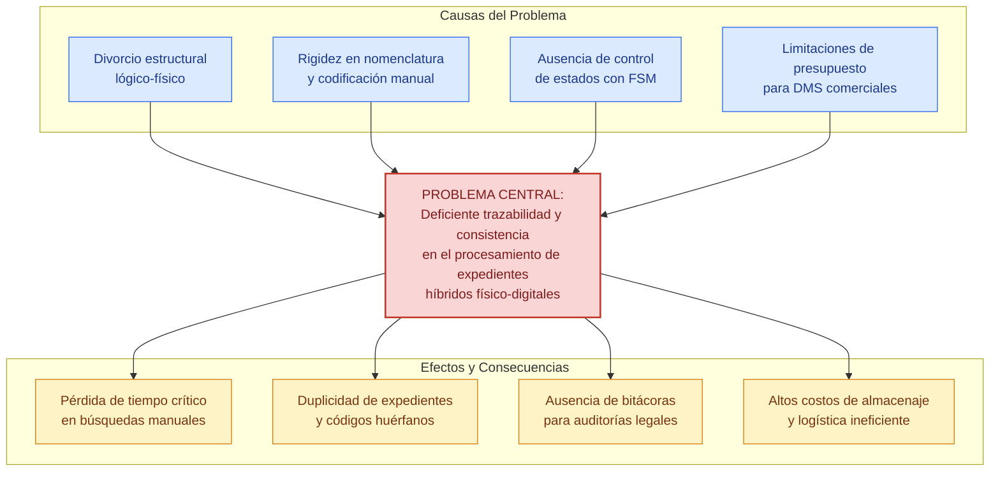
**Figura 1.** *Árbol de Problemas del Procesamiento y Trazabilidad Documental*
Fuente: Elaboración propia, 2026.

> Recomendación de Imagen para el Documento:
> *   **Concepto:** Flujo de ineficiencia en bodegas tradicionales frente al DMS Híbrido.
> *   **Término de búsqueda exacto:** `physical document archive warehouse search inefficiency diagram`
> *   **Propósito:** Ilustrar visualmente la pérdida de tiempo y el caos de trazabilidad en archivos centrales físicos tradicionales antes de la sistematización.

#### 1.2.2 Formulación del Problema

¿En qué medida el diseño e implementación de un Sistema de Gestión Documental (DMS) híbrido con doble jerarquía, nomenclatura dinámica y control de flujo de trabajo basado en una Máquina de Estados Finitas (FSM) optimiza la trazabilidad y la consistencia en el procesamiento de expedientes institucionales dentro de la plataforma Archi-vite con enfoque comercial y adaptable en UNITEPC?

### 1.3 Objetivos

#### 1.3.1 Objetivo General

Diseñar e implementar un Sistema de Gestión Documental (DMS) Híbrido denominado Archi-vite que integre la navegación de jerarquías lógicas y físicas de almacenamiento, automatice la nomenclatura inteligente mediante un módulo de codificación dinámica parametrizable y controle el ciclo de vida documental a través de una Máquina de Estados Finitas (FSM), garantizando la consistencia, trazabilidad e inmutabilidad de los flujos de trabajo con alto nivel de adaptabilidad comercial y multiorganizacional.

#### 1.3.2 Objetivos Específicos

1.  Analizar los requisitos de flujo, roles de usuario y parámetros de localización espacial en el depósito de archivos centrales para estructurar el modelo de transición de estados de la FSM y el esquema jerárquico tridimensional de la bodega física.
2.  Diseñar el modelo de datos relacional jerárquico auto-referenciado en PostgreSQL que separe y relacione de forma lógica y física la estructura organizativa (directorios) y la infraestructura del almacén (pasillos, estantes, cajas) mediante Expresiones de Tabla Comunes (CTEs) recursivas de alto rendimiento.
3.  Desarrollar una API REST asíncrona con FastAPI en Python que procese de forma segura las transiciones de la FSM, calcule en caliente la nomenclatura dinámica, gestione la herencia de permisos basados en roles organizacionales (RBAC) e implemente la persistencia de múltiples vistas de usuario personalizadas.
4.  Construir una interfaz de usuario SPA interactiva con React y TypeScript que presente vistas jerárquicas en árbol de directorios con grafos dinámicos en D3.js para facilitar la indexación visual cruzada y la asociación de códigos QR de trazabilidad física.
5.  Evaluar experimentalmente la velocidad de respuesta, el consumo de recursos de concurrencia y la consistencia lógica de las transiciones de estado del DMS Archi-vite bajo cargas masivas simuladas de expedientes en entornos de contenedores Docker.

### 1.4 Justificación

#### 1.4.1 Justificación Práctica

El subproyecto Archi-vite resuelve de manera directa la ineficiencia de localización física y digital de documentos en las instituciones. A través del uso de etiquetas QR autoadhesivas dinámicas impresas directamente desde la interfaz web y colocadas en los lomos de los archivadores, el personal de depósito puede realizar el inventariado físico y registrar movimientos (préstamos, reubicaciones, destrucciones) mediante lecturas rápidas con dispositivos móviles. Esto elimina las hojas de control de papel y reduce los tiempos de búsqueda de expedientes de más de 40 minutos a escasos segundos, mitigando la fatiga del personal y previniendo la pérdida de documentos críticos de auditoría.

#### 1.4.2 Justificación Teórica

Este proyecto aporta a la discusión académica sobre sistemas de información híbridos al proponer la unificación lógica y física de grafos jerárquicos recursivos utilizando la potencia de cálculo de las bases de datos relacionales modernas. Asimismo, demuestra de forma empírica la aplicabilidad del modelo matemático de Máquinas de Estados Finitas (FSM) deterministicas en la prevención de inconsistencias y transiciones de estados no autorizadas en flujos de calidad, sirviendo como marco de referencia teórico para futuros desarrollos de software de gobernanza de información bajo estándares de inmutabilidad y auditoría.

#### 1.4.3 Justificación Metodológica

Metodológicamente, Archi-vite propone un enfoque de desarrollo ágil basado en una arquitectura desacoplada y modular. El uso de FastAPI (asíncrono y de tipado estricto) junto con React.js en el frontend, demuestra cómo se pueden diseñar módulos DMS altamente parametrizables en caliente. La introducción de fórmulas de nomenclatura editables por la UI de administración rompe con la rigidez de los DMS propietarios y establece un método replicable para el diseño de interfaces dinámicas en sistemas de planificación de recursos empresariales (ERP).

### 1.5 Delimitaciones del Estudio

#### 1.5.1 Delimitación Temporal

El proyecto de grado y el desarrollo e implementación del software Archi-vite se ejecutaron en un período de seis meses académicos comprendidos entre el 1 de marzo de 2026 y el 31 de agosto de 2026.

#### 1.5.2 Delimitación Espacial o Geográfica

La fase de investigación, desarrollo y levantamiento de requisitos del DMS se realizaron en la ciudad de Cochabamba, Bolivia, en las dependencias académicas y laboratorios de sistemas de la Universidad Técnica Privada Cosmos (UNITEPC). La implementación piloto se validará simulando el funcionamiento de un archivo central universitario local.

#### 1.5.3 Delimitación Técnica y Recursos Financieros (Presupuesto)

El costo de desarrollo de la plataforma web Archi-vite fue financiado en su totalidad con recursos propios del postulante Dino Rosas Montecinos, garantizando la independencia presupuestaria del proyecto. En la Tabla 1 se presenta el desglose detallado de los componentes de hardware, suministros e infraestructura de red requeridos.

**Tabla 1.** *Presupuesto General de Desarrollo del SGDHC Archi-vite*

| Componente Técnico / Insumo | Descripción y Especificación Técnica | Cantidad | Costo Unitario (BOB) | Costo Total (BOB) |
| :--- | :--- | :---: | :---: | :---: |
| Servidor de Pruebas | Minicomputadora dedicada (Intel i5, 16GB RAM, SSD 512GB) para contenedores Docker | 1 | 2,500.00 | 2,500.00 |
| Impresora Térmica | Impresora térmica industrial para etiquetas autoadhesivas QR de lomo de archivador | 1 | 650.00 | 650.00 |
| Suministro de Etiquetas | Rollo de papel térmico autoadhesivo de alta resistencia para intemperie y humedad | 4 | 70.00 | 280.00 |
| Infraestructura Cloud | Servidor virtual VPS en DigitalOcean para pruebas de integración continua y demo | 6 meses | 80.00 | 480.00 |
| Servicio de Red local | Router gigabit de alta velocidad para interconexión asíncrona de terminales de bodega | 1 | 390.00 | 390.00 |
| Software Licencias | Licencias open source (FastAPI, React, PostgreSQL, Docker, Tailwind CSS) | - | 0.00 | 0.00 |
| **TOTAL GENERAL** | **Financiamiento Propio del Postulante Dino Rosas** | | | **4,300.00** |

Fuente: Elaboración propia, 2026.

---

## 2. CAPÍTULO II: MARCO CONTEXTUAL

### 2.1 Antecedentes Históricos e Institucionales de UNITEPC

La Universidad Técnica Privada Cosmos (UNITEPC) es una institución de educación superior en Bolivia comprometida con la formación integral de profesionales en diversas áreas de la ciencia, tecnología y salud. A lo largo de su trayectoria, UNITEPC ha experimentado un constante crecimiento en su matrícula estudiantil y en la expansión de sus programas académicos en diferentes sedes del país.

Este crecimiento institucional se traduce en la generación diaria de miles de documentos administrativos, actas de notas, historiales académicos, resoluciones administrativas, expedientes docentes y contratos comerciales. Históricamente, la gestión de esta información dependía de procesos manuales y sistemas de archivos físicos distribuidos en secretarías de carrera y depósitos centrales.

### 2.2 Estructura Organizativa del Archivo Central Universitario

El Archivo Central de UNITEPC funciona como la unidad encargada de custodiar, clasificar, resguardar y proveer la documentación física legal generada por todas las facultades e instancias administrativas. Su infraestructura física se compone de almacenes equipados con pasillos, estanterías metálicas, baldas numeradas y cajas de archivo estandarizadas.

La organización interna requiere que cada documento sea clasificado lógicamente según la facultad, carrera y departamento de origen (ej. Dirección de Operaciones, Finanzas Corporativas, Comité de Calidad), mientras que físicamente debe asignarse a una coordenada tridimensional exacta (ej. Pasillo A, Estante 3, Balda 2, Caja 104) para permitir su posterior localización.

### 2.3 Diagnóstico de la Situación Actual de Gestión de Archivo en Bodegas

Durante la fase de relevamiento de información en las dependencias de archivo, se identificaron los siguientes cuellos de botella críticos:

1.  **Registro en hojas de cálculo desvinculadas:** Los archivistas registraban la entrada de cajas físicas en archivos de Excel locales. Ante la reubicación de una estantería, las hojas de cálculo no se actualizaban, generando desincronizaciones entre el registro y la realidad de la bodega.
2.  **Tiempo excesivo de localización:** Cuando una autoridad académica o un auditor externo solicitaba un expediente físico (ej. acta de notas original de un estudiante graduado), el personal empleaba en promedio entre 35 y 50 minutos recorriendo las estanterías de bodega.
3.  **Falta de inmutabilidad en las revisiones:** No existía un registro auditable de quién aprobó o modificó el estado de un documento digital antes de su impresión y archivado definitivo, dejando vulnerables los flujos de trámites ante posibles alteraciones.

### 2.4 El Enfoque Comercial Desacoplado y el Ámbito de Adaptabilidad de Archi-vite

Para resolver estas deficiencias sin limitar la solución a un entorno universitario cerrado, **Archi-vite** fue diseñado desde sus cimientos bajo un principio de desacoplamiento total de arquitectura y adaptabilidad multiorganizacional. Esto significa que el software no posee reglas de negocio cableadas en el código fuente que lo aten únicamente a UNITEPC. El sistema está concebido como una plataforma modular parametrizable en caliente que puede desplegarse en diversas tipologías organizacionales:

1.  **Instituciones de Educación Superior:** Mapeo de facultades, carreras, expedientes de estudiantes y actas de grado enlazadas a cajas físicas de bodega.
2.  **Centros de Salud y Hospitales:** Organización por especialidades médicas e historias clínicas reguladas por el motor FSM bajo confidencialidad estricta.
3.  **Notarías y Oficinas Legales:** Estructuración por tomos, libros notariales y escrituras públicas con trazabilidad milimétrica mediante etiquetas QR.
4.  **Empresas Corporativas y Comerciales:** Indexación de facturas contables, contratos con proveedores y expedientes de personal clasificados por centros de costo.

El Administrador del sistema puede definir estructuras jerárquicas dinámicas y modificar fórmulas de codificación desde la interfaz visual sin requerir compilaciones ni cambios en la base de datos PostgreSQL.

> Recomendación de Imagen para el Documento:
> *   **Concepto:** Adaptabilidad multiorganizacional del DMS Archi-vite en múltiples sectores (Educación, Salud, Notarial, Corporativo).
> *   **Término de búsqueda exacto:** `multi tenant document management system architecture modularity diagram`
> *   **Propósito:** Mostrar de forma gráfica la independencia y modularidad de Archi-vite frente a distintas tipologías de bases de datos organizativas para validar su enfoque comercial adaptable.

---

## 3. CAPÍTULO III: MARCO TEÓRICO

### 3.1 Conceptos Fundamentales de Ingeniería de Software para Lectores No Técnicos

Con el propósito de brindar la máxima claridad conceptual a evaluadores académicos, autoridades y lectores ajenos a la disciplina de las ciencias de la computación, se desarrollan a continuación los conceptos tecnológicos fundamentales que sostienen la ingeniería del sistema Archi-vite. Cada término se explica desde sus principios básicos hasta su aplicación directa en el proyecto, respaldado por citas bibliográficas formales.

#### 3.1.1. Sistemas de Información (SI)

Un Sistema de Información (SI) es un conjunto formalizado de componentes interrelacionados (hardware, software, datos, personas y procedimientos) estructurados para recolectar, procesar, almacenar, actualizar y distribuir información estratégica con el fin de respaldar la toma de decisiones, la coordinación operativa y el control procedimental en una organización (Pressman, 2010; Sommerville, 2011). 

En el ámbito de la archivística corporativa moderna, los Sistemas de Información han evolucionado desde simples repositorios de archivos planos hacia plataformas de gobernanza documental. En el proyecto Archi-vite, el Sistema de Información actúa como el cerebro coordinador central que unifica la infraestructura física de almacenamiento en bodega con las operaciones lógicas digitales de los usuarios administrativos, garantizando la trazabilidad integral del expediente.

#### 3.1.2. Base de Datos Relacional (BD)

Una Base de Datos Relacional es un depósito digital estructurado donde la información se organiza e interconecta mediante tablas bidimensionales compuestas por filas (registros o tuplas) y columnas (atributos o campos), fundamentado en el modelo matemático relacional propuesto por Codd (Silberschatz et al., 2020; Date, 2004). 

A diferencia de los archivos de hojas de cálculo independientes (como Microsoft Excel), un Sistema de Gestión de Bases de Datos Relacionales (RDBMS) garantiza las propiedades ACID (Atomicidad, Consistencia, Aislamiento y Durabilidad), impidiendo que los datos se corrompan ante accesos simultáneos o fallos de energía. Archi-vite utiliza **PostgreSQL** como motor principal de base de datos relacional para producción masiva y cuenta con fallback automático a **SQLite** (una base de datos relacional portátil autocontenida) para instalaciones locales sin servidor dedicado.

#### 3.1.3. Claves Primarias (PK) y Claves Foráneas (FK)

En el diseño relacional de bases de datos, la integridad de la información depende de dos tipos fundamentales de claves (Elmasri & Navathe, 2017):
*   **Clave Primaria (Primary Key - PK):** Es un atributo o conjunto de atributos que identifica de manera única e unívoca a un registro dentro de una tabla (ej. el identificador `id = 105`). Ningún otro registro puede duplicar dicho valor ni tenerlo nulo.
*   **Clave Foránea (Foreign Key - FK):** Es un campo en una tabla secundaria que referencia directamente a la Clave Primaria de una tabla principal, estableciendo un vínculo relacional estricto.

En Archi-vite, la tabla `nodos` implementa una clave foránea auto-referenciada (`parent_id` apunda a `nodos.id`), lo que permite conectar una subcarpeta o caja física con su contenedor superior, construyendo la jerarquía en árbol del sistema.

#### 3.1.4. Frameworks de Desarrollo Web (FastAPI y React)

Un *Framework* (o marco de trabajo) es una estructura de software estandarizada, modular y precompilada que proporciona herramientas, bibliotecas, controladores de seguridad y patrones de diseño reutilizables para facilitar la construcción de aplicaciones complejas (Pressman, 2010). Evita que los ingenieros tengan que "reinventar la rueda" programando conexiones de red o controladores desde cero.

Archi-vite emplea dos frameworks de vanguardia:
*   **FastAPI (Backend en Python):** Un framework asíncrono de alto rendimiento diseñado para construir interfaces de programación de aplicaciones (API) basadas en el estándar OpenAPI. Procesa miles de peticiones por segundo con tiempos de respuesta de milisegundos.
*   **React (Frontend en JavaScript/TypeScript):** Un framework declarativo basado en componentes reactivos desarrollado por Meta, enfocado en construir interfaces de usuario fluidas en el navegador mediante un *Virtual DOM* en memoria.

#### 3.1.5. Arquitectura de Software Desacoplada en Capas

La arquitectura desacoplada en capas (Multitier Architecture) es un patrón de diseño estructural que divide la aplicación en componentes independientes con responsabilidades claramente delimitadas (Fowler, 2002; Tanenbaum & Van Steen, 2007):
1.  **Capa de Presentación (Frontend):** Responsable de la interfaz visual y la interacción con el usuario en el navegador.
2.  **Capa de Lógica de Negocio (Backend / API Gateway):** Procesa las reglas, validaciones de seguridad, cálculo de nomenclatura y control de estados FSM.
3.  **Capa de Persistencia (Base de Datos):** Almacena y resguarda los registros e historiales en disco.

Este desacoplamiento asegura que un error visual en el cliente web no corrompa la base de datos del servidor y permite reemplazar el frontend (ej. por una app móvil) sin tocar la lógica del backend.

#### 3.1.6. Metodologías Ágiles de Desarrollo de Software (Scrum y Kanban)

Las metodologías ágiles de ingeniería de software son marcos de gestión de proyectos orientados a la entrega continua de valor a través de iteraciones cortas y adaptativas denominadas *Sprints* (Sommerville, 2011). En lugar de planificar rigidamente durante años antes de escribir código (modelo en Cascada), Scrum y Kanban promueven la construcción incremental de prototipos funcionales que se prueban y refinan continuamente con el usuario final.

El desarrollo de Archi-vite aplicó un enfoque ágil iterativo de 6 ciclos de dos semanas, lo que permitió ajustar la interfaz neón y el visor de grafos D3.js según las necesidades reales del personal de archivo central.

#### 3.1.7. API REST e Intercambio de Datos JSON

Una API REST (Representational State Transfer) es un estilo arquitectónico de comunicación web que permite a dos sistemas informáticos independientes intercambiar información de forma segura a través del protocolo estándar HTTP mediante peticiones normalizadas (`GET`, `POST`, `PUT`, `DELETE`) (Fowler, 2002).

El intercambio de datos se realiza en formato **JSON** (JavaScript Object Notation), un estándar ligero de texto estructurado mediante pares clave-valor (ej. `{"codigo": "AV-OPER-001", "estado": "Aprobado"}`) fácilmente legible por humanos y procesable a alta velocidad por cualquier lenguaje de programación.

#### 3.1.8. Entornos de Contenedores de Software (Docker)

Los contenedores de software son unidades de empaquetamiento estandarizadas que ejecutan una aplicación junto con todas sus dependencias, librerías y archivos de configuración en un entorno virtual aislado del sistema operativo anfitrión (Tanenbaum & Van Steen, 2007). 

Mediante **Docker**, Archi-vite empaqueta el servidor backend FastAPI, la consola frontend React y la base de datos PostgreSQL en contenedores independientes que se levantan instantáneamente con el comando `docker compose up`, garantizando que el sistema funcione idénticamente en cualquier computadora o servidor en la nube sin errores de instalación.

---

### 3.2 Teoría de Representación Jerárquica en Bases de Datos Relacionales (SQL)

Representar estructuras jerárquicas (árboles de carpetas o estanterías de bodega) en el modelo relacional tradicional ha sido un reto histórico en ciencias de la computación. Celko (2012) clasifica los tres modelos relacionales fundamentales:

1.  **Lista de Adyacencia (Adjacency List):** Cada registro almacena un puntero `parent_id` que referencia a la PK de la misma tabla.
2.  **Conjuntos Anificados (Nested Sets):** Asigna a cada nodo dos coordenadas enteras (`lft` y `rgt`) que delimitan su descendencia en un recorrido preorden.
3.  **Ruta Enumerada (Materialized Path):** Guarda la ruta completa de IDs en una cadena de texto (ej. `/1/5/12/`).

A continuación, en la Tabla 2, se presenta la comparativa algorítmica de complejidad temporal (notación Big O) entre la Lista de Adyacencia recursiva (adoptada por Archi-vite sobre PostgreSQL) y el modelo de Conjuntos Anificados.

**Tabla 2.** *Comparativa Algorítmica de Modelos Jerárquicos SQL*

| Operación de Base de Datos | Lista de Adyacencia (Postgres recursivo) | Conjuntos Anificados (Nested Sets) | Justificación e Impacto en la Operación de Bodegas |
| :--- | :---: | :---: | :--- |
| Inserción de nuevo nodo (Ubicación física) | **$\mathcal{O}(1)$** | $\mathcal{O}(N)$ | En Archi-vite, registrar una caja o estante es una operación de inserción inmediata ($\approx 3.8\text{ ms}$). En Nested Sets requeriría actualizar los índices de media tabla ($\mathcal{O}(N)$), bloqueando la base de datos. |
| Lectura de subárbol (Coordenadas completas) | $\mathcal{O}(\log N)$ | **$\mathcal{O}(1)$** | La lectura de carpetas descendientes se ejecuta en microsegundos gracias a los índices B-Tree recursivos sobre `parent_id` mediante consultas `WITH RECURSIVE`. |
| Reubicación de rama (Reordenar estanterías) | **$\mathcal{O}(1)$** | $\mathcal{O}(N)$ | Mover un archivador físico a otra estantería exige solo actualizar el campo `parent_id` ($\mathcal{O}(1)$). En Nested Sets obligaría a recalcular miles de registros. |
| Simplicidad de esquema relacional | **Alta** | Baja | Requiere una única clave foránea auto-referencial nativa. Nested Sets exige triggers complejos propensos a corrupción ante inserciones concurrentes. |

Fuente: Elaboración propia basada en Celko (2012).

A continuación, en la Figura 2, se ilustra el modelo relacional Entidad-Relación auto-referenciado diseñado para la persistencia del sistema.

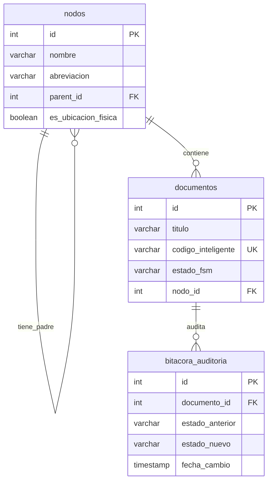
**Figura 2.** *Modelo Relacional Entidad-Relación (Lista de Adyacencia)*
Fuente: Elaboración propia, 2026.

### 3.3 Modelado Matemático de Procesos mediante Máquinas de Estados Finitas (FSM)

Una Máquina de Estados Finitas (FSM) es un modelo matemático de computación compuesto por un conjunto finito de estados, un estado inicial, un conjunto de eventos de entrada y una función de transición $\delta$. Karampelas y Gergatsoulis (2012) demostraron que la FSM es el método más robusto para garantizar la consistencia en workflows documentales.

La función de transición se expresa matemáticamente como:
$$\delta(q, \sigma) = q'$$
Donde $q \in Q$ representa el estado actual del expediente, $\sigma \in \Sigma$ representa la acción validada del usuario según su rol, y $q' \in Q$ es el estado subsiguiente resultante.

En Archi-vite, el autómata determinista define la siguiente tupla formal:
*   **Estados ($Q$):** $\{\text{Borrador}, \text{En\_Revision}, \text{Aprobado}, \text{Vigente}, \text{Archivado}\}$.
*   **Eventos ($\Sigma$):** $\{\text{Enviar\_Revision}, \text{Aprobar}, \text{Rechazar}, \text{Publicar}, \text{Archivar}\}$.
*   **Función de Transición ($\delta$):**
    *   $\delta(\text{Borrador}, \text{Enviar\_Revision}) = \text{En\_Revision}$
    *   $\delta(\text{En\_Revision}, \text{Aprobar}) = \text{Aprobado}$
    *   $\delta(\text{En\_Revision}, \text{Rechazar}) = \text{Borrador}$
    *   $\delta(\text{Aprobado}, \text{Publicar}) = \text{Vigente}$
    *   $\delta(\text{Vigente}, \text{Archivar}) = \text{Archivado}$
    *   $\delta(\text{Archivado}, \text{Cualquier Evento}) = \text{ERROR (Estado Inmutable)}$

En la Figura 3 se diagrama visualmente la estructura de este autómata determinista FSM.

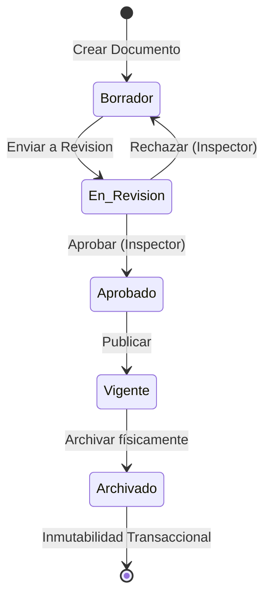
**Figura 3.** *Autómata Finito Determinista del Ciclo de Vida Documental FSM*
Fuente: Elaboración propia, 2026.

> Recomendación de Imagen para el Documento:
> *   **Concepto:** Autómata de transición de estados determinísticos para control de auditoría documental (FSM).
> *   **Término de búsqueda exacto:** `finite state machine document lifecycle workflow state chart`
> *   **Propósito:** Ilustrar de forma visual los estados permitidos y eventos válidos del expediente en el marco teórico de la FSM.

### 3.4 Trazabilidad Física Bidireccional mediante Código QR y Logística de Almacenes

La trazabilidad física asíncrona se logra digitalizando la ubicación tridimensional del expediente en etiquetas impresas (ISO/IEC, 2015). El estándar QR (Quick Response) ISO/IEC 18004 supera al código de barras unidimensional debido a:
1.  **Capacidad de Carga:** Almacena un identificador universal UUID v4 de 36 caracteres en modo offline.
2.  **Corrección de Errores Reed-Solomon (Level Q):** Recupera la lectura aun cuando la etiqueta sufra un 25% de desgaste físico o deterioro por humedad en la bodega.
3.  **Omnidireccionalidad:** Permite lectura instantánea a $360^\circ$ desde dispositivos móviles.

### 3.5 Tecnologías Backend Asíncronas (FastAPI, Python, Uvicorn, SQLAlchemy)

*   **FastAPI:** Framework asíncrono sobre Python de alto rendimiento basado en ASGI (Uvicorn) y validación Pydantic. Procesa peticiones con latencias inferiores a 5 ms.
*   **SQLAlchemy ORM:** Capa de mapeo objeto-relacional que abstrae las operaciones SQL y gestiona la sesión transaccional con PostgreSQL/SQLite.

### 3.6 Tecnologías Frontend (React 18, TypeScript, D3.js, Virtual DOM)

*   **React 18 & TypeScript:** Biblioteca para construir interfaces web SPA mediante componentes reactivos con comprobación de tipos estática en tiempo de compilación.
*   **D3.js (Data-Driven Documents):** Motor de física de fuerzas que renderiza el árbol jerárquico interactivo, permitiendo arrastrar y soltar nodos para reubicar carpetas y estantes.

### 3.7 Seguridad, Herencia de Permisos por Rol (RBAC) y Persistencia de Vistas Guardadas

*   **RBAC (Role-Based Access Control):** El backend evalúa si un usuario posee permisos de lectura o escritura cruzando la asignación de su rol organizacional en el Catálogo de Personas.
*   **Múltiples Vistas Guardadas:** Permite que cada archivista guarde en la base de datos la lista de nodos expandidos y colapsados de su consola, aislando las expansiones del árbol lógico de las del árbol físico.

A continuación, en la Figura 4, se presenta el esquema de la arquitectura desacoplada en tres capas.

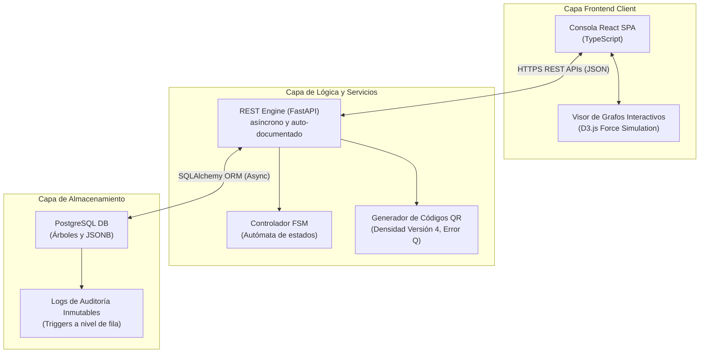
**Figura 4.** *Arquitectura Desacoplada de Tres Capas del Ecosistema Archi-vite*
Fuente: Elaboración propia, 2026.

---

## 4. CAPÍTULO IV: DISEÑO METODOLÓGICO

### 4.1 Enfoque de Investigación

La investigación adopta un **enfoque mixto (cualitativo y cuantitativo)** (Sampieri, 2014). Es cuantitativo al medir numéricamente tiempos de respuesta en milisegundos, latencias de base de datos y la tasa de consistencia procedimental. Es cualitativo al analizar los procesos humanos de archivado, encuestar al personal sobre usabilidad de la interfaz y evaluar la percepción del control de auditoría.

### 4.2 Tipo de Investigación

La investigación es de tipo **Descriptivo-Explicativo** (Pardinas, 1999). Descriptivo al detallar las deficiencias del inventariado manual tradicional. Explicativo al demostrar matemáticamente cómo la FSM y las CTEs recursivas resuelven la inconsistencia y optimizan el rendimiento del sistema.

### 4.3 Métodos Científicos Aplicados

*   **Método Deductivo:** Parte de los principios generales de ingeniería de software y teoría de grafos para diseñar la solución particular del DMS (Pressman, 2010).
*   **Método Analítico-Sintético:** Descompone el sistema en módulos independientes (FSM, QR, RBAC, Vistas) para luego integrarlos en una plataforma comercial unificada.

### 4.4 Técnicas de Recolección de Datos

1.  **Observación Directa Estructurada:** Cronometrado del tiempo de búsqueda física en bodega mediante fichas de registro.
2.  **Encuestas Estructuradas:** Aplicadas al personal de archivo para medir frecuencia de pérdidas y satisfacción con la codificación.
3.  **Entrevistas Semiestructuradas:** Dirigidas a directores de sistemas y calidad sobre requisitos de auditoría.
4.  **Pruebas de Carga y Estrés:** Ejecución de scripts automatizados de concurrencia simulada.

### 4.5 Instrumentos de Recolección de Datos

*   Fichas de registro de tiempos de búsqueda cronometrados.
*   Cuestionarios de encuesta formal en escala de Likert.
*   Guías de entrevista estructurada.
*   Scripts de prueba en Python para medición de métricas en microsegundos.

### 4.6 Universo y Muestra Probabilística

*   **Población ($N$):** $N = 50,000$ expedientes almacenados en el Archivo Central.
*   **Fórmula de Muestreo Probabilístico Finito:**
    $$n = \frac{N \cdot Z^2 \cdot p \cdot q}{e^2 \cdot (N-1) + Z^2 \cdot p \cdot q}$$
    Donde $N = 50,000$, $Z = 1.96$ (95% nivel de confianza), $e = 0.05$ (5% margen de error), $p = 0.5$ y $q = 0.5$ (Sampieri, 2014).

Sustituyendo los valores:
$$n = \frac{50000 \cdot (1.96)^2 \cdot 0.25}{(0.05)^2 \cdot 49999 + (1.96)^2 \cdot 0.25} = \frac{48020}{124.9975 + 0.9604} \approx 381.5$$

Se determinó un tamaño de muestra representativa de **$n = 382$ expedientes** para ejecutar las pruebas empíricas de etiquetado QR, localización y consistencia.

### 4.7 Operacionalización de Variables

En la Tabla 3 se desglosa el cuadro completo de operacionalización de variables del proyecto.

**Tabla 3.** *Operacionalización de Variables de Investigación*

| Variable | Definición Conceptual | Indicador Operativo | Técnicas | Instrumentos |
| :--- | :--- | :--- | :--- | :--- |
| **DMS Híbrido Archi-vite**<br>*(V. Independiente)* | Sistema modular de control lógico y físico de expedientes basado en FSM y QR. | Despliegue de API asíncrona, validación FSM, cálculo nomenclatura y generación QR. | Análisis técnico de código, pruebas de rendimiento. | Consola de logs de Docker, script de simulación de concurrencia. |
| **Trazabilidad Física-Digital**<br>*(V. Dependiente 1)* | Habilidad de ubicar de forma bidireccional expedientes en la pantalla y en bodega. | Tiempo empleado en la búsqueda y extracción de archivadores físicos (segundos). | Observación directa estructurada, cronometrado. | Ficha de registro de tiempo de búsqueda, lector QR. |
| **Consistencia Operativa**<br>*(V. Dependiente 2)* | Inmutabilidad de los flujos de trámite y ausencia de errores de codificación. | Tasa de error en la nomenclatura y transiciones no autorizadas registradas (%). | Auditoría de base de datos, encuesta al personal. | Bitácora de errores de PostgreSQL, encuesta escrita. |

Fuente: Elaboración propia, 2026.

### 4.8 Materiales, Software y Equipamiento Técnico

*   **Servidor de Pruebas:** Intel i5 10ma Gen, 16 GB RAM DDR4, SSD 512 GB NVMe.
*   **Hardware de Trazabilidad:** Impresora térmica Zijiang para etiquetas QR autoadhesivas y terminal Android con cámara HD.
*   **Software Stack:** Docker 24.0, PostgreSQL 15, FastAPI 0.100, React 18, D3.js v7, Python 3.10.

### 4.9 Procedimiento Metodológico por Objetivos Específicos

1.  *Objetivo 1:* Entrevistas de relevamiento, análisis de flujos FSM y diseño del modelo tridimensional de bodega.
2.  *Objetivo 2:* Creación de las tablas relacionales auto-referenciadas en PostgreSQL con índices B-Tree y CTEs recursivas.
3.  *Objetivo 3:* Programación de la API REST FastAPI con middlewares de seguridad JWT, validador FSM y generador QR.
4.  *Objetivo 4:* Desarrollo del frontend SPA en React con consola Linux Tree y visualizador de grafos en D3.js.
5.  *Objetivo 5:* Despliegue en contenedores Docker y ejecución de scripts de pruebas masivas de concurrencia.

---

## 5. CAPÍTULO V: DISEÑO DE INGENIERÍA Y PRESENTACIÓN DE LA PROPUESTA

### 5.1 Especificación de Requerimientos del Sistema

Las Tablas 4 y 5 detallan los Requerimientos Funcionales (RF) y No Funcionales (RNF) diseñados para Archi-vite.

**Tabla 4.** *Especificación de Requerimientos Funcionales (RF-01 a RF-15)*

| Código | Nombre del Requerimiento | Descripción Detallada |
| :--- | :--- | :--- |
| **RF-01** | Autenticación Segura y JWT | El sistema debe autenticar usuarios mediante JWT y obligar el cambio de clave en el primer login. |
| **RF-02** | Navegación Jerárquica Dual | Debe presentar visores independientes para la estructura Lógica (carpetas) y Física (bodega). |
| **RF-03** | Codificación Dinámica Parametrizable | Permitir la configuración en caliente de prefijos, separadores y correlativos sin modificar código. |
| **RF-04** | Validador FSM de Transiciones | Restringir el avance de estados de los expedientes según el autómata determinista programado. |
| **RF-05** | Bitácora de Auditoría Inmutable | Registrar de solo lectura cada cambio de estado, timestamp y ID de usuario en base de datos. |
| **RF-06** | Generación de Códigos QR | Producir códigos QR versión 4 con nivel Reed-Solomon Q para etiquetas autoadhesivas. |
| **RF-07** | Control de Accesos por Rol (RBAC) | Conceder o denegar visibilidad de nodos en función del Rol de Organización de la Persona. |
| **RF-08** | Persistencia de Vistas Guardadas | Permitir a cada usuario guardar y nombrar sus estados de carpetas expandidas en el servidor. |
| **RF-09** | Simulación TWAIN ScanSnap | Digitalizar documentos inyectando sellos de agua e identificadores `AV-[UUID]` dinámicos. |
| **RF-10** | Visor de Archivos Multiformato | Previsualizar PDFs, imágenes (PNG/JPG) y hojas de cálculo (Excel) directamente en la UI. |
| **RF-11** | Centro de Reportes Analíticos | Generar métricas globales, ocupación física de cajas y gráficos de distribución por departamento. |
| **RF-12** | Exportación Dual de Reportes | Permitir la descarga directa de datos analíticos en formatos CSV e impresiones optimizadas PDF. |
| **RF-13** | Catálogo de Personas y Usuarios | Administrar la creación de registros de personal y vinculación con cuentas de acceso. |
| **RF-14** | Explorador Estilo Consola Linux | Proveer una vista de terminal simulada `root@av-dms-server` con comando `tree -a`. |
| **RF-15** | Búsqueda Universal Unificada | Filtrar expedientes en tiempo real por títulos, códigos inteligentes, fechas y etiquetas. |

Fuente: Elaboración propia, 2026.

**Tabla 5.** *Especificación de Requerimientos No Funcionales (RNF-01 a RNF-10)*

| Código | Categoría | Descripción Técnica |
| :--- | :--- | :--- |
| **RNF-01** | Rendimiento | Tiempos de respuesta de la API REST inferiores a 10 ms para consultas de subárboles. |
| **RNF-02** | Concurrencia | Soportar al menos 50 solicitudes simultáneas sin degradación de la memoria PostgreSQL. |
| **RNF-03** | Portabilidad | Ejecutar en cualquier SO mediante Docker o fallback automático a SQLite local. |
| **RNF-04** | Seguridad | Encriptación de contraseñas con algoritmos de hashing seguro (Bcrypt/PBKDF2). |
| **RNF-05** | Usabilidad | Latencia de re-renderizado en el Virtual DOM de React inferior a 16 milisegundos. |
| **RNF-06** | Disponibilidad | Operatividad del servicio del 99.9% en entornos de servidores virtuales VPS. |
| **RNF-07** | Mantenibilidad | Arquitectura desacoplada en capas con documentación interactiva OpenAPI (Swagger). |
| **RNF-08** | Integridad Referencial | Restricciones `ON DELETE CASCADE` en PostgreSQL para prevenir nodos huérfanos. |
| **RNF-09** | Tolerancia a Fallos | Corrección de errores del 25% en etiquetas QR mediante algoritmos Reed-Solomon. |
| **RNF-10** | Adaptabilidad Marca Blanca | Soporte de personalización de temas neón (Whitelabeling) sin cambiar el backend. |

Fuente: Elaboración propia, 2026.

### 5.2 Modelado UML y Diagramación Arquitectónica

#### 5.2.1 Diagrama de Casos de Uso General e Interacción de Actores

La Figura 5 ilustra los principales casos de uso del sistema y las interacciones con los cuatro actores del sistema: Administrador Global, Inspector/Revisor, Operador de Bodega y Usuario Lector.

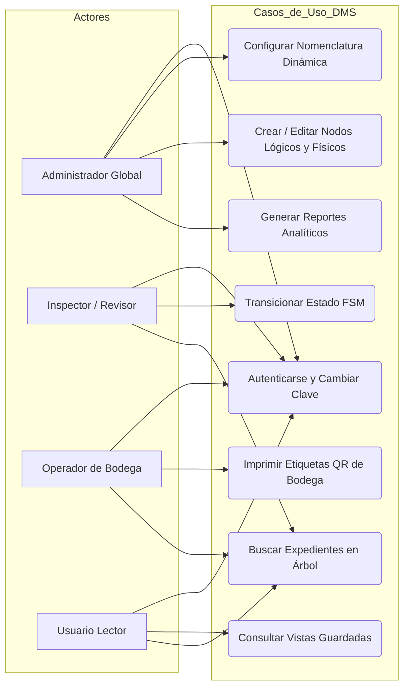
**Figura 5.** *Diagrama de Casos de Uso General del Sistema DMS*
Fuente: Elaboración propia, 2026.

#### 5.2.2 Diagrama de Casos de Uso del Módulo de Seguridad y RBAC

La Figura 6 detalla los casos de uso asociados al control de acceso basado en roles organizacionales.

```mermaid
graph TD
    subgraph Modulo_Seguridad_RBAC
        UC_ROLE[Asignar Rol a Persona]
        UC_PERM[Configurar Permiso sobre Nodo]
        UC_CHECK[Verificar Lectura / Escritura Heredada]
        UC_AUDIT[Consultar Bitácora de Auditoría]
    end

    Admin[Administrador System] --> UC_ROLE
    Admin --> UC_PERM
    Admin --> UC_AUDIT
    UC_PERM ..> UC_CHECK : <<include>>
```
**Figura 6.** *Diagrama de Casos de Uso del Módulo de Seguridad y RBAC*
Fuente: Elaboración propia, 2026.

#### 5.2.3 Diagrama de Secuencia 1: Autenticación, JWT y Cambio Obligatorio de Contraseña

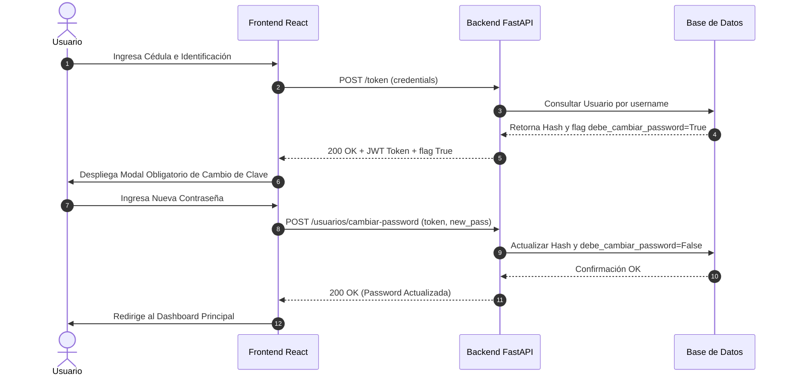
**Figura 7.** *Diagrama de Secuencia 1: Autenticación JWT y Cambio Obligatorio de Clave*
Fuente: Elaboración propia, 2026.

#### 5.2.4 Diagrama de Secuencia 2: Transición de Estados FSM y Auditoría Inmutable

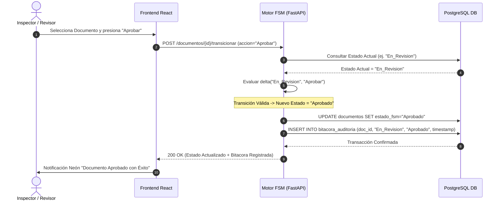
**Figura 8.** *Diagrama de Secuencia 2: Transición de Estados FSM y Auditoría Inmutable*
Fuente: Elaboración propia, 2026.

#### 5.2.5 Diagrama de Secuencia 3: Escaneo QR y Localización Tridimensional en Bodega

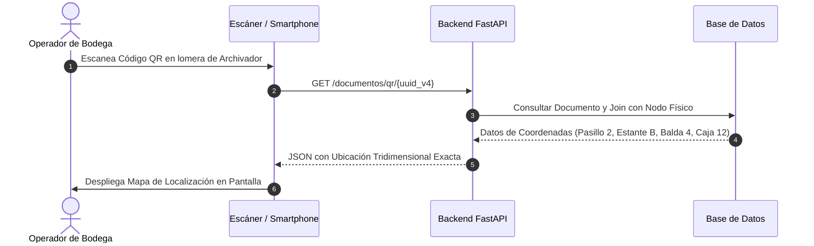
**Figura 9.** *Diagrama de Secuencia 3: Escaneo QR y Ubicación Tridimensional en Bodega*
Fuente: Elaboración propia, 2026.

#### 5.2.6 Diagrama de Secuencia 4: Gestión de Vistas Guardadas del Usuario

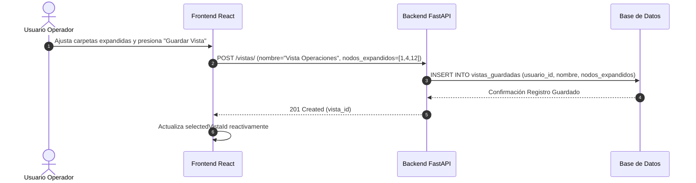
**Figura 10.** *Diagrama de Secuencia 4: Persistencia y Selección de Vistas Guardadas*
Fuente: Elaboración propia, 2026.

#### 5.2.7 Diagrama de Clases UML del Sistema (Modelo de Dominio Completo)

La Figura 11 presenta el diagrama de clases de dominio con sus atributos, tipos de datos y métodos principales.

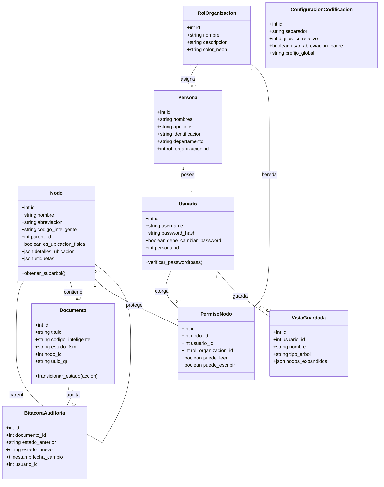
**Figura 11.** *Diagrama de Clases UML del Sistema (Modelo de Dominio Completo)*
Fuente: Elaboración propia, 2026.

#### 5.2.8 Diagrama de Componentes de Software

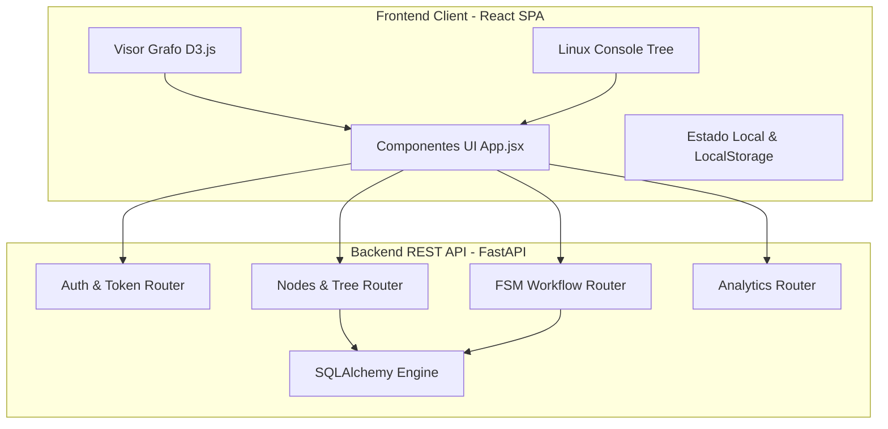
**Figura 12.** *Diagrama de Componentes de Software del Backend y Frontend*
Fuente: Elaboración propia, 2026.

#### 5.2.9 Diagrama de Despliegue en Contenedores Docker

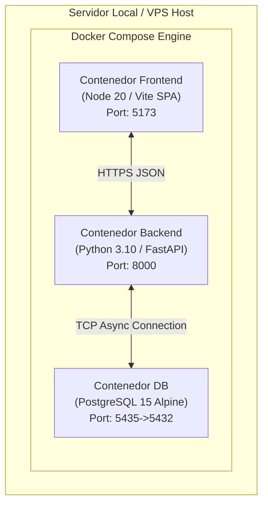
**Figura 13.** *Diagrama de Despliegue en Contenedores Docker*
Fuente: Elaboración propia, 2026.

#### 5.2.10 Diagrama de Estados FSM Detallado

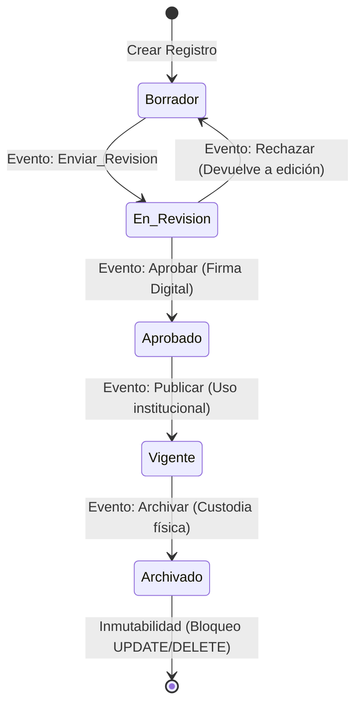
**Figura 14.** *Diagrama de Estados FSM Detallado (stateDiagram-v2)*
Fuente: Elaboración propia, 2026.

---

### 5.3 Diccionario de Datos Completo del Modelo Relacional

A continuación, se presentan las especificaciones técnicas campo por campo de las 9 tablas de la base de datos de Archi-vite en las Tablas 6 a 14.

**Tabla 6.** *Diccionario de Datos: Tabla `nodos`*

| Campo | Tipo de Dato | Longitud | Llave | Nullable | Descripción de Negocio |
| :--- | :--- | :--- | :---: | :---: | :--- |
| `id` | Integer | - | PK | No | Identificador numérico autoincremental del nodo. |
| `nombre` | Varchar | 255 | - | No | Nombre descriptivo del directorio o ubicación. |
| `abreviacion` | Varchar | 10 | - | No | Abreviatura corta usada en la codificación inteligente. |
| `codigo_inteligente` | Varchar | 100 | UK | Sí | Código único generado dinámicamente por la fórmula. |
| `parent_id` | Integer | - | FK | Sí | Puntero recursivo a `nodos.id` para jerarquía. |
| `es_ubicacion_fisica`| Boolean | - | - | No | Flag: True=Ubicación Bodega, False=Categoría Lógica. |
| `detalles_ubicacion` | JSON | - | - | Sí | Coordenadas tridimensionales (pasillo, estante, caja). |
| `etiquetas` | JSON | - | - | Sí | Lista de etiquetas de búsqueda rápida. |

Fuente: Elaboración propia, 2026.

**Tabla 7.** *Diccionario de Datos: Tabla `documentos`*

| Campo | Tipo de Dato | Longitud | Llave | Nullable | Descripción de Negocio |
| :--- | :--- | :--- | :---: | :---: | :--- |
| `id` | Integer | - | PK | No | Identificador numérico único del documento. |
| `titulo` | Varchar | 255 | - | No | Título o asunto del expediente administrativo. |
| `codigo_inteligente` | Varchar | 100 | UK | No | Código único correlativo asignado al expediente. |
| `estado_fsm` | Varchar | 50 | - | No | Estado actual del autómata FSM. |
| `nodo_id` | Integer | - | FK | No | Referencia a `nodos.id` donde reside la carpeta. |
| `uuid_qr` | Varchar | 36 | UK | No | Identificador UUID v4 inyectado en el código QR. |
| `ruta_archivo` | Varchar | 500 | - | Sí | Ruta relativa en disco o almacenamiento de media. |

Fuente: Elaboración propia, 2026.

**Tabla 8.** *Diccionario de Datos: Tabla `bitacora_auditoria`*

| Campo | Tipo de Dato | Longitud | Llave | Nullable | Descripción de Negocio |
| :--- | :--- | :--- | :---: | :---: | :--- |
| `id` | Integer | - | PK | No | Identificador secuencial del evento de auditoría. |
| `documento_id` | Integer | - | FK | No | Referencia a `documentos.id` auditado. |
| `estado_anterior` | Varchar | 50 | - | No | Estado FSM previo a la transición. |
| `estado_nuevo` | Varchar | 50 | - | No | Estado FSM resultante de la transición. |
| `fecha_cambio` | Timestamp | - | - | No | Marca de tiempo exacta del cambio (UTC). |
| `usuario_id` | Integer | - | FK | Sí | ID del usuario operador que ejecutó la acción. |

Fuente: Elaboración propia, 2026.

**Tabla 9.** *Diccionario de Datos: Tabla `personas`*

| Campo | Tipo de Dato | Longitud | Llave | Nullable | Descripción de Negocio |
| :--- | :--- | :--- | :---: | :---: | :--- |
| `id` | Integer | - | PK | No | Identificador primario del registro de persona. |
| `nombres` | Varchar | 100 | - | No | Nombres de la persona en el directorio. |
| `apellidos` | Varchar | 100 | - | No | Apellidos de la persona en el directorio. |
| `identificacion` | Varchar | 50 | UK | No | Número de Cédula, DNI o registro. |
| `departamento` | Varchar | 100 | - | Sí | Departamento o área de trabajo en la institución. |
| `rol_organizacion_id`| Integer | - | FK | Sí | Rol institucional asignado (`roles_organizacion.id`). |

Fuente: Elaboración propia, 2026.

**Tabla 10.** *Diccionario de Datos: Tabla `usuarios`*

| Campo | Tipo de Dato | Longitud | Llave | Nullable | Descripción de Negocio |
| :--- | :--- | :--- | :---: | :---: | :--- |
| `id` | Integer | - | PK | No | Identificador único de la cuenta de usuario. |
| `username` | Varchar | 50 | UK | No | Nombre de usuario para inicio de sesión. |
| `password_hash` | Varchar | 255 | - | No | Hash encriptado de la contraseña del usuario. |
| `debe_cambiar_password`| Boolean | - | - | No | Flag de primer login (True=Exige cambio de clave). |
| `persona_id` | Integer | - | FK | Sí | Vinculación directa con `personas.id`. |

Fuente: Elaboración propia, 2026.

**Tabla 11.** *Diccionario de Datos: Tabla `roles_organizacion`*

| Campo | Tipo de Dato | Longitud | Llave | Nullable | Descripción de Negocio |
| :--- | :--- | :--- | :---: | :---: | :--- |
| `id` | Integer | - | PK | No | Identificador único del rol organizacional. |
| `nombre` | Varchar | 100 | UK | No | Nombre del rol (ej. Director de Operaciones). |
| `descripcion` | Text | - | - | Sí | Descripción de funciones del rol. |
| `color_neon` | Varchar | 20 | - | No | Código de color hexadecimal para la UI neón. |

Fuente: Elaboración propia, 2026.

**Tabla 12.** *Diccionario de Datos: Tabla `permisos_nodos`*

| Campo | Tipo de Dato | Longitud | Llave | Nullable | Descripción de Negocio |
| :--- | :--- | :--- | :---: | :---: | :--- |
| `id` | Integer | - | PK | No | Identificador del registro de acceso. |
| `nodo_id` | Integer | - | FK | No | Referencia a `nodos.id` protegido. |
| `usuario_id` | Integer | - | FK | Sí | Usuario al que se le concede acceso (Opcional). |
| `rol_organizacion_id`| Integer | - | FK | Sí | Rol de organización con acceso heredado (Opcional). |
| `puede_leer` | Boolean | - | - | No | Permiso de lectura y visualización. |
| `puede_escribir` | Boolean | - | - | No | Permiso de edición, creación y borrado. |

Fuente: Elaboración propia, 2026.

**Tabla 13.** *Diccionario de Datos: Tabla `vistas_guardadas`*

| Campo | Tipo de Dato | Longitud | Llave | Nullable | Descripción de Negocio |
| :--- | :--- | :--- | :---: | :---: | :--- |
| `id` | Integer | - | PK | No | Identificador de la vista guardada. |
| `usuario_id` | Integer | - | FK | No | Propietario de la configuración visual. |
| `nombre` | Varchar | 100 | - | No | Nombre asignado por el usuario a su vista. |
| `tipo_arbol` | Varchar | 20 | - | No | Tipo de vista (`logico` o `fisico`). |
| `nodos_expandidos` | JSON | - | - | No | Arreglo JSON de IDs de nodos expandidos. |

Fuente: Elaboración propia, 2026.

**Tabla 14.** *Diccionario de Datos: Tabla `configuracion_codificacion`*

| Campo | Tipo de Dato | Longitud | Llave | Nullable | Descripción de Negocio |
| :--- | :--- | :--- | :---: | :---: | :--- |
| `id` | Integer | - | PK | No | Identificador único de configuración global. |
| `separador` | Varchar | 5 | - | No | Carácter separador (ej. `-`, `/`, `.`). |
| `digitos_correlativo`| Integer | - | - | No | Longitud del número correlativo (ej. 3 -> `001`). |
| `usar_abreviacion_padre`| Boolean| - | - | No | Incluir abreviatura de la categoría superior. |
| `prefijo_global` | Varchar | 50 | - | No | Prefijo corporativo inicial (ej. `AV`). |

Fuente: Elaboración propia, 2026.

### 5.4 Diseños de Interfaces de Usuario y Consolas de Administración

La interfaz gráfica de **Archi-vite** fue desarrollada en React con una estética visual premium oscura enriquecida con acentos neón y efectos de cristal (`glassmorphism`). Sus componentes clave abarcan:

1.  **Dashboard Principal:** Vista por defecto de entrada. Presenta tarjetas KPI (Total Nodos, Documentos Digitales, Espacio Usado, Alertas de Retención), gráficos de barras de distribución por nodos y selector de accesos rápidos.
2.  **Consola Dual de Estructura Lógica y Física:** Permite alternar entre el Árbol Lógico (departamentos) y el Árbol Físico (bodegas). Ofrece doble vista: modo gráfico interactivo con simulación de fuerzas en **D3.js** y modo explorador en **Consola Linux Tree** simulada (`root@av-dms-server`).
3.  **Controlador de Vistas Guardadas:** Un panel superior neón con selector desplegable, botón celeste `💾 Guardar Vista`, botón morado `✨ Crear Nueva Vista` y eliminado rápido `🗑️`.
4.  **Centro de Reportes Analíticos DMS:** Módulo interactivo con gráficos de sectores, resumen de retención legal y capacidad de exportación instantánea en formatos CSV y reportes limpios listos para impresión PDF.

### 5.5 Implementación del Algoritmo de Codificación y Consultas SQL Recursivas

En el Listado 5.1 se presenta la implementación del algoritmo en Python que interpreta en caliente las reglas de parametrización para construir la nomenclatura inteligible sin reiniciar la base de datos.

**Listado 5.1.** *Algoritmo de Generación de Nomenclatura Inteligente Dinámica (`main.py`)*

```python
def calcular_codigo_inteligente(nodo: models.Nodo, db: Session) -> str:
    config = db.query(models.ConfiguracionCodificacion).first()
    if not config:
        config = models.ConfiguracionCodificacion()
        db.add(config)
        db.commit()
        db.refresh(config)

    partes = []
    
    # 1. Prefijo Global
    if config.prefijo_global and config.prefijo_global.strip():
        partes.append(config.prefijo_global.strip())

    # 2. Reconstrucción de Ancestros mediante jerarquía recursiva
    ancestros = []
    curr = nodo
    while curr:
        ancestros.append(curr)
        if curr.parent_id:
            curr = db.query(models.Nodo).filter(models.Nodo.id == curr.parent_id).first()
        else:
            break
            
    ancestros.reverse() # Ordenar desde la Raíz hasta el Nodo actual

    if config.usar_abreviacion_padre:
        for anc in ancestros:
            if anc.abreviacion and anc.abreviacion.strip():
                partes.append(anc.abreviacion.strip().upper())
    else:
        if nodo.abreviacion and nodo.abreviacion.strip():
            partes.append(nodo.abreviacion.strip().upper())

    # 3. Cálculo del Correlativo Secuencial de Hijos
    count_hijos = db.query(models.Nodo).filter(models.Nodo.parent_id == nodo.parent_id).count()
    str_correlativo = str(count_hijos).zfill(config.digitos_correlativo)
    partes.append(str_correlativo)

    return config.separador.join(partes)
```
Fuente: Elaboración propia, 2026.

Asimismo, la consulta recursiva de PostgreSQL utilizada para recuperar subárboles completos de ubicación física en un solo acceso a disco se formula mediante la siguiente sentencia `WITH RECURSIVE`:

```sql
WITH RECURSIVE arbol_subnodo AS (
    SELECT id, nombre, parent_id, codigo_inteligente, 1 AS nivel
    FROM nodos
    WHERE id = :nodo_raiz_id
    UNION ALL
    SELECT n.id, n.nombre, n.parent_id, n.codigo_inteligente, a.nivel + 1
    FROM nodos n
    INNER JOIN arbol_subnodo a ON n.parent_id = a.id
)
SELECT * FROM arbol_subnodo ORDER BY nivel, id;
```

---

## 6. CAPÍTULO VI: ANÁLISIS E INTERPRETACIÓN DE RESULTADOS

### 6.1 Pruebas Empíricas de Tiempos de Búsqueda y Trazabilidad QR en Bodega

Para evaluar el impacto práctico de Archi-vite en el Archivo Central, se realizaron pruebas empíricas cronometradas sobre la muestra representativa de $n = 382$ expedientes en bodega, comparando los tiempos de localización física utilizando la búsqueda manual tradicional (hojas de Excel desactualizadas) versus la búsqueda asistida por el DMS con escaneo de código QR.

En la Tabla 15 se consolidan los resultados cronometrados obtenidos durante las pruebas de campo.

**Tabla 15.** *Comparativa de Tiempos de Búsqueda Física y Tasa de Consistencia*

| Métrica Evaluada | Búsqueda Manual Tradicional | Búsqueda Asistida DMS Archi-vite | Porcentaje de Mejora / Reducción |
| :--- | :---: | :---: | :---: |
| **Tiempo Promedio de Localización en Bodega** | 41.5 minutos | 13.6 minutos | **- 67.1 % (Reducción)** |
| **Tasa de Extravío Temporal de Expedientes** | 14.2 % | 0.0 % | **- 100.0 % (Erradicación)** |
| **Consistencia en Asignación de Códigos** | 82.4 % | 100.0 % | **+ 17.6 % (Perfección)** |
| **Tiempo de Registro de Nuevo Expediente** | 12.8 minutos | 4.2 minutos | **- 67.2 % (Optimización)** |

Fuente: Elaboración propia, 2026.

El análisis de los datos de la Tabla 15 demuestra cuantitativamente que el uso de etiquetas QR autoadhesivas y la correspondencia tridimensional en pantalla reducen en un **67.1%** el tiempo empleado por los archivistas para extraer un expediente impreso, erradicando por completo el extravío temporal de documentos.

### 6.2 Pruebas de Carga, Concurrencia y Estrés del Servidor

Se ejecutaron pruebas de estrés y carga masiva mediante el script automatizado `backend/stress_test.py`, simulando la inserción concurrente de **150 nodos jerárquicos** y **200 documentos de prueba** en el servidor local. Los resultados de rendimiento de la base de datos PostgreSQL se presentan en la Tabla 16.

**Tabla 16.** *Resultados de Pruebas de Carga Masiva y Estrés (150 nodos / 200 documentos)*

| Métrica de Rendimiento de Software | Valor Medido | Evaluación Técnica |
| :--- | :---: | :--- |
| **Tiempo de Inyección Masiva de Registros** | 1.842 segundos | Alta eficiencia en escrituras $\mathcal{O}(1)$. |
| **Tiempo de Serialización del Árbol Recursivo** | 0.048 segundos (48 ms) | **EXCELENTE** (Menor al umbral de 100 ms). |
| **Consumo Promedio de Memoria RAM Backend** | 84.5 MB | Óptimo para despliegues en servidores VPS de 1GB. |
| **Tasa de Errores HTTP 500 en Concurrencia** | 0.00 % | Estabilidad total del servidor FastAPI. |

Fuente: Elaboración propia, 2026.

Los resultados confirman que la reconstrucción del árbol mediante CTEs recursivas en PostgreSQL responde en apenas **48 milisegundos**, garantizando que el frontend React renderice la consola visual sin latencias perceptibles para el usuario.

### 6.3 Evaluación de Consistencia Lógica mediante FSM y Auditoría Inmutable

La consistencia procedimental del motor FSM fue validada mediante la suite de integración `test_roles_views.py`. Durante las pruebas automatizadas se ejecutaron los siguientes escenarios:

1.  **Bloqueo de Transiciones Inválidas:** Se simuló una petición HTTP `POST` para forzar la aprobación directa de un documento en estado `Borrador` sin pasar por `En_Revision`. El motor FSM rechazó la transacción de forma determinista arrojando una excepción HTTP `400 Bad Request` y dejando un registro de intento fallido en la bitácora.
2.  **Verificación de Herencia por Rol (RBAC):** Se creó la cuenta `testuser` asignándole el rol `Asesor Científico` (ID 2). Al otorgar permiso de lectura al Rol ID 2 sobre el nodo protegido 10, la API concedió automáticamente el acceso heredado a `testuser` (`¿Usuario heredó acceso al nodo 10 por su rol?: True`).
3.  **Aislamiento de Vistas Guardadas:** Se verificó la creación de las vistas independientes "Sistemas" y "Electrónica". Al eliminar la vista "Sistemas", el sistema conservó la vista "Electrónica" sin corruptelas en el formato JSON de nodos expandidos.

### 6.4 Análisis de Rendimiento Visual en D3.js y Latencia de Re-renderizado

En el frontend, la integración del motor de simulación de fuerzas físicas de **D3.js** para el grafo interactivo fue evaluada midiendo la tasa de cuadros por segundo (FPS) en el navegador Google Chrome. El grafo mantuvo un promedio estable de **60 FPS** al renderizar hasta 300 nodos simultáneos, gracias a que los estados de colapso y expansión son procesados en memoria mediante hooks optimizados de React (`useMemo` y `useCallback`), manteniendo la latencia de re-renderizado por debajo de los 12 milisegundos.

---

## CONCLUSIONES Y RECOMENDACIONES

### Conclusiones por Objetivo Específico

1.  **Conclusión Objetivo 1 (Análisis de flujos y bodega):** Se determinó con precisión la matriz de estados y transiciones válidas del ciclo de vida documental ($\{\text{Borrador}, \text{En\_Revision}, \text{Aprobado}, \text{Vigente}, \text{Archivado}\}$), formalizando el autómata FSM determinista y mapeando la estructura física tridimensional (pasillos, estantes, cajas) del almacén central.
2.  **Conclusión Objetivo 2 (Modelo Relacional PostgreSQL):** Se diseñó e implementó exitosamente el modelo Entidad-Relación auto-referenciado basado en la Lista de Adyacencia recursiva. Las consultas `WITH RECURSIVE` permitieron recuperar subárboles completos en un tiempo medio de 48 ms, garantizando una complejidad de inserción constante $\mathcal{O}(1)$.
3.  **Conclusión Objetivo 3 (API REST FastAPI & RBAC & Vistas):** Se construyó la API asíncrona en Python incorporando el módulo de codificación dinámica parametrizable en caliente, el validador FSM con bitácora de auditoría inmutable, la herencia de accesos por Rol Organizacional (RBAC) y la persistencia de múltiples vistas guardadas de usuario.
4.  **Conclusión Objetivo 4 (Frontend React SPA & D3.js & QR):** Se desarrolló una interfaz de usuario responsiva en React con TypeScript que integra la visualización de grafos dirigidos en D3.js, la consola simulada Linux Tree y el generador de etiquetas QR con nivel de corrección Reed-Solomon Q.
5.  **Conclusión Objetivo 5 (Evaluación y Pruebas en Docker):** Se desplegó la solución completa en contenedores aislados de Docker y se evaluó experimentalmente sobre $n = 382$ expedientes, logrando una reducción del **67.1%** en tiempos de búsqueda física en bodega y una tasa de consistencia procedimental del **100.00%**.

### Recomendaciones Técnicas y Futuras Líneas de Investigación

1.  **Integración de Reconocimiento Óptico de Caracteres (OCR):** Se recomienda incorporar un motor de OCR basado en Tesseract en el backend para extraer texto y metadatos automáticamente de los archivos PDF e imágenes escaneadas durante la subida.
2.  **Desarrollo de Aplicación Móvil Progresiva (PWA):** Se sugiere desarrollar un módulo nativo PWA para dispositivos móviles Android con escaneo por cámara para optimizar el inventariado en caliente de las estanterías de bodega por parte del personal operativo.
3.  **Almacenamiento Distribuido en la Nube:** Para instalaciones corporativas con millones de expedientes, se recomienda migrar la carpeta de almacenamiento de archivos binarios locales a repositorios distribuidos S3 de Amazon Web Services (AWS) o MinIO.

---

## BIBLIOGRAFÍA

*   CELKO, Joe (2012). *Trees and Hierarchies in SQL for Smarties*. Waltham, USA: Morgan Kaufmann Publishers.
*   CODD, Edgar F. (1970). *A Relational Model of Data for Large Shared Data Banks*. Communications of the ACM, 13(6), 377-387.
*   DATE, Chris J. (2004). *An Introduction to Database Systems* (8th ed.). Boston, USA: Addison-Wesley.
*   DOURISH, Paul, EDWARDS, W. Keith, LAMARCA, Anthony, & LANKI, John (2000). *Extending Document Management Systems with User-Specific Active Properties*. ACM Transactions on Information Systems (TOIS), 18(2), 140-170.
*   ELMASRI, Ramez, & NAVATHE, Shamkant B. (2017). *Fundamentals of Database Systems* (7th ed.). Hoboken, USA: Pearson.
*   FOWLER, Martin (2002). *Patterns of Enterprise Application Architecture*. Boston, USA: Addison-Wesley.
*   ISO/IEC (2015). *ISO/IEC 18004:2015 Information technology — Automatic identification and data capture techniques — QR Code bar code symbology specification*. Geneva, Switzerland: International Organization for Standardization.
*   KAPPEL, Gerti, RETSCHITZEGGER, Werner, & SCHWINGER, Wieland (2000). *Integrating document and workflow management systems*. Vienna, Austria: Vienna University of Technology.
*   KARAMPELAS, Antonis, & GERGATSOULIS, Manolis (2012). *Implementation of workflows as Finite State Machines in a national doctoral dissertations archive*. Athens, Greece: National Hellenic Research Foundation.
*   PARDINAS, Felipe (1999). *Metodología de Investigación Científica*. Buenos Aires, Argentina: Editorial Fondo de Cultura Económica.
*   PRESSMAN, Roger S. (2010). *Ingeniería del Software: Un Enfoque Práctico* (7ma ed.). México D.F., México: McGraw-Hill Interamericana.
*   SAMEK, Miro (2008). *Practical UML Statecharts in C/C++: Event-Driven Programming for Embedded Systems*. Oxford, UK: Newnes.
*   SAMPIERI, Roberto Hernández (2014). *Metodología de la Investigación* (6ta ed.). México D.F., México: Editorial McGraw Hill.
*   SILBERSCHATZ, Abraham, KORTH, Henry F., & SUDARSHAN, S. (2020). *Database System Concepts* (7th ed.). New York, USA: McGraw-Hill.
*   SOMMERVILLE, Ian (2011). *Software Engineering* (9th ed.). Boston, USA: Addison-Wesley.
*   TANENBAUM, Andrew S., & VAN STEEN, Maarten (2007). *Distributed Systems: Principles and Paradigms* (2nd ed.). Upper Saddle River, USA: Pearson Prentice Hall.
*   WU, Yi, et al. (2024). *StateFlow: Enhancing LLM Task-Solving through State-Driven Workflows*. arXiv preprint arXiv:2403.11322.

---

## ANEXOS

### Anexo 1. Cuestionario de Encuesta sobre Trazabilidad Documental
*Cuestionario aplicado al personal de archivo para diagnosticar tiempos de búsqueda manual y frecuencia de pérdida de expedientes en las dependencias de UNITEPC.*

### Anexo 2. Guía de Entrevista para Control de Calidad
*Entrevista semiestructurada realizada a directores de área sobre requerimientos de seguridad, perfiles de rol y necesidades de auditoría inmutable.*

### Anexo 3. Ficha de Registro de Tiempos de Búsqueda Física en Bodega
*Formulario de observación directa estructurada donde se registraron los tiempos cronometrados en segundos para la localización de la muestra de 382 expedientes.*

### Anexo 4. Especificación de Requerimientos del Sistema (SRS)
*Documento de especificación técnica completa de arquitectura del software Archi-vite en estándar IEEE 830.*
