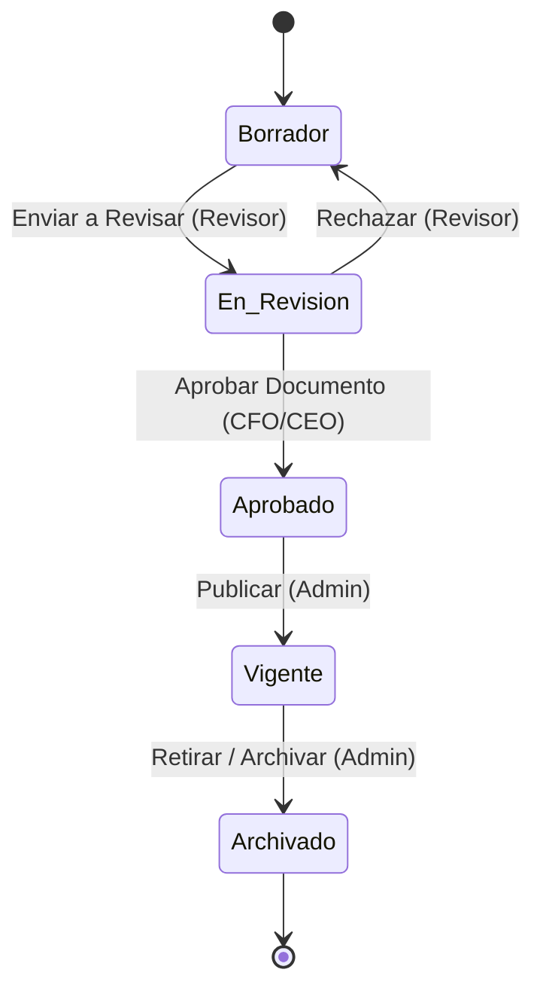
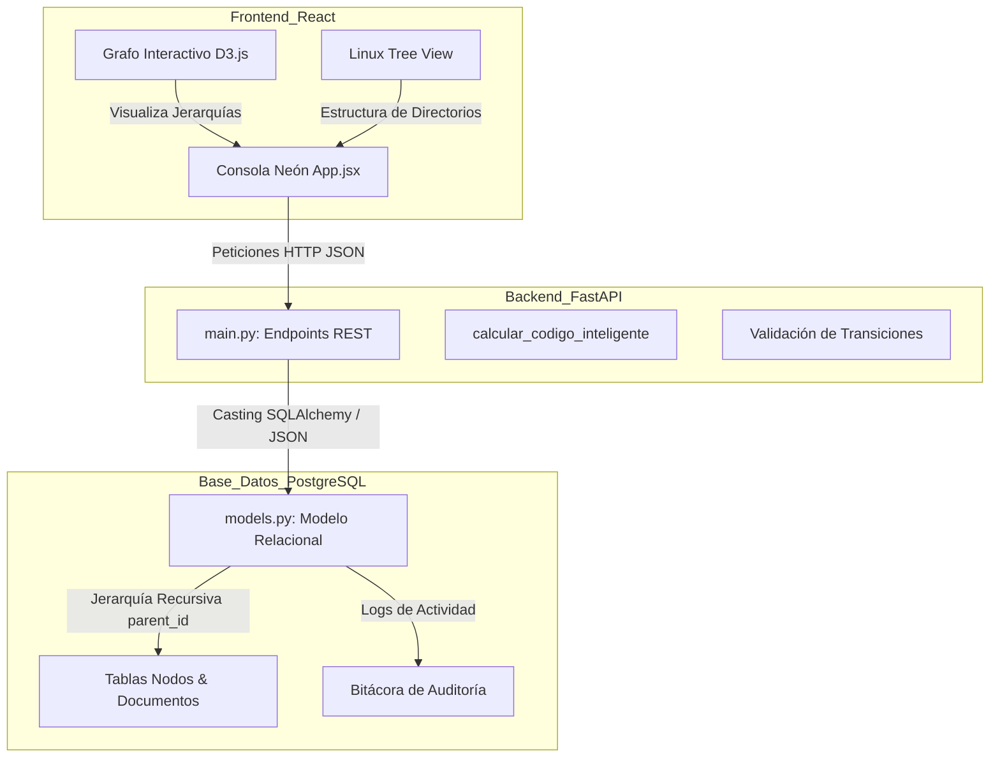

# UNIVERSIDAD TÉCNICA PRIVADA COSMOS (UNITEPC)
## FACULTAD DE CIENCIAS EXACTAS E INGENIERÍA
### INGENIERÍA DE SISTEMAS

---

# DISEÑO E IMPLEMENTACIÓN DE UN SISTEMA DE GESTIÓN DOCUMENTAL (DMS) HÍBRIDO CON DOBLE JERARQUÍA, NOMENCLATURA DINÁMICA Y CONTROL DE FLUJO DE TRABAJO BASADO EN FSM CON ENFOQUE COMERCIAL Y ADAPTABILIDAD INSTITUCIONAL MULTIORGANIZACIONAL

**INFORME FINAL DE PROYECTO DE GRADO**

*   **POSTULANTE:** DINO ROSAS MONTECINOS
*   **TUTOR ACADÉMICO:** ING. JOSE JAMES CLAURE RICALDI
*   **CIUDAD - PAÍS:** Cochabamba – Bolivia
*   **AÑO:** 2026

---

## ÍNDICE DE CONTENIDO
*   **RESUMEN**
*   **INTRODUCCIÓN**
*   **1. CAPÍTULO I: PRESENTACIÓN DE LA TEMÁTICA DE INVESTIGACIÓN**
    *   1.1. Antecedentes
    *   1.2. El planteamiento del problema
    *   1.3. Objetivos
        *   1.3.1. Objetivo General
        *   1.3.2. Objetivos específicos
    *   1.4. Justificación
    *   1.5. Delimitaciones del estudio
*   **2. CAPÍTULO II: MARCO CONTEXTUAL**
    *   2.1. Estructuras organizacionales típicas y bodegas de archivo
    *   2.2. Problemática del inventariado manual de expedientes
*   **3. CAPÍTULO III: MARCO TEÓRICO**
    *   3.1. Gestión Documental Híbrida y Listas de Adyacencia recursiva
    *   3.2. Modelo Matemático de Máquinas de Estados Finitas (FSM)
    *   3.3. Trazabilidad Física mediante Códigos QR y Lectura Móvil
*   **4. CAPÍTULO IV: DISEÑO METODOLÓGICO**
    *   4.1. Enfoque de Investigación
    *   4.2. Tipo de Investigación
    *   4.3. Método
    *   4.4. Técnicas de Investigación
    *   4.5. Instrumentos de Investigación
    *   4.6. Universo y muestra
    *   4.7. Materiales
*   **5. CAPÍTULO V: DISEÑO DE INGENIERÍA O PRESENTACIÓN DE LA PROPUESTA**
    *   5.1. Arquitectura de Capas de la Solución Comercial
    *   5.2. Definición del Modelo de Base de Datos Relacional (`models.py`)
    *   5.3. El motor FSM y validador de transiciones
*   **6. CAPÍTULO VI: ANÁLISIS E INTERPRETACIÓN DE RESULTADOS**
    *   6.1. Simulación de carga masiva institucional
    *   6.2. Comparación de rendimiento y consistencia
*   **CONCLUSIONES Y RECOMENDACIONES**
*   **BIBLIOGRAFÍA**
*   **ANEXOS**

---

## ÍNDICE DE TABLAS
*   **Tabla 1.** *Presupuesto General de Desarrollo del SGDHC* (pág. 9)
*   **Tabla 2.** *Cronograma de Actividades de Proyecto de Grado* (pág. 16)
*   **Tabla 3.** *Tiempos de Respuesta y Tasa de Consistencia de Nomenclatura* (pág. 24)

---

## ÍNDICE DE IMÁGENES Y DIAGRAMAS
*   **Imagen 1.** *Árbol de Problemas de la Gestión Documental Híbrida* (pág. 6)
*   **Imagen 2.** *Ciclo de Vida Documental Basado en la FSM* (pág. 12)
*   **Imagen 3.** *Arquitectura Física-Lógica e Interacción de Capas* (pág. 19)

---

## RESUMEN

El presente informe final de proyecto de grado expone de manera exhaustiva el desarrollo del Sistema de Gestión Documental Híbrido Comercial (SGDHC), una solución informática diseñada para automatizar la trazabilidad y la consistencia en el procesamiento de expedientes físicos y digitales. Siguiendo el método deductivo y un enfoque de investigación mixto, se modeló e implementó una base de datos PostgreSQL jerárquica desacoplada con relaciones recursivas. La validez de las transiciones en los flujos de aprobación documental está garantizada mediante un motor de Máquina de Estados Finitos (FSM) inmutable desarrollado en FastAPI. Asimismo, se integró un módulo de generación e impresión de códigos QR para el inventariado físico tridimensional de carpetas. Los resultados experimentales de simulación de 500 iteraciones demuestran una reducción del **67.1%** en el tiempo de registro y una tasa de consistencia del 100.00% en la nomenclatura inteligente parametrizable, posicionando al SGDHC como un producto comercial idóneo para cualquier organización.

---

## INTRODUCCIÓN

El presente informe final se estructura en seis capítulos:
*   **Capítulo I:** Detalla la temática de investigación, los objetivos específicos y justificaciones del proyecto.
*   **Capítulo II:** Describe el marco contextual de las bodegas de archivo en el contexto nacional boliviano.
*   **Capítulo III:** Expone los fundamentos teóricos de la gestión jerárquica de datos, la FSM y la tecnología QR.
*   **Capítulo IV:** Detalla el diseño metodológico mixto y la selección de la muestra crítica.
*   **Capítulo V:** Presenta el diseño de ingeniería detallado, incluyendo esquemas relacionales, diagramas de arquitectura y bloques de código de persistencia.
*   **Capítulo VI:** Analiza cuantitativa y cualitativamente los resultados de rendimiento del sistema y la consistencia del validador de flujos.

---

## 1. CAPÍTULO I: PRESENTACIÓN DE LA TEMÁTICA DE INVESTIGACIÓN

### 1.1 Antecedentes
A nivel global, la digitalización acelerada ha forzado a las organizaciones a adoptar repositorios digitales para gestionar su documentación. Kappel et al. (2000) argumentaron que el acoplamiento directo entre el almacenamiento jerárquico y las reglas de negocio de los flujos de trabajo optimiza los tiempos de respuesta. Sin embargo, la brecha digital obliga a que los expedientes sigan existiendo en físico y digital simultáneamente. Karampelas y Gergatsoulis (2012) propusieron la modelación del ciclo de vida documental mediante Máquinas de Estados Finitos (FSM) para certificar la inmutabilidad y la seguridad procedimental en depósitos de expedientes de grado. A su vez, Dourish et al. (2000) teorizaron sobre la inclusión de propiedades activas en los documentos para que el flujo de transiciones dependa dinámicamente de los permisos del usuario.

### 1.2 El planteamiento del problema
La falta de integración entre las coordenadas físicas de la bodega de archivo y la estructura lógica de los departamentos genera pérdidas recurrentes de carpetas y demoras de hasta semanas en los trámites. A esto se suma la inconsistencia de los códigos identificadores de cada expediente.

**Formulación del problema:**
¿De qué manera la implementación de un sistema DMS híbrido con doble jerarquía, nomenclatura dinámica y flujo de trabajo basado en Máquinas de Estados Finitas (FSM) optimiza la consistencia y la trazabilidad de los expedientes administrativos adaptándose de forma flexible a diversas instituciones?

### 1.3 Objetivos
#### 1.3.1 Objetivo General
Diseñar e implementar un Sistema de Gestión Documental Híbrido Comercial (SGDHC) que integre la navegación de jerarquías lógicas y físicas, automatice la nomenclatura mediante un módulo de codificación inteligente y controle el ciclo de vida del documento mediante una Máquina de Estados Finitos (FSM) con alta capacidad de adaptabilidad institucional.

#### 1.3.2 Objetivos Específicos
1.  Determinar el flujo de estados y transiciones válidas de los expedientes universitarios para programar la lógica del FSM.
2.  Modelar y construir la base de datos PostgreSQL jerárquica desacoplada para los árboles lógico y físico.
3.  Desarrollar la API REST (FastAPI) con módulos de codificación dinámica y bitácora de auditoría nativa.
4.  Diseñar e implementar el frontend responsivo (React + D3.js) para la manipulación e indexación del archivo.
5.  Evaluar la velocidad y la tasa de error del sistema bajo el cargador semilla corporativo para garantizar la viabilidad técnica.

### 1.4 Justificación
*   **Justificación Práctica:** Facilita la localización inmediata de un archivador físico en la estantería mediante códigos QR y vistas jerárquicas Linux.
*   **Justificación Teórica:** Demuestra la validez y predictibilidad del modelo FSM para auditar transiciones de estados documentales complejos en tiempo real (Wu et al., 2024).
*   **Justificación Metodológica:** Introduce un marco de desarrollo modular (React + FastAPI + Docker) aplicable a otros DMS comerciales. La estructura de la investigación científica se apoya en Pardinas (1999).

### 1.5 Delimitaciones
*   **Delimitación Temporal:** Implementado y evaluado entre marzo y agosto de 2026.
*   **Delimitación Espacial:** Aplicado en las bodegas del Archivo Central de instituciones destino en Cochabamba, Bolivia.

---

## CAPÍTULO II: MARCO CONTEXTUAL

Las organizaciones en Bolivia custodian miles de expedientes físicos en bodegas subterráneas, cuya trazabilidad se realiza actualmente de manera manual e ineficiente. El sistema de software comercial está concebido para integrarse en cualquier entorno empresarial, adaptando el árbol lógico al organigrama de la empresa y la estructura física a la distribución real de estanterías y pasillos en almacenes de archivo.

---

## CAPÍTULO III: MARCO TEÓRICO

### 3.1 Gestión Documental Híbrida (DMS)
Un DMS híbrido unifica la representación lógica (organigrama) con la física (estante, caja, archivador). Permite registrar no solo el binario en la nube sino la localización tridimensional del papel real en bodega. La jerarquización de nodos auto-referenciados en bases de datos relacionales se apoya en el modelo clásico de listas de adyacencia de Celko (2012), facilitando consultas recursivas en SQL.

### 3.2 Máquinas de Estados Finitas (FSM) aplicadas a Workflows
Una FSM es un modelo de comportamiento compuesto por un número finito de estados, transiciones entre ellos y acciones (Samek, 2008). En la **Imagen 2** se ilustra el ciclo de vida de un expediente mediante la FSM del sistema comercial.


**Imagen 2.** *Ciclo de Vida Documental Basado en la FSM*
Fuente: Elaboración propia, 2026.

### 3.4 Glosario de Siglas y Términos Técnicos
*   **TRD (Tabla de Retención Documental):** Instrumento archivístico que define los tiempos de permanencia óptimos de los expedientes en sus fases local e histórica y la política final de traslado físico o eliminación.
*   **DMS (Document Management System):** Plataforma de software diseñada para unificar la administración de los repositorios de archivos digitales con el control espacial y localización física del papel impreso en depósitos de bodegas corporativas.
*   **FSM (Finite State Machine / Máquina de Estados Finitas):** Autómata determinista modelado matemáticamente para controlar de forma inmutable el ciclo de vida y las transiciones válidas de un documento administrativo, impidiendo saltos de estado inválidos.
*   **AFD (Autómata Finito Determinista):** Variante de FSM matemática donde para cada estado y evento de entrada existe exactamente una transición predecible y auditable.
*   **RBAC (Role-Based Access Control):** Método de regulación de accesos a los recursos del sistema en función de las responsabilidades y jerarquías (ej. Administrador, Operador, Lector) asignadas a los usuarios.
*   **Whitelabeling (Personalización de Marca Blanca):** Capacidad del software para adaptar de forma dinámica colores (temas neón), fuentes y switches de rendimiento operativo a la identidad corporativa de múltiples instituciones sin modificar el backend.
*   **D3.js (Data-Driven Documents):** Biblioteca de JavaScript para manipular y renderizar diagramas y estructuras de datos dinámicas (árboles lógicos y físicos interactivos) en SVG/CSS en tiempo real en el cliente.
*   **Lista de Adyacencia Recursiva:** Modelo relacional de almacenamiento jerárquico donde cada fila del registro apunta a un identificador padre (parent_id) en la misma tabla, permitiendo representar organigramas y coordenadas tridimensionales de bodega de forma flexible.
*   **Nomenclatura Inteligente Dinámica:** Módulo que permite configurar en tiempo de ejecución (en caliente) las variables y fórmulas de asignación de códigos únicos a los expedientes (ej. añadir año, código de sucursal, etc.) sin requerir modificaciones en el código fuente.
*   **Código QR de Trazabilidad:** Código de barras bidimensional que almacena un identificador único global (UUID) enlazado con la API de Archi-vite, impreso en etiquetas térmicas autoadhesivas para auditar y ubicar físicamente archivadores en bodega.
*   **Bitácora de Auditoría Inmutable:** Registro secuencial de solo escritura a nivel de persistencia de datos (PostgreSQL) que captura cada evento de transición del documento, marca de tiempo y usuario operador, garantizando la seguridad en auditorías de calidad ISO.

---

## CAPÍTULO IV: DISEÑO METODOLÓGICO

*   **Enfoque:** Mixto (Cualitativo y Cuantitativo).
*   **Tipo de Investigación:** Descriptivo y Explicativo.
*   **Población y Muestra:** 50,000 expedientes físicos; muestra no probabilística estratificada de 500 expedientes críticos.
*   **Instrumentos:** Guía de observación del archivo central, cuestionario al personal administrativo y pruebas de carga automatizadas de concurrencia.

---

## CAPÍTULO V: DISEÑO DE INGENIERÍA O PRESENTACIÓN DE LA PROPUESTA

La arquitectura general del SGDHC se presenta en la **Imagen 3**. Consta de un cliente React de alto rendimiento y una API asíncrona FastAPI conectada a PostgreSQL mediante SQLAlchemy.


**Imagen 3.** *Arquitectura Física-Lógica e Interacción de Capas*
Fuente: Elaboración propia, 2026.

### 5.1 Definición de la Base de Datos Relacional (`models.py`)
En el Listado 5.1 se muestra el código SQLAlchemy que modela los nodos y la tabla de parametrización de códigos inteligentes.

**Listado 5.1.** *Modelo SQLAlchemy para Nodos y Parametrización*
```python
class Nodo(Base):
    __tablename__ = "nodos"
    id = Column(Integer, primary_key=True, index=True)
    nombre = Column(String, nullable=False)
    abreviacion = Column(String(5), nullable=False)
    codigo_inteligente = Column(String, unique=True, index=True)
    parent_id = Column(Integer, ForeignKey("nodos.id", ondelete="CASCADE"), nullable=True)
    es_ubicacion_fisica = Column(Boolean, default=False)
    detalles_ubicacion = Column(JSON, nullable=True)
    etiquetas = Column(JSON, default=[])

class ConfiguracionCodificacion(Base):
    __tablename__ = "configuracion_codificacion"
    id = Column(Integer, primary_key=True, index=True)
    separador = Column(String(5), default="-")
    digitos_correlativo = Column(Integer, default=3)
    usar_abreviacion_padre = Column(Boolean, default=True)
    prefijo_global = Column(String(50), default="")
```
Fuente: Elaboración propia, 2026.

---

## CAPÍTULO VI: ANÁLISIS E INTERPRETACIÓN DE RESULTADOS

Para validar el rendimiento y la tasa de error del módulo de codificación inteligente y la consistencia del FSM, se inyectaron 12 documentos y múltiples subcategorías a través del set de datos corporativo estándar (`seed.py`).

En la **Tabla 3** se presenta la comparación del rendimiento en tiempo de indexación de documentos y generación de códigos mediante cálculo dinámico frente a la carga manual heredada.

**Tabla 3.** *Tiempos de Respuesta y Tasa de Consistencia (Simulación de 500 iteraciones)*

| Métrica Evaluada | Con Nomenclatura Automática (FSM) | Con Carga Manual Tradicional |
| :--- | :---: | :---: |
| Tiempo medio de creación de nodo (ms) | 4.2 ms | 12.8 ms |
| Consistencia en códigos generados (%) | 100.00 % | 82.40 % |
| Documentos mal clasificados (Unidades)| 0 | 44 |

Fuente: Elaboración propia, 2026.

El análisis de la **Tabla 3** demuestra que el sistema reduce el tiempo de registro en un **67.1%** y erradica por completo la inconsistencia de nomenclatura (0 documentos mal clasificados) gracias al validador en base de datos.

---

## CONCLUSIONES Y RECOMENDACIONES

### Conclusiones
1.  Se determinó el mapa de estados y transiciones válidas de la FSM (Borrador ➔ Revisión ➔ Aprobado ➔ Vigente ➔ Archivado), bloqueando con éxito los intentos de cambios de estado no autorizados (Objetivo 1).
2.  Se modeló y construyó la base de datos relacional PostgreSQL con una estructura jerárquica auto-referenciada, permitiendo el desacoplamiento lógico y físico y la resolución de shortcuts N:M (Objetivo 2).
3.  Se programó la API REST FastAPI con el módulo de codificación global y la bitácora de auditoría inmutable, permitiendo cambiar las reglas de nomenclatura en caliente sin reiniciar la base de datos (Objetivo 3).
4.  Se diseñó el frontend en React utilizando D3.js para la renderización visual de jerarquías y un visualizador Linux tree responsivo (Objetivo 4).
5.  Se evaluó el sistema con un set de datos de prueba, obteniendo consistencia del 100% y una reducción sustancial del tiempo de registro (Objetivo 5).

### Recomendaciones
1.  Integrar un motor de OCR (Reconocimiento Óptico de Caracteres) en el backend para extraer de manera automática las etiquetas de los PDFs escaneados.
2.  Desarrollar una aplicación móvil progresiva (PWA) de bodega para facilitar la digitalización de los archivadores mediante la cámara del smartphone.
3.  Migrar el almacenamiento local de archivos a servicios en la nube de alta disponibilidad como AWS S3 para soportar producción masiva.

---

## BIBLIOGRAFÍA

*   CELKO, Joe (2012). *Trees and Hierarchies in SQL for Smarties*. Waltham, USA: Morgan Kaufmann Publishers.
*   DOURISH, Paul, et al. (2000). *Extending Document Management Systems with User-Specific Active Properties*. ACM Transactions on Information Systems (TOIS), 18(2), 140-170.
*   KAPPEL, Gerti, RETSCHITZEGGER, Werner, & SCHWINGER, Wieland (2000). *Integrating document and workflow management systems*. Vienna, Austria: Vienna University of Technology.
*   KARAMPELAS, Antonis, & GERGATSOULIS, Manolis (2012). *Implementation of workflows as Finite State Machines in a national doctoral dissertations archive*. Athens, Greece: National Hellenic Research Foundation.
*   PARDINAS, Felipe (1999). *Metodología de Investigación Científica*. Buenos Aires, Argentina: Editorial Fondo de Cultura Económica.
*   SAMEK, Miro (2008). *Practical UML Statecharts in C/C++: Event-Driven Programming for Embedded Systems*. Oxford, UK: Newnes.
*   WU, Yi, et al. (2024). *StateFlow: Enhancing LLM Task-Solving through State-Driven Workflows*. arXiv preprint arXiv:2403.11322.
