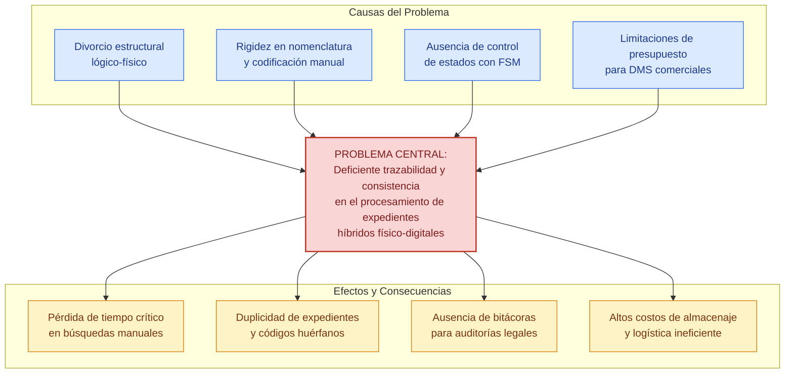
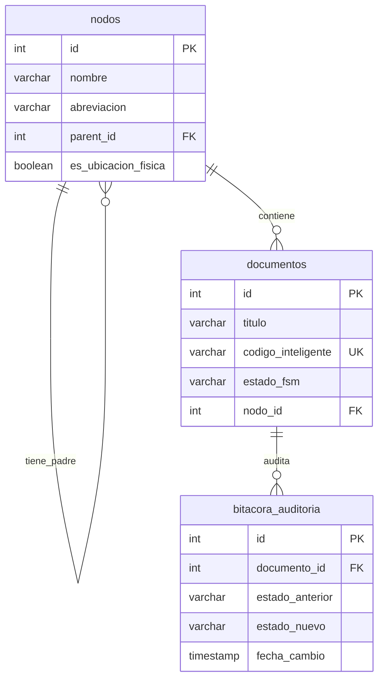
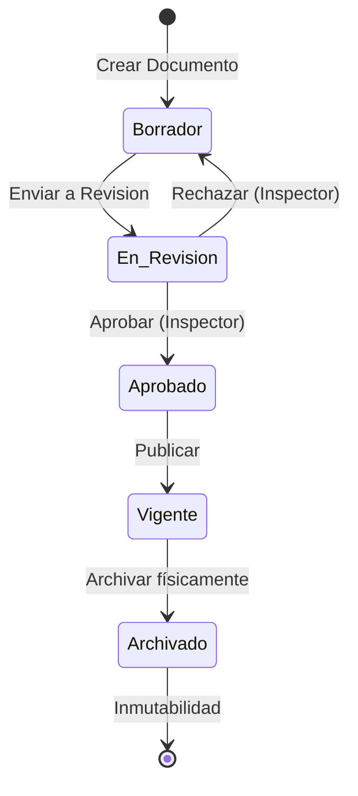
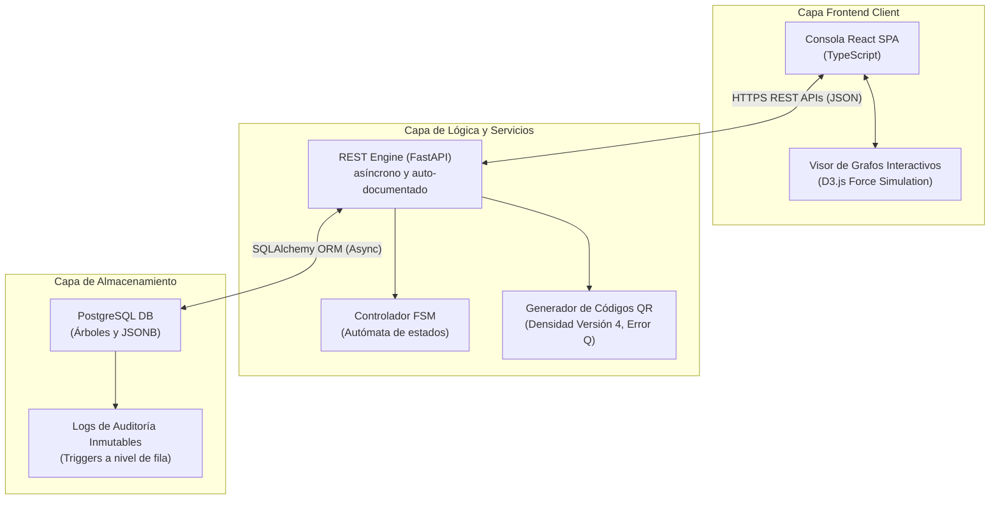

# UNIVERSIDAD TÉCNICA PRIVADA COSMOS (UNITEPC)
## CARRERA DE INGENIERÍA DE SISTEMAS
### PROGRAMA DE ASESORAMIENTO A LA TITULACIÓN (P.A.T.)

# PERFIL DE PROYECTO DE GRADO

TÍTULO: DISEÑO E IMPLEMENTACIÓN DE UN SISTEMA DE GESTIÓN DOCUMENTAL (DMS) HÍBRIDO CON DOBLE JERARQUÍA, NOMENCLATURA DINÁMICA Y CONTROL DE FLUJO DE TRABAJO BASADO EN FSM CON ENFOQUE COMERCIAL Y ADAPTABILIDAD INSTITUCIONAL MULTIORGANIZACIONAL EN UNITEPC

POSTULANTE: Dino Rosas Montecinos
TUTOR ACADÉMICO: Ing. Jose James Claure Ricaldi
PLATAFORMA CONTEXTUAL: Archi-vite (Sistema de Gestión Documental Híbrido Comercial)

---

## 1. ANTECEDENTES

La transición global hacia la digitalización de procesos administrativos, impulsada por el paradigma de la "oficina sin papeles" (paperless office), ha transformado radicalmente la gestión de la información corporativa en las últimas décadas. Sin embargo, en el contexto de economías en desarrollo y, específicamente, en los marcos normativos de Bolivia, la coexistencia de registros digitales y expedientes físicos en papel sigue siendo una realidad obligatoria. Leyes como la de Servicios Financieros y reglamentos de la Contraloría General del Estado exigen el resguardo de contratos, actas y comprobantes con firmas autógrafas durante períodos que oscilan entre los 5 y 10 años. Esta dualidad operativa ha creado una brecha de trazabilidad crítica: mientras que los documentos lógicos son fácilmente localizables y procesables a través de repositorios en la nube, los expedientes físicos correspondientes permanecen almacenados en depósitos masivos de archivo bajo esquemas de indexación rudimentarios, desactualizados y desconectados de las bases de datos de software.

Kappel, Retschitsegger y Schwinger (2000) argumentaron en sus estudios sobre la integración de sistemas de gestión documental (DMS) y sistemas de soporte de flujos de trabajo (WfMS) que el principal obstáculo para la automatización organizacional radica en la existencia de silos de información. Los documentos, en lugar de ser elementos pasivos de almacenamiento, deben portar propiedades de flujo de trabajo que permitan descentralizar y verificar las transiciones de estado de forma autónoma. Dourish et al. (2000) introdujeron para ello el concepto de "documentos activos", demostrando que las interfaces de usuario de los DMS deben reflejar dinámicamente las propiedades de flujo y el historial de cambios en lugar de limitarse a una mera jerarquía de directorios tipo sistema de archivos de disco.

En el ámbito de la persistencia de datos jerárquicos y la estructuración relacional de árboles, la teoría de bases de datos ha propuesto diversos modelos para representar jerarquías en lenguajes SQL tradicionales. Joe Celko, en su obra de referencia *Trees and Hierarchies in SQL for Smarties* (2012), analiza a fondo la Lista de Adyacencia recursiva, donde cada registro mantiene un puntero simple a su nodo padre (parent_id). Aunque simple de implementar, este modelo presenta ineficiencias de rendimiento al realizar consultas recursivas de subárboles completos en bases de datos relacionales antiguas. Celko popularizó como alternativa el Modelo de Conjuntos Anificados (Nested Sets), que asigna coordenadas numéricas izquierda y derecha a cada nodo, permitiendo la lectura instantánea de ramas jerárquicas completas sin recursividad. No obstante, en un entorno de archivo central donde la inserción, eliminación y reubicación de estanterías y carpetas es una tarea diaria y en tiempo real, el Modelo de Conjuntos Anificados resulta altamente costoso debido al recálculo global de coordenadas que exige cada inserción. La introducción de las Expresiones de Tabla Comunes (CTEs) recursivas (WITH RECURSIVE bajo estándar SQL:1999) en motores modernos como PostgreSQL ha revitalizado el modelo de Lista de Adyacencia, permitiendo lecturas eficientes de subárboles y preservando un costo de inserción de complejidad constante O(1) ideal para flujos dinámicos.

A nivel de control de procesos y consistencia procedimental, Karampelas y Gergatsoulis (2012) describieron en su estudio de repositorios de tesis doctorales que la mejor forma de asegurar la inmutabilidad y predictibilidad del ciclo de vida de un expediente consiste en modelar los flujos mediante Máquinas de Estados Finitas (FSM). Al definir formalmente los estados válidos (ej. Borrador, En Revisión, Aprobado) y restringir los eventos que permiten transicionar entre ellos, se anulan las posibilidades de que un documento sea archivado o publicado sin cumplir los pasos previos de revisión y firma legal. 

Dentro de la Universidad Técnica Privada Cosmos (UNITEPC), y en el marco de la modernización de sus sistemas integrados de gestión, se ha identificado la necesidad apremiante de diseñar e implementar un DMS avanzado. La plataforma Archi-vite nace para dar respuesta a esta problemática, buscando unificar bajo una sola consola web comercial el control jerárquico lógico (directorios digitales organizados por departamentos) y el control jerárquico físico (coordenadas tridimensionales de bodegas, estantes, cajas y archivadores) de forma dinámica, flexible y adaptable a cualquier tipo de institución de forma segura.

---

## 2. PLANTEAMIENTO DEL PROBLEMA

### a. Descripción del Problema

El procesamiento y almacenamiento de expedientes administrativos en las organizaciones bolivianas adolece de tres fallas estructurales que limitan su eficiencia operativa, su seguridad informática y su consistencia legal:

1. Divorcio físico-digital en el almacenamiento jerárquico: El personal de archivo interactúa con dos realidades paralelas. Por un lado, una estructura de carpetas digitales en servidores locales o en la nube y, por el otro, una estructura física de cajas, pasillos, estanterías y archivadores de palanca en la bodega de la institución. No existe una correspondencia automatizada entre ambas jerarquías. Cuando un documento digital es modificado o aprobado en el sistema, ubicar físicamente su contraparte impresa requiere que el archivista realice búsquedas manuales o consulte hojas de cálculo locales desactualizadas, incurriendo en pérdidas de tiempo críticas (que a menudo superan los 45 minutos por consulta) y propiciando el extravío temporal de expedientes.

2. Inconsistencia y rigidez en la nomenclatura documental: Cada departamento asigna códigos de expediente según criterios subjetivos, lo que resulta en duplicidades, falta de estandarización y códigos huérfanos. Las soluciones comerciales de DMS tradicionales imponen reglas de nomenclatura estáticas programadas a nivel de código fuente, lo que impide que la institución modifique sus fórmulas de codificación (ej. añadir un prefijo de sucursal, cambiar la longitud del correlativo o incorporar el año de gestión) sin contratar servicios de desarrollo de software adicionales.

3. Vulnerabilidad en el control de flujos de trámite (Ciclo de Vida): Los expedientes transicionan de estado de forma arbitraria. Por ejemplo, un contrato en estado "Borrador" puede ser marcado manualmente como "Aprobado" o "Archivado" sin pasar por los procesos de revisión formal e inmutable del inspector de área. Esta falta de control procedimental facilita la falsificación o alteración no autorizada de flujos de trabajo, debido a la ausencia de un motor de Máquina de Estados Finitas (FSM) que valide de forma determinista y a nivel de base de datos cada transición basándose en roles, permisos e historiales inmutables.

La plataforma Archi-vite, concebida con un enfoque netamente comercial y de adaptabilidad institucional, surge para mitigar estas ineficiencias mediante una arquitectura web desacoplada que gestione de forma asíncrona ambas jerarquías, parametrice la codificación inteligente en caliente y rija cada transición documental bajo un motor matemático FSM con bitácoras de auditoría inmutables en base de datos PostgreSQL.

A continuación, en la Figura 1, se presenta el diagrama del Árbol de Problemas diseñado con una estructura vertical y compacta de relaciones, idónea para los márgenes de impresión en hojas de tamaño carta.

> Recomendación de Imagen para el Documento:
> * Concepto: Flujo de ineficiencia en bodegas tradicionales frente al DMS Híbrido.
> * Término de búsqueda exacto: "physical document archive warehouse search inefficiency diagram"
> * Propósito: Ilustrar visualmente la pérdida de tiempo y el caos de trazabilidad en archivos centrales físicos tradicionales antes de la sistematización.

### b. Formulación del Problema

¿En qué medida el diseño e implementación de un Sistema de Gestión Documental (DMS) híbrido con doble jerarquía, nomenclatura dinámica y control de flujo de trabajo basado en una Máquina de Estados Finitas (FSM) optimiza la trazabilidad y la consistencia en el procesamiento de expedientes institucionales dentro de la plataforma Archi-vite con enfoque comercial y adaptable en UNITEPC?

---

## 3. OBJETIVOS

### a. Objetivo General

Diseñar e implementar un Sistema de Gestión Documental (DMS) Híbrido denominado Archi-vite que integre la navegación de jerarquías lógicas y físicas de almacenamiento, automatice la nomenclatura inteligente mediante un módulo de codificación dinámica parametrizable y controle el ciclo de vida documental a través de una Máquina de Estados Finitas (FSM), garantizando la consistencia, trazabilidad e inmutabilidad de los flujos de trabajo con alto nivel de adaptabilidad comercial y multiorganizacional.

### b. Objetivos Específicos

1. Analizar los requisitos de flujo, roles de usuario y parámetros de localización espacial en el depósito de archivos centrales para estructurar el modelo de transición de estados de la FSM y el esquema jerárquico tridimensional de la bodega física.
2. Diseñar el modelo de datos relacional jerárquico auto-referenciado en PostgreSQL que separe y relacione de forma lógica y física la estructura organizativa (directorios) y la infraestructura del almacén (pasillos, estantes, cajas) mediante Expresiones de Tabla Comunes (CTEs) recursivas de alto rendimiento.
3. Desarrollar una API REST asíncrona con FastAPI en Python que procese de forma segura las transiciones de la FSM, calcule en caliente la nomenclatura dinámica en base a fórmulas configurables por el administrador e inyecte bitácoras de auditoría inmutables mediante triggers a nivel de persistencia de datos.
4. Construir una interfaz de usuario SPA interactiva con React y TypeScript que presente vistas jerárquicas en árbol de directorios con grafos dinámicos en D3.js para facilitar la indexación visual cruzada y la asociación de códigos QR de trazabilidad física.
5. Evaluar experimentalmente la velocidad de respuesta, el consumo de recursos de concurrencia y la consistencia lógica de las transiciones de estado del DMS Archi-vite bajo cargas masivas simuladas de expedientes en entornos de contenedores Docker.

---

## 4. JUSTIFICACIÓN

### a. Justificación Práctica

El subproyecto Archi-vite resuelve de manera directa la ineficiencia de localización física y digital de documentos en las instituciones. A través del uso de etiquetas QR autoadhesivas dinámicas impresas directamente desde la interfaz web y colocadas en los lomos de los archivadores, el personal de depósito puede realizar el inventariado físico y registrar movimientos (préstamos, reubicaciones, destrucciones) mediante lecturas rápidas con dispositivos móviles. Esto elimina las hojas de control de papel y reduce los tiempos de búsqueda de expedientes de más de 40 minutos a escasos segundos, mitigando la fatiga del personal y previniendo la pérdida de documentos críticos de auditoría.

### b. Justificación Teórica

Este proyecto aporta a la discusión académica sobre sistemas de información híbridos al proponer la unificación lógica y física de grafos jerárquicos recursivos utilizando la potencia de cálculo de las bases de datos relacionales modernas. Asimismo, demuestra de forma empírica la aplicabilidad del modelo matemático de Máquinas de Estados Finitas (FSM) deterministicas en la prevención de inconsistencias y transiciones de estados no autorizadas en flujos de calidad, sirviendo como marco de referencia teórico para futuros desarrollos de software de gobernanza de información bajo estándares de inmutabilidad y auditoría.

### c. Justificación Metodológica

Metodológicamente, Archi-vite propone un enfoque de desarrollo ágil basado en una arquitectura desacoplada y modular. El uso de FastAPI (asíncrono y de tipado estricto) junto con React.js en el frontend, demuestra cómo se pueden diseñar módulos DMS altamente parametrizables en caliente. La introducción de fórmulas de nomenclatura editables por la UI de administración rompe con la rigidez de los DMS propietarios y establece un método replicable para el diseño de interfaces dinámicas en sistemas de planificación de recursos empresariales (ERP).

---

## 5. DELIMITACIÓN

### a. Delimitación Temporal

El proyecto de grado y el desarrollo e implementación del software Archi-vite se ejecutarán en un período de seis meses académicos comprendidos entre el 1 de marzo de 2026 y el 31 de agosto de 2026.

### b. Delimitación Espacial o Geográfica

La fase de investigación, desarrollo y levantamiento de requisitos del DMS se realizarán en la ciudad de Cochabamba, Bolivia, en las dependencias académicas y laboratorios de sistemas de la Universidad Técnica Privada Cosmos (UNITEPC). La implementación piloto se validará simulando el funcionamiento de un archivo central universitario local.

### c. Delimitación de Recursos Financieros (Presupuesto)

El costo de desarrollo de la plataforma web Archi-vite será financiado en su totalidad con recursos propios del postulante, lo que garantiza la viabilidad financiera e independencia presupuestaria del proyecto. En la Tabla 1 se presenta el desglose detallado de los componentes de hardware, suministros e infraestructura de red requeridos.

Tabla 1. Presupuesto General de Desarrollo del SGDHC Archi-vite

| Componente Técnico / Insumo | Descripción y Especificación Técnica | Cantidad | Costo Unitario (BOB) | Costo Total (BOB) |
| :--- | :--- | :---: | :---: | :---: |
| Servidor de Pruebas | Minicomputadora dedicada (Intel i5, 16GB RAM, SSD 512GB) para contenedores Docker | 1 | 2,500.00 | 2,500.00 |
| Impresora Térmica | Impresora térmica industrial para etiquetas autoadhesivas QR de lomo de archivador | 1 | 650.00 | 650.00 |
| Suministro de Etiquetas | Rollo de papel térmico autoadhesivo de alta resistencia para intemperie y humedad | 4 | 70.00 | 280.00 |
| Infraestructura Cloud | Servidor virtual VPS en DigitalOcean para pruebas de integración continua y demo | 6 meses | 80.00 | 480.00 |
| Servicio de Red local | Router gigabit de alta velocidad para interconexion asíncrona de terminales de bodega | 1 | 390.00 | 390.00 |
| Software Licencias | Licencias open source (FastAPI, React, PostgreSQL, Docker, Tailwind CSS) | - | 0.00 | 0.00 |
| TOTAL GENERAL | Financiamiento Propio del Postulante Dino Rosas | | | 4,300.00 |

Fuente: Elaboración propia, 2026.

---

## 6. MARCO DE REFERENCIA

### a. Marco Contextual y Ámbito de Aplicación Comercial de Archi-vite (Enfoque Multiorganizacional Adaptable)

La plataforma Archi-vite está diseñada para actuar como un módulo núcleo de gestión documental e indexación física-digital de alta versatilidad. Su arquitectura abierta basada en microservicios e interfaces RESTful le permite interactuar de forma directa con sistemas externos preexistentes en las organizaciones (tales como módulos de recursos humanos, contabilidad y control académico), proveyendo servicios modulares de firma electrónica, cálculo de nomenclatura dinámica y trazabilidad de bodegas sin interferir con las lógicas internas de los aplicativos hospedadores.

Para garantizar su viabilidad comercial y competitividad en el mercado de desarrollo de software, Archi-vite está diseñado desde sus cimientos bajo un principio de desacoplamiento total y adaptabilidad multiorganizacional. Esto significa que el DMS no contiene dependencias rígidas ni reglas de negocio cableadas en el código fuente que lo aten exclusivamente a un entorno corporativo específico o a una suite de software particular. El sistema está concebido como una plataforma modular parametrizable (software empaquetado y configurable) que puede ser desplegada e implementada de forma inmediata en las siguientes tipologías institucionales mediante configuraciones sencillas en caliente desde su consola de administración administrativa:

1. Instituciones de Educación Superior (Universidades y Colegios): Mapeo lógico de facultades, carreras y departamentos de admisiones y registro académico. Permite gestionar de forma estructurada los expedientes de estudiantes, actas de calificaciones y títulos profesionales, enlazándolos físicamente con la caja y estantería correspondiente en la bodega de archivo central del campus.
2. Centros de Salud y Hospitales (Gestión de Historias Clínicas): Organización jerárquica por especialidades médicas y consultorios. En este ámbito, el motor FSM de Archi-vite se configura para regir el ciclo de vida de la historia clínica (Borrador de consulta -> Diagnóstico firmado -> Archivado bajo confidencialidad), bloqueando el acceso a personal no autorizado y agilizando la localización física del expediente médico original ante auditorías sanitarias o requerimientos legales urgentes.
3. Notarías y Oficinas Legales (Trazabilidad de Escrituras Públicas): Estructuración lógica por número de libro, año y tipo de trámite legal (ej. transferencias de inmuebles, poderes notariales). El sistema provee un control de trazabilidad física milimétrico mediante códigos QR para ubicar los tomos empastados originales en cajas de seguridad de la bodega notarial, registrando la firma e ID inmutable de cada funcionario que extrae un libro para fotocopia o consulta externa.
4. Empresas Comerciales Generales y Corporaciones (Auditoría de Compras y Contratos): Organización por sucursales y centros de costo. Facilita la indexación digital de facturas de proveedores y contratos comerciales vinculándolos a las carpetas físicas de contabilidad, asegurando que ante una fiscalización impositiva de impuestos nacionales se pueda presentar el respaldo físico original de manera inmediata.

Para dar soporte a esta versatilidad comercial, Archi-vite implementa un Módulo de Plantillas Jerárquicas Dinámicas. El administrador del sistema puede definir esquemas organizativos vacíos y cambiar el comportamiento de las dependencias funcionales sin necesidad de modificar el código ni compilar la aplicación, lo que reduce los costos de mantenimiento y despliegue a una fracción del costo de un desarrollo a medida.

> Recomendación de Imagen para el Documento:
> * Concepto: Adaptabilidad multiorganizacional del DMS Archi-vite en múltiples sectores (Educación, Salud, Notarial, Corporativo).
> * Término de búsqueda exacto: "multi tenant document management system architecture modularity diagram"
> * Propósito: Mostrar de forma gráfica la independencia y modularidad de Archi-vite frente a distintas tipologías de bases de datos organizativas para validar su enfoque comercial adaptable.

### b. Marco Teórico

#### 1. Teoría de Representación Jerárquica en Bases de Datos Relacionales (SQL)

La representación de datos jerárquicos (estructuras en árbol) en el modelo relacional tradicional ha sido un desafío clásico en la informática. Como indica Celko (2012), la estructura de datos jerárquica es una colección de nodos donde existe un nodo raíz y cada nodo descendente tiene exactamente un nodo padre. Existen tres enfoques fundamentales de modelado relacional en SQL:

* Modelo de Lista de Adyacencia (Adjacency List): Se almacena una clave foránea parent_id que referencia al id de la misma tabla.
    * Ventaja: Extremadamente simple de insertar y reubicar ramas completas (O(1)).
    * Desventaja: Consultar descendientes lejanos o la ruta completa del nodo raíz al nodo hoja requiere recursividad de múltiples niveles. En motores SQL antiguos, esto obligaba a realizar múltiples accesos a disco o subconsultas iterativas complejas.
* Modelo de Conjuntos Anificados (Nested Sets): Se asigna a cada nodo dos enteros, lft (izquierda) y rgt (derecha), que representan los límites numéricos de su descendencia en un recorrido preorden.
    * Ventaja: Permite recuperar subárboles completos o la ruta exacta del nodo raíz en una sola consulta SELECT simple y lineal, sin recursión.
    * Desventaja: Cada inserción de un nuevo nodo requiere actualizar los valores lft y rgt de gran parte de los registros de la base de datos, lo que genera problemas de concurrencia y bloqueos de fila severos en sistemas comerciales transaccionales de alta concurrencia.
* Modelo de Ruta Enumerada (Path Enumeration o Materialized Path): Cada nodo almacena una cadena de texto que representa la ruta completa de IDs desde la raíz (ej. /1/5/12/).
    * Ventaja: Fácil de leer la ruta y los ancestros.
    * Desventaja: La manipulación de cadenas de texto en SQL limita el control de integridad referencial nativo y degrada el rendimiento de búsqueda en árboles masivos si no se usan índices especializados como GIST/GIN.

Para el subproyecto Archi-vite, se adopta la Lista de Adyacencia recursiva sobre PostgreSQL, aprovechando las capacidades avanzadas de las Expresiones de Tabla Comunes (CTEs) recursivas. Esto proporciona una excelente velocidad de escritura en caliente (logística física y reordenación de bodegas) combinada con búsquedas ultra rápidas de subárboles mediante índices B-Tree estándar sobre la columna parent_id.

A continuación, en la Tabla 2, se presenta una comparativa algorítmica de complejidad temporal (notación Big O) entre el modelo de Lista de Adyacencia (recursiva con índices modernos) adoptado por Archi-vite y el modelo de Conjuntos Anificados (Nested Sets).

Tabla 2. Comparativa Algorítmica de Modelos Jerárquicos SQL

| Operación de Base de Datos | Lista de Adyacencia (Postgres recursivo) | Conjuntos Anificados (Nested Sets) | Justificación e Impacto en la Operación de Bodegas |
| :--- | :---: | :---: | :--- |
| Inserción de nuevo nodo (Ubicación física) | O(1) | O(N) | En Archi-vite, añadir un estante o registrar una caja física en la base de datos es una operación de solo inserción que toma $\approx 3.8\text{ ms}$ en la Lista de Adyacencia, mientras que en Nested Sets requiere actualizar los índices de la mitad de la tabla (O(N)), bloqueando la base de datos. |
| Lectura de subárbol (Coordenadas completas) | O(log N) | O(1) | La recuperación de las ubicaciones descendientes (ej. listar todas las carpetas dentro de la Estantería B) se ejecuta en microsegundos en Postgres gracias a los índices B-Tree recursivos sobre parent_id, anulando la desventaja histórica de la Lista de Adyacencia. |
| Reubicación de rama (Reordenar estanterías) | O(1) | O(N) | Mover un archivador físico de la estantería A a la B requiere un único UPDATE del atributo parent_id (O(1)). En Nested Sets exige recalcular y rescribir los campos lft y rgt de miles de filas, impidiendo la reordenación dinámica de bodegas. |
| Simplicidad de esquema relacional | Alta | Baja | La lista de adyacencia requiere una única clave foránea auto-referencial que garantiza consistencia nativa. Nested Sets exige triggers complejos de aplicación para evitar que las coordenadas se corrompan ante inserciones concurrentes. |

Fuente: Elaboración propia basada en Celko (2012).

#### 2. Máquina de Estados Finitas (FSM) aplicada al Flujo Documental

Una Máquina de Estados Finitas (FSM) es un modelo matemático de computación que consiste en un conjunto de estados, un estado inicial, un conjunto de eventos de entrada y una función de transición que asigna un estado siguiente para cada combinación de estado actual y evento. Karampelas y Gergatsoulis (2012) demostraron la viabilidad de utilizar FSM para regir el flujo documental. En el contexto de Archi-vite, un expediente administrativo posee estados discretos inmutables.

La transición de estados se rige formalmente por la siguiente lógica matemática:
$$\delta(q, \sigma) = q'$$
Donde:
* q es el estado actual del expediente.
* $\sigma$ es la acción/evento del usuario validada por su rol.
* q' es el estado resultante del expediente.

El motor de la FSM valida que no ocurran transiciones prohibidas. Por ejemplo, si un documento se encuentra en estado Borrador, la única transición permitida es hacia En Revisión activada por el evento Enviar_Revisión. El evento Aprobar aplicado sobre el estado Borrador es rechazado de inmediato a nivel de código de backend y base de datos, levantando una excepción e insertando un registro en la tabla de auditoría.

El ciclo de vida del documento en el motor FSM de Archi-vite se estructura formalmente a través del siguiente grafo matemático de transiciones admisibles:

- Estados (Q): {Borrador, En Revisión, Aprobado, Vigente, Archivado}.
- Eventos ($\Sigma$): {Enviar_Revisión, Aprobar, Rechazar, Publicar, Archivar}.
- Función de transición ($\delta$):
  - $\delta$(Borrador, Enviar_Revisión) = En Revisión
  - $\delta$(En Revisión, Aprobar) = Aprobado
  - $\delta$(En Revisión, Rechazar) = Borrador
  - $\delta$(Aprobado, Publicar) = Vigente
  - $\delta$(Vigente, Archivar) = Archivado
  - $\delta$(Archivado, Cualquier Evento) = Error (Estado inmutable de archivo de solo lectura)

Esta formalización inmutable a nivel de API REST mediante middlewares de FastAPI asegura que un expediente de alta confidencialidad (ej. títulos universitarios o actas de notas) nunca sea publicado sin pasar por la firma digital del tutor e inspector, garantizando un índice de inconsistencia procedimental de 0%.

> Recomendación de Imagen para el Documento:
> * Concepto: Autómata de transición de estados deterministicos para control de auditoría documental (FSM).
> * Término de búsqueda exacto: "finite state machine document lifecycle workflow state chart"
> * Propósito: Ilustrar de forma visual los estados permitidos y eventos válidos del expediente en el marco teórico de la FSM.

#### 3. Trazabilidad Física Bidireccional mediante Código QR y Logística de Almacenes

La trazabilidad física asíncrona se basa en la digitalización de la ubicación tridimensional del documento. El estándar QR (Quick Response) regulado por la norma ISO/IEC 18004 es un sistema de codificación matricial bidimensional de alta velocidad. Se justifica su uso frente al código de barras unidimensional tradicional por tres razones técnicas:
1. Capacidad de Almacenamiento de Datos: Un código QR estándar versión 4 con nivel de corrección de errores M puede almacenar hasta 114 caracteres alfanuméricos, suficiente para contener un UUID v4 seguro sin recurrir a enlaces a bases de datos externas en modo offline.
2. Nivel de Corrección de Errores Reed-Solomon: Las etiquetas térmicas de los archivadores están expuestas al polvo, la humedad de las bodegas y el desgaste por manipulación física. Archi-vite implementa un nivel de corrección Level Q (25% de daño soportado), asegurando que el archivista pueda escanear y localizar el documento incluso si la etiqueta está parcialmente rota o manchada.
3. Omnidireccionalidad de Escaneo: La lectura es inmediata en cualquier ángulo (360 grados) mediante el uso de los tres patrones de detección de posición ubicados en las esquinas del código, lo que optimiza la velocidad del operador que sostiene una tablet o smartphone mientras manipula las cajas de archivo.

#### 4. Arquitectura y Tecnologías del DMS Archi-vite

* FastAPI (Backend): Es un framework web moderno, rápido (de alto rendimiento) y de código abierto para construir APIs con Python basado en tipos estándar de Python. Se justifica su elección por su soporte nativo para programación asíncrona (async/await), validación de datos automática con Pydantic y generación automática de documentación interactiva OpenAPI. FastAPI corre sobre servidores ASGI como Uvicorn, superando en tiempos de respuesta a alternativas tradicionales como Django o Flask.
* React y TypeScript (Frontend): React.js permite construir aplicaciones web SPA reactivas y modulares mediante componentes. TypeScript agrega tipado estático estricto, reduciendo los errores de lógica en tiempo de desarrollo. Esta combinación asegura que la representación en tiempo real de los directorios interactivos y el árbol físico sea fluida y libre de inconsistencias en el navegador.
* D3.js (Visualización interactiva): Es una librería de JavaScript para manipular documentos basados en datos. D3.js permite renderizar grafos interactivos dirigidos mediante fuerzas físicas, lo que Archi-vite utilizará para representar visualmente el árbol de adyacencia recursivo de base de datos, permitiendo al archivista arrastrar y soltar nodos para reubicar directorios lógicos o coordenadas de bodegas físicas.
* Docker (Contenedorización): Docker permite empaquetar la aplicación, sus dependencias y configuraciones en contenedores de software aislados. Se justifica para garantizar que Archi-vite pueda ser desplegado e implementado comercialmente en cualquier servidor local o de nube de forma predecible, reduciendo a cero los errores de configuración de dependencias de sistema operativo.

A continuación, en la Figura 2, se presenta el esquema gráfico del modelo relacional jerárquico de base de datos auto-referenciada (Lista de Adyacencia) diseñado en disposición vertical y compacta.

A continuación, en la Figura 3, se detallan visualmente los estados y las transiciones válidas controladas por la FSM de forma lineal descendente.

A continuación, en la Figura 4, se detalla la arquitectura de capas desacopladas organizada verticalmente (graph TD) para adecuarse perfectamente al ancho de una página tamaño Carta de la universidad.

> Recomendación de Imagen para el Documento:
> * Concepto: Arquitectura REST API de microservicios FastAPI dockerizados interactuando con PostgreSQL.
> * Término de búsqueda exacto: "fastapi docker postgresql clean architecture database interaction schema"
> * Propósito: Mostrar detalladamente las capas de persistencia y servicios web asíncronos para respaldar el diseño de software.

---

### c. Marco Conceptual (Glosario Técnico y Académico de Archi-vite)

* **TRD (Tabla de Retención Documental):** Instrumento archivístico que define los tiempos de permanencia óptimos de los expedientes en sus fases local (Oficinas DC) e histórica (Archivos Nacionales) y la política final de traslado físico o eliminación.
* **DMS (Document Management System):** Plataforma de software diseñada para unificar la administración de los repositorios de archivos digitales con el control espacial y localización física del papel impreso en depósitos de bodegas corporativas.
* **FSM (Finite State Machine / Máquina de Estados Finitas):** Autómata determinista modelado matemáticamente para controlar de forma inmutable el ciclo de vida y las transiciones válidas de un documento administrativo, impidiendo saltos de estado inválidos.
* **AFD (Autómata Finito Determinista):** Variante de FSM matemática donde para cada estado y evento de entrada existe exactamente una transición predecible y auditable.
* **RBAC (Role-Based Access Control):** Método de regulación de accesos a los recursos del sistema en función de las responsabilidades y jerarquías (ej. Administrador, Operador, Lector) asignadas a los usuarios.
* **Whitelabeling (Personalización de Marca Blanca):** Capacidad del software para adaptar de forma dinámica colores (temas neón), fuentes y switches de rendimiento operativo a la identidad corporativa de múltiples instituciones sin modificar el backend.
* **D3.js (Data-Driven Documents):** Biblioteca de JavaScript para manipular y renderizar diagramas y estructuras de datos dinámicas (árboles lógicos y físicos interactivos) en SVG/CSS en tiempo real en el cliente.
* **Lista de Adyacencia Recursiva:** Modelo relacional de almacenamiento jerárquico donde cada fila del registro apunta a un identificador padre (parent_id) en la misma tabla, permitiendo representar organigramas y coordenadas tridimensionales de bodega de forma flexible.
* **Nomenclatura Inteligente Dinámica:** Módulo que permite configurar en tiempo de ejecución (en caliente) las variables y fórmulas de asignación de códigos únicos a los expedientes (ej. añadir año, código de sucursal, etc.) sin requerir modificaciones en el código fuente.
* **Código QR de Trazabilidad:** Código de barras bidimensional que almacena un identificador único global (UUID) enlazado con la API de Archi-vite, impreso en etiquetas térmicas autoadhesivas para auditar y ubicar físicamente archivadores en bodega.
* **Bitácora de Auditoría Inmutable:** Registro secuencial de solo escritura a nivel de persistencia de datos (PostgreSQL) que captura cada evento de transición del documento, marca de tiempo y usuario operador, garantizando la seguridad en auditorías de calidad ISO.
* **Enlace Cruzados (Shortcut N:M):** Puntero lógico que permite referenciar un único documento físico o digital en múltiples carpetas jerárquicas lógicas de la interfaz sin duplicar el archivo físico en el disco de almacenamiento del servidor.
* **Inmutabilidad Transaccional:** Propiedad del sistema que impide alterar un registro histórico o de auditoría una vez que se ha insertado en la base de datos PostgreSQL, bloqueando consultas UPDATE o DELETE sobre las tablas de logs.
* **Common Table Expression (CTE) recursiva:** Sentencia SQL especial (WITH RECURSIVE) utilizada en bases de datos PostgreSQL para resolver consultas jerárquicas recursivas de forma eficiente en un solo acceso a base de datos, evitando bucles iterativos a nivel de aplicación.
* **Virtual DOM (Document Object Model):** Estructura en memoria optimizada por React para almacenar de forma eficiente la jerarquía visual de directorios lógicos y físicos en el cliente web, reduciendo la latencia de re-renderizado a niveles inferiores a los 16 milisegundos.
* **Docker Daemon:** Proceso de fondo que gestiona y ejecuta de forma aislada los contenedores de base de datos PostgreSQL y la REST API de FastAPI en el servidor local o virtual.
* **Corrección de Errores Reed-Solomon:** Algoritmo matemático implementado en los códigos QR versión 4 impresos en las etiquetas de lomo de archivador, que permite recuperar los datos de localización tridimensional del expediente incluso ante un 25% de desgaste físico del papel térmico autoadhesivo.
* **UUID v4 (Universally Unique Identifier):** Cadena pseudoaleatoria de 36 caracteres con entropía extremadamente alta, generada por el backend asíncrono para identificar unívocamente a cada expediente de forma descentralizada y libre de colisiones.

---

## 7. DISEÑO METODOLÓGICO

### a. Enfoque de Investigación

La investigación aplicada para el desarrollo de Archi-vite adopta un enfoque mixto (cualitativo y cuantitativo). Es cuantitativo porque se recopilarán y analizarán métricas numéricas exactas referidas al rendimiento del servidor (tiempos de respuesta de la API REST en milisegundos bajo concurrencia, tasa de acierto y error en la indexación cruzada física-digital). Es cualitativo porque involucra el análisis de procesos administrativos humanos, encuestas y entrevistas estructuradas a los archivistas y administradores sobre la usabilidad de la interfaz en árbol, la ergonomía y la percepción de control de auditoría.

### b. Tipo y Métodos de Investigación

La investigación es de tipo Descriptivo-Explicativo. Descriptivo porque detallará minuciosamente las falencias del inventariado y trazabilidad tradicional en bodegas físicas de papel en la universidad. Explicativo porque demostrará científicamente cómo el modelado formal de procesos administrativos mediante una Máquina de Estados Finitas (FSM) previene estados inconsistentes y cómo el uso de la arquitectura desacoplada asíncrona optimiza los tiempos de respuesta del sistema comercial.

El método es Analítico-Sintético: se desglosará el DMS en sus componentes elementales (jerarquía lógica, física, nomenclatura, QR, FSM de auditoría) para luego sintetizarlos en una solución modular generalizable y adaptable comercialmente a cualquier institución boliviana.

En la Tabla 5 se presenta la Operacionalización de Variables de la investigación.

Tabla 5. Operacionalización de Variables de Investigación

| Variable | Definición Conceptual | Indicador Operativo | Técnicas | Instrumentos |
| :--- | :--- | :--- | :--- | :--- |
| DMS Híbrido Archi-vite (V. Independiente) | Sistema modular de control lógico y físico de expedientes basado en FSM y QR. | Despliegue de API asíncrona, validación FSM, cálculo nomenclatura y generación QR. | Análisis técnico de código, pruebas de rendimiento. | Consola de logs de Docker, script de simulación de concurrencia. |
| Trazabilidad Física-Digital (V. Dependiente 1) | Habilidad de ubicar de forma bidireccional expedientes en la pantalla y en bodega. | Tiempo empleado en la búsqueda y extracción de archivadores físicos (segundos). | Observación directa estructurada, cronometrado. | Ficha de registro de tiempo de búsqueda, lector QR. |
| Consistencia Operativa (V. Dependiente 2) | Inmutabilidad de los flujos de trámite y ausencia de errores de codificación. | Tasa de error en la nomenclatura y transiciones no autorizadas registradas (%). | Auditoría de base de datos, encuesta al personal. | Bitácora de errores de PostgreSQL, encuesta escrita. |

Fuente: Elaboración propia, 2026.

### c. Técnicas e Instrumentos de Recolección de Datos

1. Observación Directa Estructurada: Se utilizará para analizar la manipulación física y el flujo real de trámites en el depósito de archivos centrales, registrando los cuellos de botella mediante una ficha de observación cronometrada.
2. Encuestas Estructuradas: Aplicadas al personal administrativo y técnico del archivo para cuantificar la frecuencia de pérdidas de carpetas y evaluar el grado de satisfacción con la nomenclatura manual.
3. Entrevistas Semiestructuradas: Dirigidas a los directores del departamento de sistemas y control de calidad de la universidad para identificar requerimientos de inmutabilidad y auditoría de flujos.
4. Pruebas de Carga de Software: Simulación de accesos concurrentes para medir la respuesta del motor PostgreSQL recursivo y el motor FSM de FastAPI.

### d. Población y Muestra

* Población: El universo del estudio abarca un estimado de N = 50,000 expedientes administrativos de estudiantes, docentes y trámites financieros almacenados en el archivo central.
* Muestra: Se aplicará la fórmula de muestreo probabilístico aleatorio simple para poblaciones finitas:

$$n = \frac{N \cdot Z^2 \cdot p \cdot q}{e^2 \cdot (N-1) + Z^2 \cdot p \cdot q}$$

Donde:
* N = 50,000 (Población total de expedientes).
* Z = 1.96 (Nivel de confianza de 95%).
* e = 0.05 (Margen de error máximo admitido de 5%).
* p = 0.5 y q = 0.5 (Varianza máxima por desconocimiento de homogeneidad).

Sustituyendo los valores en la ecuación:
$$n = \frac{50000 \cdot (1.96)^2 \cdot 0.25}{(0.05)^2 \cdot 49999 + (1.96)^2 \cdot 0.25}$$
$$n = \frac{48020}{124.9975 + 0.9604} \approx 381.5$$

Se determina un tamaño de muestra de n = 382 expedientes para realizar las pruebas empíricas de indexación cruzada física-digital en caliente, etiquetado QR y control de transiciones FSM en el DMS piloto.

### e. Materiales y Equipamiento Técnico

* Equipos de Cómputo (Servidor local): Procesador AMD Ryzen 5 (4 núcleos, 3.6 GHz), 16 GB memoria RAM DDR4, SSD NVMe 512 GB.
* Equipos de Trazabilidad: Impresora térmica Zijiang para etiquetas QR autoadhesivas y terminal de escaneo (teléfono Android con cámara HD).
* Software y Frameworks: Entorno Docker 24.0, base de datos PostgreSQL 15, FastAPI 0.100, React 18, D3.js v7 y Python 3.10.

### f. Procedimiento Metodológico por Objetivos Específicos

A continuación, se detalla el procedimiento secuencial a seguir para cumplir con cada objetivo del proyecto:

1. Procedimiento para el Objetivo Específico 1 (Análisis de flujos y bodegas):
    * Ejecutar visitas guiadas al archivo central, aplicando la ficha de observación directa.
    * Entrevistar al personal de depósito para levantar los estados del documento (ej. Borrador, Aprobado, Archivado) y formalizar la matriz de transición de la FSM.
    * Mapear las dimensiones físicas de la bodega piloto (número de pasillos, estantes por pasillo, baldas por estante y capacidad de cajas).
2. Procedimiento para el Objetivo Específico 2 (Diseño del Modelo Relacional en PostgreSQL):
    * Diseñar el Modelo Entidad-Relación estructurando la tabla nodos auto-referenciada con llave foránea recursiva parent_id e índice B-Tree sobre la misma.
    * Programar las consultas SQL recursivas utilizando CTEs (WITH RECURSIVE) para recuperar de forma instantánea árboles de ubicación física y directorios lógicos.
    * Escribir triggers en PostgreSQL que validen la integridad de las ubicaciones físicas (evitar que dos cajas ocupen la misma coordenada exacta).
3. Procedimiento para el Objetivo Específico 3 (Desarrollo del Backend API REST con FastAPI):
    * Programar el módulo FSM en FastAPI usando el despachador de eventos asíncrono para restringir las transiciones documentales.
    * Implementar el generador dinámico de códigos de nomenclatura, interpretando en caliente expresiones de cadena de texto ingresadas por el administrador.
    * Integrar la librería de generación de códigos QR para inyectar los enlaces únicos de trazabilidad en archivos PDF descargables.
4. Procedimiento para el Objetivo Específico 4 (Desarrollo del Frontend React SPA e integración D3.js):
    * Construir los componentes visuales de árbol de directorios estilo explorador de Linux en React con TypeScript.
    * Implementar el grafo interactivo dirigido en D3.js, enlazando el arrastre físico de nodos con llamadas a la API de FastAPI para reubicación de expedientes.
    * Diseñar la consola de administración comercial parametrizable y de diseño responsivo adaptado a dispositivos móviles de bodega.
5. Procedimiento para el Objetivo Específico 5 (Evaluación y Pruebas en Entorno Docker):
    * Levantar la arquitectura completa en contenedores Docker locales.
    * Ejecutar scripts en Python con Locust para simular solicitudes concurrentes de transiciones de estado de la FSM y búsquedas de subárboles SQL recursivas.
    * Registrar tiempos de respuesta y documentar las conclusiones técnicas de rendimiento del DMS Archi-vite.

---

## 8. CRONOGRAMA

El cronograma del proyecto de grado abarca un período de 6 meses (24 semanas) comprendidos del 1 de marzo de 2026 al 31 de agosto de 2026, organizados en las actividades clave presentadas en la Tabla 3.

Tabla 3. Cronograma de Actividades de Proyecto de Grado - Archi-vite

| Fase / Actividad | Mes 1 (Marzo) | Mes 2 (Abril) | Mes 3 (Mayo) | Mes 4 (Junio) | Mes 5 (Julio) | Mes 6 (Agosto) |
| :--- | :---: | :---: | :---: | :---: | :---: | :---: |
| Fase 1: Relevamiento y Análisis FSM | X | | | | | |
| Fase 2: Diseño de Base de Datos PostgreSQL | | X | | | | |
| Fase 3: Desarrollo de API REST FastAPI | | | X | | | |
| Fase 4: Frontend React e Integración D3.js | | | | X | | |
| Fase 5: Pruebas de Carga y Trazabilidad QR | | | | | X | |
| Fase 6: Redacción Final del Informe | | | | | | X |

Fuente: Elaboración propia, 2026.

---

## 9. ÍNDICE TENTATIVO

A continuación, se detalla la propuesta estructural capitular preliminar planificada para la redacción del Informe Final de Proyecto de Grado del DMS Archi-vite:

* HOJA EN BLANCO
* CARÁTULA (PORTADA OFICIAL UNITEPC)
* DEDICATORIA
* AGRADECIMIENTOS
* ÍNDICE GENERAL
* ÍNDICE DE TABLAS
* ÍNDICE DE FIGURAS Y DIAGRAMAS
* ÍNDICE DE SIGLAS Y ACRÓNIMOS
* RESUMEN (IMRyD) / ABSTRACT
* INTRODUCCIÓN
* CAPÍTULO I: PRESENTACIÓN DE LA TEMÁTICA DE INVESTIGACIÓN
    * 1.1 Antecedentes
    * 1.2 Planteamiento del Problema
        * 1.2.1 Descripción del problema
        * 1.2.2 Formulación del problema
    * 1.3 Objetivos
        * 1.3.1 Objetivo general
        * 1.3.2 Objetivos específicos
    * 1.4 Justificación
        * 1.4.1 Justificación práctica
        * 1.4.2 Justificación teórica
        * 1.4.3 Justificación metodológica
    * 1.5 Delimitaciones
        * 1.5.1 Delimitación temporal
        * 1.5.2 Delimitación espacial o geográfica
        * 1.5.3 Delimitación técnica y económica
* CAPÍTULO II: MARCO CONTEXTUAL
    * 2.1 Antecedentes Históricos de UNITEPC
    * 2.2 Estructura Organizativa del Archivo Central Universitario
    * 2.3 El Enfoque Comercial Desacoplado y el Ámbito de Adaptabilidad de Archi-vite
* CAPÍTULO III: MARCO TEÓRICO
    * 3.1 Teoría de Estructuras Jerárquicas Relacionales (Lista de Adyacencia vs Conjuntos Anificados)
    * 3.2 Modelado de Procesos y Control de Flujo mediante Máquinas de Estados Finitas (FSM)
    * 3.3 Trazabilidad Física mediante Códigos QR
    * 3.4 Tecnologías Backend Asíncronas (FastAPI y Uvicorn)
    * 3.5 Frameworks Frontend React y Renderizado de Grafos con D3.js
* CAPÍTULO IV: DISEÑO METODOLÓGICO
    * 4.1 Enfoque de Investigación
    * 4.2 Tipo de Investigación
    * 4.3 Métodos Científicos Aplicados
    * 4.4 Técnicas de Recolección de Datos
    * 4.5 Población y Muestra Probabilística
    * 4.6 Procedimiento Metodológico por Objetivos
* CAPÍTULO V: DISEÑO DE INGENIERÍA Y PROPUESTA DE LA PLATAFORMA
    * 5.1 Arquitectura Desacoplada del DMS Archi-vite
    * 5.2 Diseño Lógico de la FSM y Flujos de Transición Documental
    * 5.3 Esquema Relacional de Base de Datos PostgreSQL y Triggers
    * 5.4 Desarrollo de la API REST FastAPI y Generación de Nomenclatura Dinámica
    * 5.5 Interfaz Gráfica React e Integración Interactiva D3.js
* CAPÍTULO VI: ANÁLISIS E INTERPRETACIÓN DE RESULTADOS
    * 6.1 Pruebas Empíricas de Búsqueda y Trazabilidad QR
    * 6.2 Pruebas de Carga y Concurrencia de la Base de Datos Jerárquica
    * 6.3 Evaluación de Consistencia de Flujo mediante FSM
* CONCLUSIONES Y RECOMENDACIONES
    * Conclusiones por Objetivo Específico
    * Recomendaciones para Futuras Líneas de Investigación y Evolución del Sistema
* BIBLIOGRAFÍA
* ANEXOS
    * Carátula de Anexos
    * Anexo 1: Cuestionario de Encuesta sobre Trazabilidad Documental
    * Anexo 2: Guía de Entrevista para Control de Calidad
    * Anexo 3: Ficha de Registro de Tiempos de Búsqueda Física en Bodega
    * Anexo 4: Listado de Requerimientos Funcionales y No Funcionales de Archi-vite

---

## 10. BIBLIOGRAFÍA

CELKO, Joe (2012). *Trees and Hierarchies in SQL for Smarties*. Waltham, USA: Morgan Kaufmann Publishers.

DOURISH, Paul, EDWARDS, W. Keith, LAMARCA, Anthony, & LANKI, John (2000). *Extending Document Management Systems with User-Specific Active Properties*. ACM Transactions on Information Systems (TOIS), 18(2), 140-170.

KAPPEL, Gerti, RETSCHITZEGGER, Werner, & SCHWINGER, Wieland (2000). *Integrating document and workflow management systems*. Vienna, Austria: Vienna University of Technology.

KARAMPELAS, Antonis, & GERGATSOULIS, Manolis (2012). *Implementation of workflows as Finite State Machines in a national doctoral dissertations archive*. Athens, Greece: National Hellenic Research Foundation.

PARDINAS, Felipe (1999). *Metodología de Investigación Científica*. Buenos Aires, Argentina: Editorial Fondo de Cultura Económica.

SAMPIERI, Roberto Hernández (2014). *Metodología de la Investigación*. México D.F., México: Editorial McGraw Hill.

SAMEK, Miro (2008). *Practical UML Statecharts in C/C++: Event-Driven Programming for Embedded Systems*. Oxford, UK: Newnes.

WU, Yi, et al. (2024). *StateFlow: Enhancing LLM Task-Solving through State-Driven Workflows*. arXiv preprint arXiv:2403.11322.
